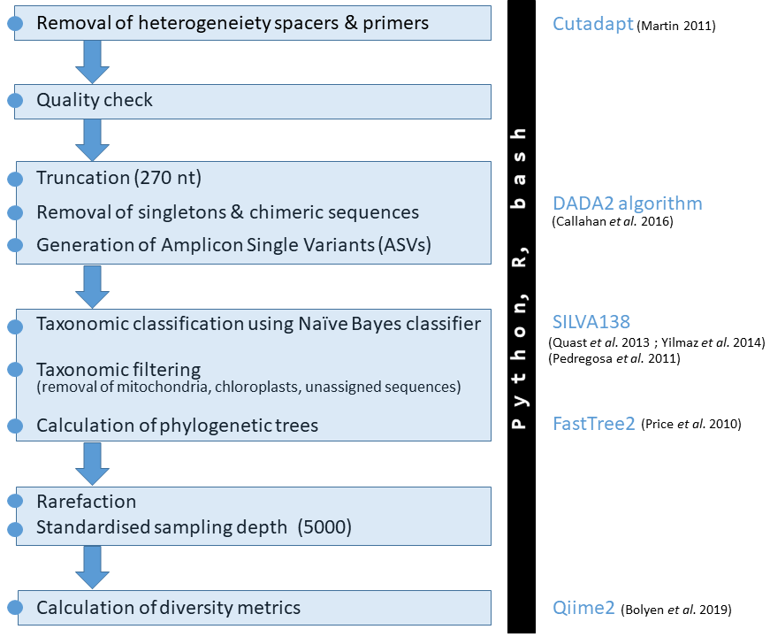

# 16S-AmpliconCorePipeline
related to [Busch et al. 2022](https://www.nature.com/ncomms/ 'Busch et al. 2022'), code archived under  [)](https://github.com/KathrinBusch/16S-AmpliconCorePipeline/releases)

## This repository includes the core bioinformatic SOP developed within the deep-sea sponge microbiome project.
## The very basic workflow looks like this:

