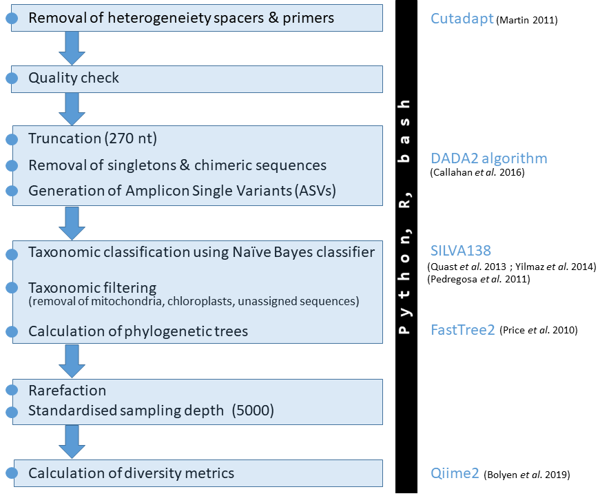
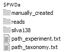
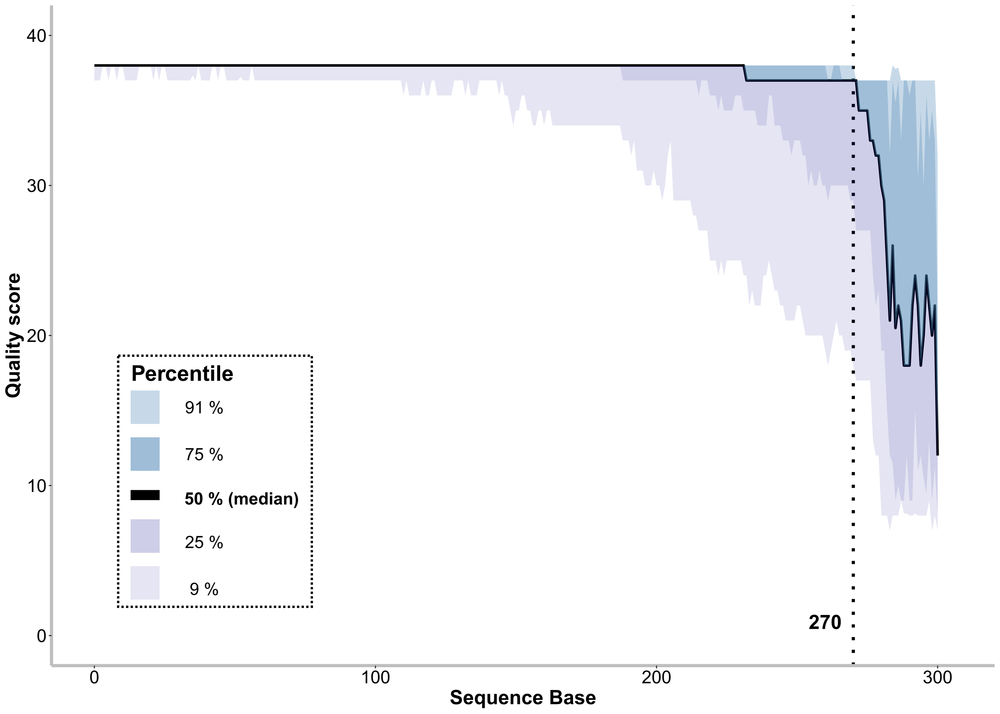
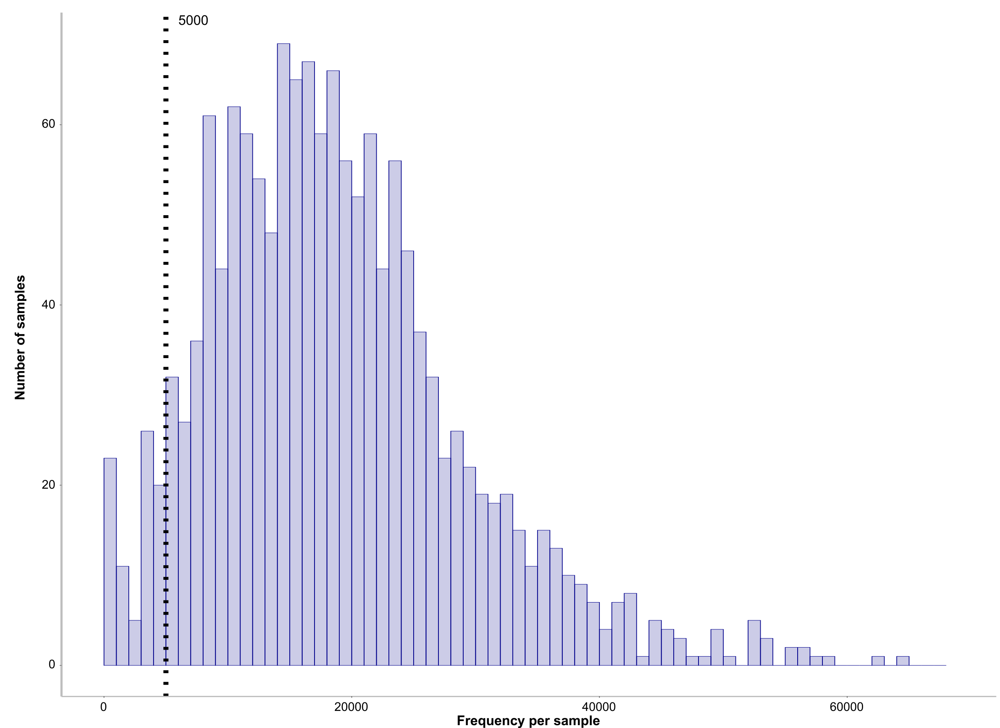
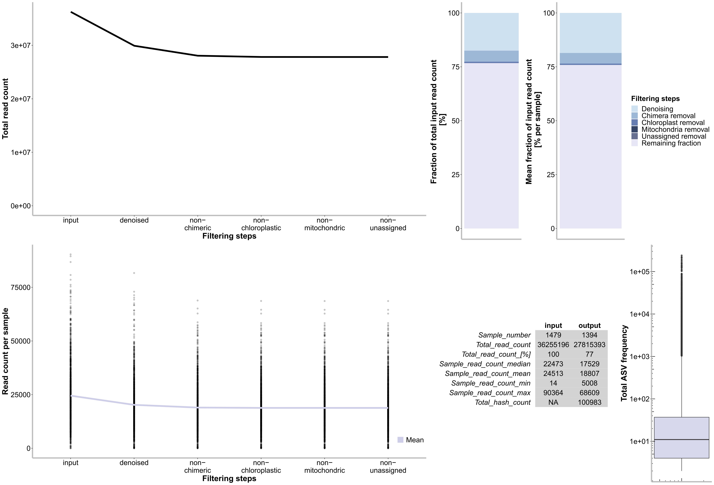
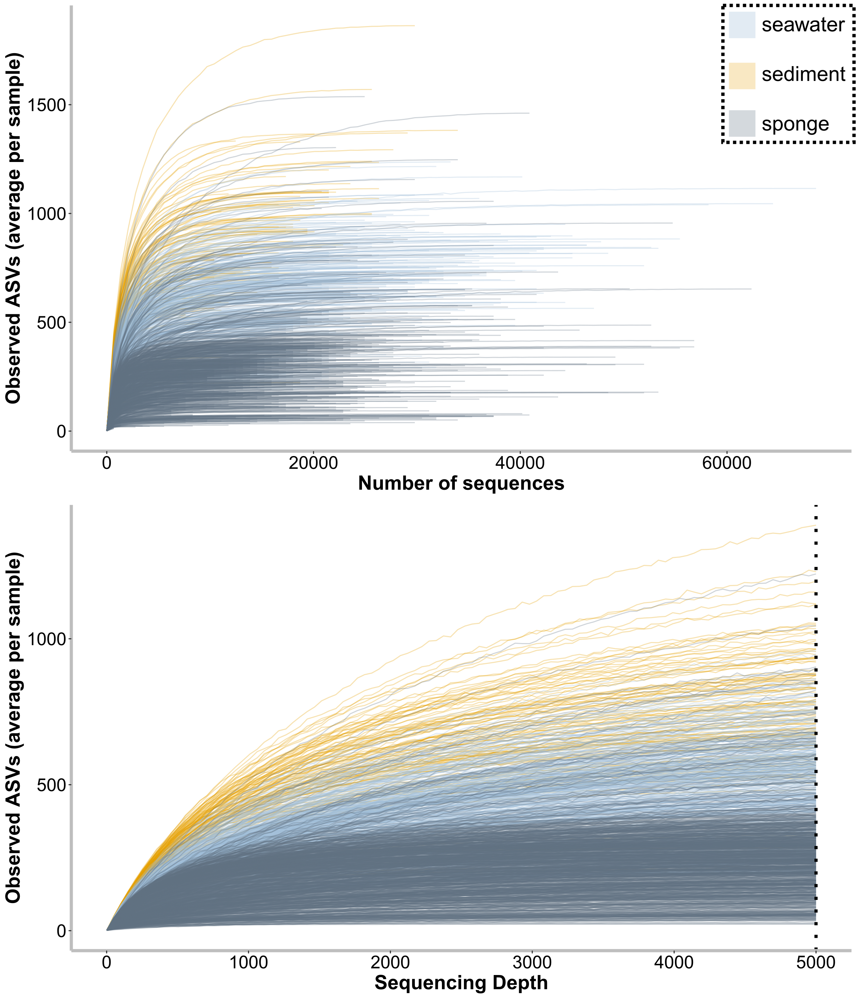
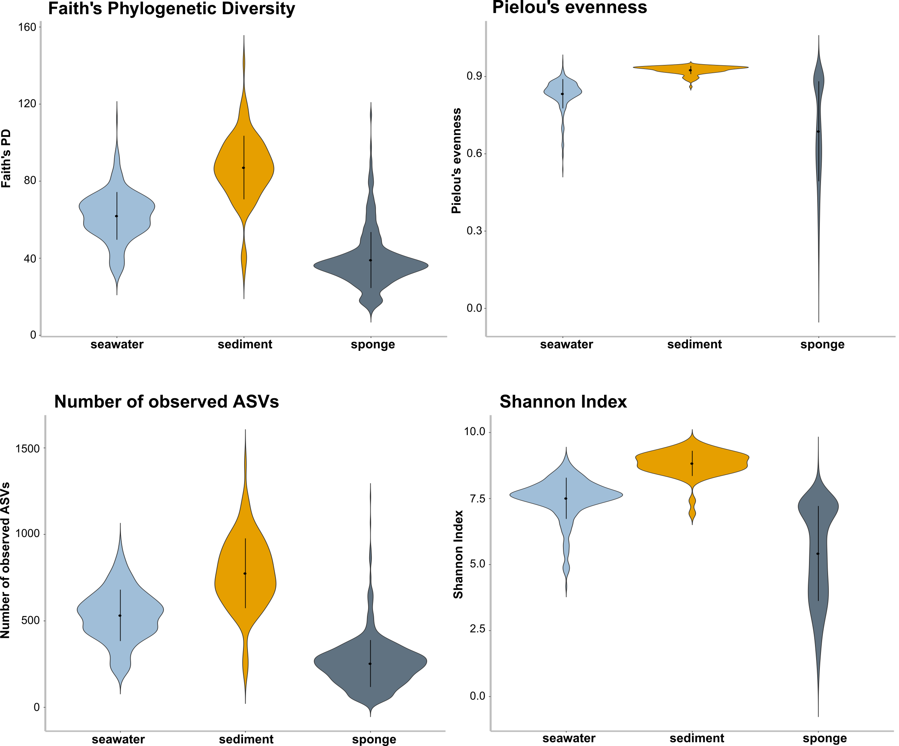
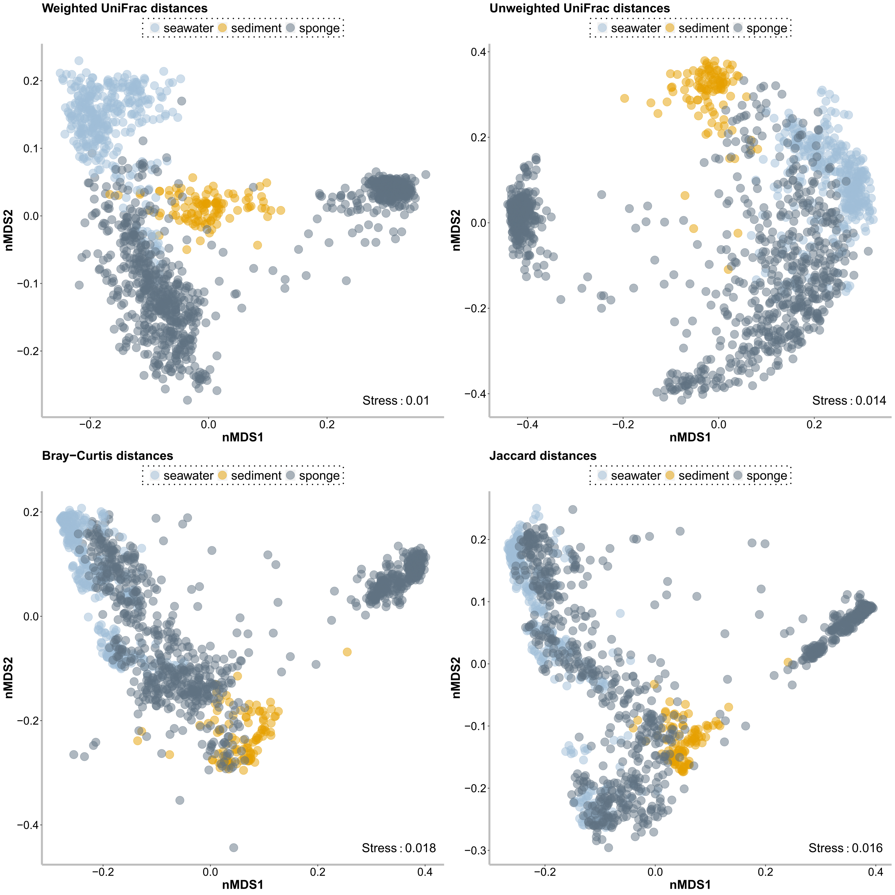

# <br> 16S Amplicon Core Analyses {-}

## Workflow diagram 
This documentation includes the core bioinformatic SOP developed within the deep-sea sponge microbiome project.
The very basic workflow looks like this:

\

## Getting started 
Operated from Ubuntu 14.04.6 LTS (GNU/Linux 4.4.0-148-generic x86_64) command line.

---


Program versions used:

> * qiime2-2019.10 (via miniconda3 v4.4.10)
> * R version 3.5.1 (unless other version is stated explicitely)
> * SILVA_138

---
Input files and structure:

> * Downloaded *SILVA_138_SSURef_NR99_tax_silva.fasta.gz* from  
    https://www.arb-silva.de/no_cache/download/archive/release_138/Exports/
    <br> <sub><sup>(accessed on the  19th of December 2019)<sub><sup>
> * Started the following script from the working directory (path_experiment) within a screen session 
> \


<!--html_preserve--><a href="data:application/zip;base64,UEsDBAAAAAgAAJyWI1EAAAAAAAAAAAAAAAAGAAAAaW5wdXQvUEsDBAAAAAgAAJyWI1EAAAAAAAAAAAAAAAAXAAAAaW5wdXQvbWFudWFsbHlfY3JlYXRlZC9QSwMEFAAICAgAnJYjUQAAAAAAAAAAAAAAACoAAABpbnB1dC9tYW51YWxseV9jcmVhdGVkL2ZpbHRlcl9tYW51YWxseS50eHRlkjFvQjEMhGcq9b/YTmLHK6JDRae+ofOTmg3UCiF+P2+C3DF+cXI++7Ks5//T+DzsLuP8dxvvb8vHQUS87n7HaVy3g5+9iIkDV01kM2DVePB+kehYzU6vFbhJAQ7FeiR274J1LejGa9B9nKZEmd0aVcWIC3Elt4W6UV3QvZcgvfbgo2Zg96bI1okNd2s1affIzYTcg55KaXi/4nSmQrtWSJ7+UaKaBqq5CHXDLCRx2qykT3p1mm5z43POSs6NcjD27o3qNEt7vj+a+veCVjJo8Uqx+2zOUDzNv9bLbR3zOL1StDjQJonRFvwa0Z0YHeYLP5d/B1BLBwjLmsQ09QAAADcEAABQSwMEFAAICAgAnJYjUQAAAAAAAAAAAAAAAC8AAABpbnB1dC9tYW51YWxseV9jcmVhdGVkL21ldGFkYXRhVjM0X2NvbXBsZXRlLnR4dG2bwY4c5w0GzwmQdxmSP3+SRxuOAcE5RQefBVhIAsSOYRsJ8vZZ78rxsD7dzNbudE1LW8VeT7//8P2P//z47qs//Pz6H7/898ePf/rjl+8fD/vDzz/+64e/fZp8Tbmmu6ZaU69pnid7rGmdz9b5LNZ01vTC8vHDfz788vGnt/liXjy2eGzx+CLwReCLwNf79/X+fZ3P1/l8nS/W+WKdL17O9/G7f3z/8Ydf3ub1nmOdP9b5Y50/Gq+zCM76GziL5yyes97/WTRn0ZxFcxbNWVfjLJZcLLlYcrEkrk0umkz86eLJxZOLJxfPfezXuYZ5Md11fe4iuuv63MVzF8/F39ZdRLWuUK0rVIumFk0tmlo0dfcZqzCvK1SLpxdPL55ePL14evH04mmcv9f5e51/1vlnnX98W2AC88EMaww4ZnHMM4c9HmuyNcWazppyTXdNtab978KWR2151JZHbXnUlkdtedRs0diiWQ615VBbDjVfLMuotoxqy6jmi2X51ZZfbfnVll9t+dXid5ZvXv5B2BfPY+zx+NP4wmZPU5415fM0sSdfU6zprCnXdJ+ndb65a6o9rfPVOl+vr3z6gfzGn/7F/jqcPX2xxnyenl/TH+s17ZnzZdp/9tf3v4/z9M/im3UB1/Vbl2HO+pPf3+j7P3/1eLwuK///Afl0yPVQ6KGjh1IPXT1Ueqj10Mghe+ghpTelN6U3pTelN6U3pTelN6V3pXeld6V3pXeld6V3pXeld6V3pQ+lD6UPpQ+lD6UPpQ+lD6UPpQ+lP0p/lP4o/VH6o/RH6Y/SH6U/Sn+UPpU+lT6VPpU+lT6VPpU+lT6VPpX+Kv1V+qv0V+mv0l+lv0p/lf4q/VX6UvpS+lL6UvpS+lL6UvpS+lL6UvpW+lb6VvpW+lb6VvpW+lb6VvpW+lH6UfpR+gH9O/mid5/7GrzBd5Z6JHlkSo7gzb17XRpwZH3Nt791+Lc1+u2Iy5GQI0eOpBy5cqTkSMuR4ZHX/O4jwmzCbMJswmzCbMJswmzCbMLswuzC7MLswuzC7MLswuzC7MIccvaQs4ecPeTsIWcPOXvo2eWKHbliR67YEeYjzEeYjzAfYT7CfIT5CHMKcwpzCnMKcwpzCnMKcwpzCnMK8xXmK8xXmK8wX2G+wnyF+QrzFeYrzCXMJcwlzCXMJcwlzCXMJcwlzCXMLcwtzC3MLcwtzC3MLcwtzC3MLcwjzCPMI8wjzCPMI8wjzCPMI8xD5tdf5eCIyRGXIyFHjhxJOXLlSMmRliPCLEUzKZpJ0UyKZlI0k6KZFM2kaCZFMymaSdFMimZSNJOimRTNpGgmRTMpmknRXn+VtI+EMIcwSwdNOmjSQZMOmnTQpIMmHTTpoEkHTTpo0kGTDpp00KSDJh006aBJB006aNJBkw6adNCkgyYdNOmgSQdNOmjSQZMOmnTQpIMmHTTpoEkHTTpo0kGTDpp00KSDJh006aBJB006aNJBkw6adNCkgyYdNOmgSQdNimZSNJOimRTNpGgmRTMpmknRTIpmUjSTopn0y6RfJv0y6ZdLv1z65dIvl3659MulXy79cumXS79c+uXSL5d+ufTLpV8u/XLpl0u/XPrl0i+Xfrn0y6VfLv1y6ZdLv1z65dIvl3659MulXy79cumXS79c+uXSL5d+ufTLpV8u/XLpl0u/XPrl0i+Xfrn0y6VfLv1y6ZdLv1z65dIvl3659MulXy79cumXS79cauVSK5daudTKpVYutXKplUutXGrlUiuXWrnUyqVWLrVyqZVLrVwK4nIn5XIn5a2vI+9duuPSHZfuuHTHpTsu3XHpjkt3XLrj0h2XOymXErmUyKVELiUKKVFIiUJKFFKikKaENCWkKSFNCWlKSFNCmhLSlJCmhDQlpCkhTQlpSkhTQpoS0pSQpoQ0JaQpIU0JaUpIU0KaEtKUkKaENCWkKSFNCWlKSFNCmhLSlJCmhDQlpCkhTQlpSkhTQpoS0pSQpoQ0JaQpIU0JaUpIU0KaEtKUkKaENCXknijEqyF3ASF3ASF3AVH6yvtqfM1fNX3N+5av903Kt19++t8Qnz4f8DYn5tqz4eufPifzNl/Ms+enT6+8zk+fPHmb8fqB1w/wHLzeAf8Bz8H3P31e7m3G+RLff8F78fUXPBfnK7y/wtc/fYrsbcb1a5y/8XqN99Pga5yvcb0a77fB3+Br8A34BnwDvgHfgG/AN+Ab8A34ZvM9fwLtbTbMjjkwH8wXc2FuzOAx8ODn6/lTaW8zeAw8lpjBZ+Az8OHn9flTam8z+Bx8Dj78vD9/Xu1tBp+Dz8Hn4IM/DP6wAB98YgG+AF+AD/55/dXimsF3wHfAd8B3wAe/Gfxm8JvBb3bAd8CX4EvwwY8GP1qCL8EHf1qCL8GX4INvnz869zaDDz42+Ngu+C744OvXXw+uGXwFPvjdCnwFPvjfCnwFvgIfemHohaEXhl4YemHohaEXhl4YemHohaEXhl4YemHohaEXhl4YemHohaEXhl4YemHohaMXjl44euHohWOfcvTC0QtHLxy9cPTC0QtHLxy9cPTC0QtHLxy9cPTC0QtHLxy9cPTC0QtHLxy9cPTC0QtHLxy9cPTC0QdHHxx9cPTB0QdHHxx9cPTB0QdHHxx9cPTB0QdHHxx9cPTB0QdHHxx9cPTB0QdHHxx9cPTB0QdHHxx9cPTB0QdHHxx9cPTB0QdHHxx9cPTB0QdHHxx9cPTB0QdHHxx9cPTB0QdHHxx9cPTB0QdHHxx9cPTB0QdHHxx9cPg54M+APwP7djz4/fv1A34M+DHgx4AfA34M+DGM5yvMjXlf74AfA34M+DHgx4AfA34M+DHgx4AfA34M+DGwTwf8GPBhwIcBHwZ8GPBhwIcBHwZ8GPBhwIcBHwZ8GPBhwIcBHwb8FvBZwD8B/wR8EvBJwCcBnwR8EvBJwCcBnwT8EPBB4Oc58PMb2NcC+1pgXwvsa4F9LeiD4fnAi30tsK8d7GsH+9qBbw58c+CbA98c+OZgfzvY3w72twM/HfjpwE8Hfjrw04GfDvx04KcDPx346cBPB3468NOBnw78dOCnAz8d+OnATwd+OvDTgZ8O9rkDXx3scwf+OvDXgb8O/HXgrwN/HfjrwDcHvjnwzcH+9TL/5cNP//7wEUfxLrF1HVjqYMs62LIOtqyDLevAci/z56jgvpf5s18FdmxkL/Nnvys5f/ar8LcJ277Mn/0uXA04+MDBBw4+cPCBgw92uoOd7sDRB44+2NEOdrSDHe3A6Qc72sE9+8E9+oHjD5x+4PQDpx84/cDpB04/cHrC0QlHJ5yccHLCyQknJ5yccHLCyQknJ5yccHLCyQknJ5yccHLCyQknJ5yccHLCyQknJ5yccHLCyQknJ5yccHLCyQknJ5yccHLCyQknJ5yccHLCyQknJ3bKxE6Z2CkTO2Vip0w4PuH4hOMTjk/cYyfusRO2T9g+YfvEPXbC/gn7J+yfsH/C/gnPJ4yeMHrC3QlLJyyd8HHCxwkfJ3yc8HHCxwkfJ+6pE/fQiXvmhH8Tvk3s0AnfZvP18f6wcyd8nNi5E35O+Dnh54SfE35O+Dnh54ud+2Lnvti5L3x+4fOLnfvC7xd+v/D7hd8v/H7h9wu/X/j9wu8Xfr7w64UfL/x24bcLv1347cJvF3678NuF3y78duG3C79d+O3Cbxd+u/Dbhc8ufHbhswufXfjswmcXPrvw2U3y4HrBZxc+u/DZhc8ufHbhswufXfjswmcXPrvw2YXPLnx24bMLn13slxd+u9g3L3x3sX9e+O9iH73w4cU+euHHi330wpcXvrrDPwc/fHXhq4KvCr4q+Krgq4KvCr4q+Krgq4KvCr4q+Krgq4KvCr4q+Kqwjxb20cI+WthHC74r7KOFfbSwjxb20YIvC/toYR8t7KOFfbTg28I+WthHC/toYR8t+Lrg64KvC74u+Lrg64KvC74u+Lrg64KvC74u+Lrg64KvC/towd8Ffxf8XfB3wd8Ffxf8XfB3wd8Ffxf8XfB3wd8Ffxf8XfB3wd8Ffxf8XfB3wd8Ffxf8XfB3wd8Ffxf8XfB3wd8Ffxf8XfB3wd8Ffxf8XfB3wd+Ffbew7xb23cK+W9h3C/tuYd8t7LuFfhT6UehHoR+FfjT60ehHox+NfjT60ehHox+NfjT60ehHox+NfjT60ehHox+NfjT60ehHox+NfjT60ehHox+NfjT60ehHox+NfjT60ehHox+NfjT60ehHox+NfjT60ehHox+NfjT60ehHoxeNHjT83/B9w+8Nvzf83vB7w+8Nv3fy/Hh/8HvD7w2/N/ze8HvD7w2/N/ze8HvD7w2/N/ze8HvD7w2/N/ze8HvD7w2/N/ze8HvD7w2/N/ze8HvD7w2/N/ze8HvD7w2/N/ze8HvD7w2/N/ze8HvD7w2/N/w+8PvA7wO/D/w+8PvA7wO/D/w+8PvA7wO/D/w+8PvA7wO/v8yf+b8gA+sPrD+w/sD6A+sPrD+w/sD6A+sPrD+w/vj93LuA+wfuH7h/4P6B+wfuH7h/4P6B+wfuH7h/4P6B+wfuH7h/cO8waMHg3mFw7zBoxeDeYdCOwb3DoCWDe4dBWwZtGbRl0JZBWwZtGbRl0JZBWwZtGbRl0JZBWwZtGbRl0JZBWwZtGbRl0JZBWwZtGbRl0JZBWwZtGbRl0JZBWwZtGbRl0JZBWwZtGbRl0JZBWwZtGbRl0JZBW2bi2+/+jkNARF4GeRnkZZCX2Xmxx86L4REse+y82GPnxR47L4ZHtuyx8/LrrGI0PNhljx0dezxAbaA2UBuoDdQGagO1gdrAZ+Az8Dn4HHwOPgefg8/B5+Bz8Dn4HHwBvgBfgC/AF+AL8AX4AnwBvgDfAd8B3wHfAd8B3wHfAd8B3wHfAV9hbvA2eBu8Dd4Gb4N3i8jw4JjhwTHDg2OGB8cMD46Z4acWD5IZHiQzPEhmeJDM8CCZ4UEyw4NkhgfJDA+SGR4kMzxIZniQzPAgmeFBMsODZIYHyQwPkhkeJDM8OGZ4cMzw4Jg9Pzj2P1BLBwjHKyKusg4AALhjAABQSwMEFAAICAgAnJYjUQAAAAAAAAAAAAAAAC0AAABpbnB1dC9tYW51YWxseV9jcmVhdGVkL3ByZS0zMy1tYW5pZmVzdFYzNC5jc3aNnU+vJbdxxfcB8i2ylJLmf3LpgWNoMF4EeYu7FCaRDAuwY0dWkq+fZnfVFeD7e6+ONgIe5nTfJg+LZNWpqr99/fNf//Tjtz/98M3X//jbX/70P7/8+O0ffvrTj3/9+ssfv/nhp59//M9ffvrLf/3jP7z962+P87/0zT/92+O3X//ll59/+vOff/zhX747ej3yt79P37+Vkr///fkvvv/39P35v3/+w9e//fLf3/zhLz//39eff3g+INMDij2gCA8o9IBqD6jCAyo9oNkDmvCARg/o9oAuPKDTA4Y9YAgPGPSAaQ+YwgMmPWDZA5bwgAUPSMf9gHrED0gHPSDZA5LwAGJiMiZWgYmJmJiMiVVgYiImJmNiFZiYiInJmFgFJiZiYjImVoGJiZiYjIlVYGL6eyaef/72+vv3b3koD5jvPGDuBwhUTuudB6z9AIHK+eAH5ON8wBSonNM7D0j7AQKVc37nAXk/QKByLu88oOwHCFTOf8/Ez8eY/bYHyge0d97f9vsFIucO7x+3OVG+/x0W5s3CKbAwT3q/WSMBvgh+2yLBDpSD4LclEgavJILfdkiwAeUd9pXNviWMfnmHfWWzbwnDV+o7D6j7AcoAvsO/svm3lCHs7zyg7wcog/gOA8tm4BIYWN6xg+du/la6sAbLO3bw3M3PBwjTWN+xg+dufj5AmMb6sp3l82R370ZL+ILaCH9vRgoPayf8fSpSaFgH4W8jqLCwTsDX24gpJKyL8LcRUjhYE+FvK6RQsGbC32ZoCTtxLYS/7dASNuIGZnBMO5QewgA2MIRj2aH0EEawZXqAbQOHMISt0APsUHoIY9gqPcAOpYcyiI0eYIfSJJxmWqcH2KE0Ccu4DXqAHUqTsI7bpAfYoTQJC7kteoBdj5KwkjsxcRkTk8DETlvyYUxMAhN7pgcYE5PAxF7oAcbEJDCxN3qAESkLROp0pvN7dhaI1Ac9wIiUBSJ1OtX5PTsLROp0rvN7dhaINOhk5/fsLBBpEJH8np0FIg0ikt+zs0Ck8WLVT/6N+xOmMgQV8FPf1UcDvC0lZQA7we8pVGzJGIC3K7ZC4jEBn+9llAV7Phbgi61jYfrmAXg7lCguhpkIf49fE8ZvZsC3e/yUY+0k+nW73AjjN4l+djVT/BPz1QzObIfa0gU7Ojs9wIyQ9AWDHmBGaAiGeL6awTTtXJkOZQ4XPSDbAwQbsA56QLEHCCxciR5Q7QGCGVyZHtDsAQIPVqEHdHtAxIPPrz/g9LSd/u7bDoS3q8+v77/ww/AjxoOvsZgdyCGLPqcG+HNx3N/fYngjuDmYVghf4PBOtgp7j+GT4EszIp/zAb7qZPQdJYbT29s9dB87xz69vTpXPp8eEYuXBP7RjZ6Evj88f7x7n+hG785muo4coRuh/ToXvfv1CH6iS1UuQhudCN2UW9BG06jVrBy+T/TLiWOj26Gc+TZ6EDopB74TPQndsxJZOtGL0O4FrcG700GjNg3dPl6kj3dCi9nGLQV++Mc7kcVsI5cCN/zjncBibrbLBV74xztxxdxskwuc8I93woq52R4XnLQfFFXc54RnMGjGeDpnPMNZ8fy93Pfsr6elCW46D7rs2V83Wnj3RPSOIQV3nAdFQ98e315/PuFFmDj0/t/GJn75SyD0fnna0acSj9tLGNTg28CXeOBegqAG377/Ivz4wvDt+S8x5V4CoAbffv8gCv2g8KfBt9e/xgYjYdDJbqYxevDLN2NrbC0Sc+4Ke9aYc69Rz8cz6FljW5GZdFfIs8akyxhxskt1PPCZfBLmUkixoc7k2pq2UcQjn5l0eZOuxvOemXRXqLPF394XWqo9byVGj4PQ47IV8cCNhOjLVAjj1vnDt4FvwqzxerlCtE14O/nypu3OMeEL27krxtliO1fYzl0RzhbbucKUu+KbLaZcYcpd0c0ek6bwxF2xzR5PXOGJuyKbPZ64woZuxzWje+8Dw5oPj2rmHs97ZUO3Y5q5x4au8u5ar0t3vLtWZl3N8Z39QQE1g2/W9Zh1lVlXN+t6zLrKrKstdhg8KBpr8M26EbOuMuvqpSuKWVeZdfVSFcWsq3Skm0Xxdjwokml/jcOQDwpj2l/jGOSDYpj21zgA+aAApv01jj4+KHppf41Djw8KXdpf47jjg+KW9tc46PigoKX9NY44PihiaX+Nw40PClfaX+NY44NilfbXOND4oECl/TWOMj4oSml/jUOMDwpR2l83OuZaR671GkcnHxTdtL/GockHBdXsr9vREf/ygd899ncLu/kglc3Tky3gSWXzdGQL304qmzoMH6+0QSqbOqVoxAMDahu/pGDEAwNqJ97dTEe83l4DahufpFDEAwNqG5+lSMQDA2obX6RAxAMDahvvoZSYvZP4Z97sJFj5SfyzgGAS7Pwk/jXjn2DpJ/GvGf8EWw/RtDMe2gSp7INCad+V0w9R1ZvzOgA+3EcZwxPA7eYseNleY1gbbpHIeOW9hrBOuAmDBI/JawTrjEGYIEW4eK8GcMsXEK5wqwM8H0oE6oIPgt9DN4ShmwC3+Jfgml7AuuzKvHDo0nEQ5bugzr7QRLreRG9POoh0Jo6OjwnpINJZVCJ2DaejEtyCWC2GN6L8baxiL186iHQmoWrC0BHpLMOlCUNHpMv30HVh6Ih0Fv8b8dClgyh/D10cTUkpEeWbIka+4JkoP4SEgAtNpOtd9FCmRKQzQX98tk2JSGeusjxjeCfOWvyyx/BBIzeFXIgLTZwzzV8TRo44ZzGs+GydMnEu3yMXO1xSJs6Ve+RGPHI5E3wqSrsLXojxXRHaXXAiXVuCzu5CE+f6UGR2F5w4ZyG0+D6W8iDGF0Vkd8EnMT4pGrsLTmc6UwvHwZRUiHSmUm3x0BUinSURxt7dVIh0uSjSmAtOpCtJkdddcDrTmTBnCkPXyNaonC1Eun4IeVMXmjjXpxiQSIU4N+xMFa/WQpybLo8J4ZXuEZ6nEBu6CqJQl7jkQ8Bnwk9b7vHYVxCF1u6DFw9+BVFo9Q02DoWlCprkaltkrsL3d8Lb9zfh+0GU3GyXFKIiqYIoudk2KXjXUwX2VRPE5RlbjQb0c5FTlC134RPhtUyhCw9Gr3Ytw+TCg9WrQ0ttuPBg9qrtV0XYsBrsttU3LGHHap3wS0o8v/Bg+5onVgh7VgPj1zzxXdi0GvCv2aZVhF2rA/9a8Q0/Hr9O/Ksu6o/Nbyf+mQ8wr9h+dOJf1xLdLjzxr2sJUhee+De0zJwLT/zz3UvYvvog/map/sWFJ/55elYVxo/453lBLR6/QfxzqV4cU08jEf+rlBJw4TPx35NK4vEbxD+7XGfhdj2If83P6/H6HcS/ruVpXnjiX9fy+y488W9oiWUXfhL/vQSNMH60/3qWaCycS5P459mFNRy/TD65OrS0tgtP/HHvSqy4zOSVq56jWuPxg6Sgk/82fkMYP+KfXbWzcNeexL/mp/d4/U7iX9fSjC888W9o6akXnvg3tLzIjacwhjuUi3D+pjhG9STnWPmZKJDRPDlWOL9TJKN5VqZwfqdQRks2fvH5PZNbuXkRrVjDmMmv3DwptAnrn85/ydZ/LKtKFExp2eZfuH9QNKV5csgU5p/4bzHsqGLJhSf+Wwy0xDF0SCja61fL8r/wxP+hZYdfeDr/eGLPEOwvyKP8/huyP5Nnv5oCICr3cuHB+9AtjhiPfaKEVAsjxiOfKB3VoojCwCfKRrUoorBvJsqFzl73LYZTLrRFEaswcpQKbbcewegkyoS2S49gcxIlQru3Lh66THnQduURGJ8pDdpuPHFuUc5EOrvwxP6SDK79k/FDC8DmTKQ7mqg5yJlIl4qoOciZSGdRxFhzkDORzrMIY1uRiXQWRazC0BHp7KITaw5yIdLZPSfWHORCpLNrTqw5yIVIZ7ecWHOQCxZ+GKLmIBes+9BEzUEujSg/tQBsLlj1oYuag1yw6EMVNQe5YM2HLGoOcsGSD4eoOciVSGdhxFhzkCsWfOii5iBXrPdQRc1BrljuIYuag1yx2sMhag4y+fWH3WumMHTEuikVQLvggyi/tMh5Jp/+MJ9srDnIlUhnLtlYc5AbkS4XUXOQG5HOHbKxpWtEOgsjxtlwuRHp7DoQiw5yI9LZbaALQ0eks8tAF4aOSGd3gSEMHeVVeRldZeYoUyLJoYxMpbZmkl3BGSttJdmVlqHQ1pM6Ahqqgnh1nZg4vRI6iXscFOg60Vk0F1Cd60QXLXSeoTTX8yoQcw7qcj1PVbGNh6Jczw0q5itU5Hqu9ZitUI7rWQ1JOEoPIltVE1/zILY1NfE1T/p0V07H3z7p2z1oH3/7pG+3mG0cMs2Tvt2uf1n4dlpqdpSOHfZ50lqzY0ns78yTFpuZeOHaP2m1mWhcuEJR/adhAlzhOErVn4aLLeIFR7WfRh+iNitT5Se/twvbA9V9Gs9ITwwn1rmjPGbdIta5ny5m3SLWjazefRexzpTTwj1iEetMJCOcyRaxzjUSMesWsc5DzCHrykGs8wjdiuHEOrsIxPGFchDrLD4WO9rKQayzNI3YaVEOmjhzNsXB7XLQxFlwrgpDRxNn+t/YZVISTZxL+uKhSzRx5pmOj/Il0cSZsCbWtZREE2e6hFgWUBKZCwvrthbDyVxYVCwOSpVE5sKCqrF/tiRinXnlY19XScQ6c3HGfoOSiHXmLorvYCUT6+zqHeuRSqbyhKYnieUcJVNxQgvHxyUSSqbShBbNjIOJBXo/nPAiOtZLbgSvopOyQOeH5FWCY4dPyYPgXbw8l0ylMc1pEuvISqbCmKYDimU4pVBZTKvOF5dIKIVYZ1HoOIhaCrHOgsBxRKQUYp05DmLvcinEOvMbxJ66Uoh15jaIvR6lEOvMaxDr/0oh1pl+K5ZPlUKss647sfqkFGKdqQfi4HepxDoL3sehrFKJdRbCjMMCpRLrLBwUu1hLJdaZaz3OkSmVWGduyjjfoFRinenuZsy6SqzLVgg0Zl0l1lnUPg4ilkqss+DxEmhDrLNAXOzcLo1YZ0GNWDFVGrHOHMSxYKM0Yp3VA4315qUR67yzSbzeG7HOG5vEE9eIdWWqFR9KI9q5i/MQpo54Vw+14kMBt1U+XK0onGtHJXxV1VZlNMI3Ve1UXgu6brxdRYWj7WtJ1413tXw8/2MS3tViwfz/7rVgwa4r+swmDWzm70CrvCs3J8ln+TtQGu/Ky0U42n56e63v+Pl0yNhVMsfoTuilJMnsWriZKukOpb3gRlPlZPda1eiXv7qNNnopjQU3muoPu8/q4+SOx6d36vAWT+76+Hxx4xvhq1Jz+sYPwru/sYd4agxZ3FO84t9PbR2L+3o/3qpufCe8i+Pj8U+L8FNJDrnwmSq9u9vv4wI7F75gHeChiEsvPJyxTrwnR8TjX6njgotLP3YB3Xiqg5xdPhHPX6Xvz0lJbrrHLxFe2u4ufMPfL2139/sL4aXt7n5/Jry03d14fL+03V14iAhPL5USbHc3HudvKcllF34Qf11+02P+dPr+p5Yh5k/H92dFHH7/fuKfJzf0mH9w3Djx7veP+feSnPL49O315yCgfoFfYpQ3eB5BPP0GJwZH4fQbnBmcg2j6Br8mxFzg8887MNtieGF42fB4xGfhn16CUP4NrgyuQST/BoOtfhYDm7GtmVSC20IVSXj9oNebzG/GpurlaGzfPqNo/o1mos8VHYwv9GKmnweUIJZ/o5nqKyy3caOZMKtE1U1vNDUL9gpo8Zy/RDXt5U2a8pfTraG79u7B6BFJmW8002XNSD9xo5kua0XyiY1+rcF1off1P1BP3OjE6FA8caOpXvvsggL8hhd+eYm0Eze6MrpG0okb3RndI+nDjR6MHpHy4UZPRs9I+HCjF6NXpHu40IlkdVPR+txw5ksKVRM3OjM6R6KJG8102T0lSonRaJwUldINb/zyFkkmbjSzLfVIMXGfAhqfArZhjOmWD2qX2aSkuhs/+fXbusWTnpkyOV07knCCIh3pUiRS98jzWtvtNEq8UhOvtd1No8SLJbNp3s00asy4zEsth1KRG42mWVHV3ZPG59a9UlPM98xLNe+lmgTCp8rwuuEjhvN62Ws1xQOfebHu8kMnXBi6wfB9lKjxamPC5k3YVEsMXwzfZ88ar7ZM28NSFIU3nETXS1EU3nAi7VIUhTfneYPIJVJH3WjaIJYiJL3hvEHs9i+1x2jeIHYPlRofRzIfR3YLlSoMG5vIc8DfYq9e5kHPe9BTFRjDS3033UnKl7OBPo9Rb7FH8bXC3o0+j1FvsT8xkT/vWXB6CiPHZipfZire1pkyuynaCRfezmZqcyYpQ8drbTe+afHZvfDZffe9iR2hr9X9DN0iOduN5qW2u940wUThcURRLV/wgvZVUS3fv50X+m65EztgX0sLGnpGSrobzUttN9yJna+vhQVv9O63E7teX+sKGjqU0d1ovnbsbjux2/W1pqChSySiu9HM9N1rJ3a5vtYTNHSLJHQ3mpm+O+30mOmFj4C7M1YSlnhlqu4+PT2mamWq7jY9PaZqZaqeVjFQ390fTm3klpIacL28MdN3k58Rnx7ZMuZtGVNsGjObxt0v8oTHuzHbxt0v8oQLlOGz6zYwqQnGkc+u28Kk2MRkNjG74eMJj0eebUyul8c5PrezkdkdH094fG5nK7M7Pp7w+NzOZmZ3fDzhMW0gtHq6CKS6LzeeebMtTRJMDduKvG1Fio1FZmOx662e8Jh2vGB3z8bTcxzzpjFv2uX0jnnTmDe7L1cSRr4xb3ZjrjRi3jTmze7MlUa8P/G3pxYKjW8078v705UvZ1O324KlEZu6RhEmy1osysgxZ3dnsDRizjbm7G4NlobAWTiGrkPJP7vgnSm/m4MFHalvOFO+xw2pbzhTfrcHSzM2VhBHP79dSZ674ZXgSvLcTVo+Du4FJ7Cms6HczbCFK2Pi5bqPY2/KauXT5F4xwoLpTPjdiTvF6inK7T6HXUk6vOFIeCXp8IJDdvcJV5IOb3giuJJ0eMOZ8LsvXIqFX3mgqbID6RDwPHNjR6uO+OrW+BqxOygOYehw3pWMyRvOZ8JxBUdjQ8eykXzJRmLJW2bhSJ6xQvaG8+a89Rf5iO9vvEekvUcMwVbwJWi3j4zFmol3iH0MD3JBbjT5getSpUaJd4h9DH+Lt6dEG8RshypUSrRDzOZCrdgp2fE07UKt+PLLm0Tam8QU3s4X722np/Bu5tz5q9+E/akz53YX81gg+6oov9G7i/mKZ33wWXR3MV/xts4meh/g3wQLzVqpLWo+F3o8ZYO39fM8ESSh3Gje1s+N4S1WBb+WvDZ0j1JQbjSTbW8tSdhaBrNtzDAB5YYz3S5FYbw5JN4c0t4cUrw5JN4c0oz7jd5wZtzWFQbtRm84n0P33pKEvYUZu0/vUbPRG86cmy3sNXrDmXSzh61Gbzizbo6w0+gNZ9Zd6r5YoJdY3pdueV/MukV7Y5N6VNx4DJIqFWtuOG6OUouAG8/EWZs4sdAuscgvXSK/WDKWmXd58y4LvFt4kvZrQDz1LBNMl0wwFhHlA6M/SrWgG86n0eOq8iScRvnuuRddjhcdFeAY3hsoDl1RAY7xbO2SYngmeBcdHlSA44QP0WdABTjGsy57jeGN4Eu8+1IBjtHyId59qQDHCU/i3ZcKcJzwLN59qQDHeLbkiVlHghTvaBJfH6kAxwlvQsGdG06sy0pn4htOrMtKl9cbTqyzhJdYy0MFOE640n7whhPrLN0lFnZQAY7hrTSqMO/EuqI0db7hxLqiNMi94BSmb0XpNnrDiXVF6dx4w4k2lpcdxwCpBMZoVWlofcNp3qvSKvWG07xbFcYuDB3NuxVSjONgVALjhC+hZs0FrzTvTWnmfcNp3pvSGPmGk7VpSpfZG060aUrHzhtO1sYOhvG5kEpgnPAm1Ky54cQ6EynHoSQqgXHCh1Cz5oYT65rShf2GE+ua0tH6gkNiZE5+NIpdrFQH4sR3pWvXhQdv3YkfStejG/+Sy38G3a2iXxKOhq9d3zbe6lAIx6vXrm8n3sriCWrl8tr1beOtkoFwwHrt+rbx1vtDOGG9VlLYeGukIByxXru+bbwlywlnrEHz53lbwiFr0PibcjYJJ41B42fXIkEEWl67dm28CTGF7XoS/0zwI0idyoL5SxbaSsKOuxLhbf5i3UxZmfA2f8KW/dq1auMtjStWzpRVCW/jL+z5Lz6BC291bGLtTFmd8DZ/wqFhAX+T1UsT1DNlTcKb/RCODYu2j660h9/wSl6F1pVW2zecDi1W1iLePCrlADYrYRzvHfWgQ4uVMI7DVPWgQ4vV1IjjVPWgQ4uVMJ45htOhxWrBxHGqSolZzQp6xDKKetChpSs90m84sc7KwcTVVCq6g6yEcRylqugOsuJDsZqgojvIqgDHkaaK7iDb8Zfw44l1tmHHQZOK7iDfb+OwR0V/kOdwxoGLig6h6XXDYuKhR2h63bCYeegWsSQjwX9f0S9iWUaCA79mrPslFwKp4BnJ6ZALgVRwjZx4uRBIxd5Vdl4S2Eu9q7worTJ91LzKi5umuMhApe5VXiQzxbmJldpXebHFFOdgVOpfNYt8XK/UwOpZ9q4K49cIb+PXhPGDxi6ezysc1yp6aLxNYhzAquCiOekr16Gp6KNZzp8YD06a7MdtQVxSK113D7mOTaV2TC6WFo67lRoyze5lMmLzRx2Zpl9XhZ0bWzKZ+RV2r3b8/uvP//v1x9dJ7G5EkvAjaBGaZ13IKq/UW2kW+c5bGy5C+c5ZG5JAvrPUhiSw7x/C9xMJ7PwkCIhrJyPuPgvh/NapMZfvwbHy48Qji66txG7OcTy3dtoK/OYlsLDn97nsTxHGArlsBiEOTlbSm3W//2dhLOv7X2FjmQRGNMJ7n7gi4N//Fb65C2NBm5tdqYR0igpF3kb3u3wWGDHe/wo74cZVJ2rHE1qXT/gdj2jGiDhWXwetbu9GLDB60BEtH/L3DzyimXWM4+114BHNxi+O29ZBK8rtQha+nzzqLhfvAh5P+F1VgNaxCD9UjVCdNH/uERRuWBPtqtuS+PdPtIhJXoWTdvcsRwTqxPmbqsipTpy/peqE6qT5MysklNyppBHrvn7jShh10fh7n1phL1g4/lleP4tOV0WOyNRFu4AFkVMcv6/QY+ocv6pGpOrC05XZr9iz1w48ncoRpXbgLmjrL7Yf7cDTqRwRaAfsX9XkE2kJ3w/jV62JZI73v5Zg/6oWSBe0ai0lwnv1oxHjYf1Ui2jmeP9qCea/moMwV+H76SzmLpL4RNkS8Keahys34fuBP832nxxfsVsC/rjYLw9h/IA/7dk1OB6/nGn+TWgZ738t0/x7qfB4/2uZ5t9Ldcf7X8uN+GeFkOL9r2Waf4sI51i41vIg/tj4NWH8aP7NO5CbMH40/4cX+I/Hj1yUrhbNsaCjkYvSVYc5Dgw1clHW4lUW4/VDCrCepnr+aeSirCYFyrGHvJGLsnpX1Pj80MhF6Y0Kcnx+aIX4Z10acxHGj/Yvi7DkWHnZCu1fz6KD8fihizIltZ5Cq3j+W+r5qYGS7Hx/VpPbG2jBTnxRM04bicG63x+F8w+5WKu3Wog9Io1crN7qIsfn50Yu1mrnvyz8fnKxViuMm2PpbqO299XL8MWKlkZ975u56LNw/mtkf/z+FodIGnlnXS+fhzB+jexvV1uFNOp9X72z0RJ+P/HPmoHnOETWyLtb7fyd4xBZI+9u9b7QcYiskXe3WnA+xyGyRt7daoq8LMw/+WWrRahzHCJr5FGtXkcyDpG1TvwzX2juwvgR/8x+5y6MX6f1k1VFX0MvZi5qdKNRsYXuIdJY0deo2kLPTfW/NSq30D26I5w/qd5Cd/+PwJ8B8pDu/oc4eaENsn9+f4+jQ23g/c/sn/L+Tvz1MqzC+NH8e4g7ri3ZJtkPk9ELCc2N/IfVWx3FsYQ2cfzs/cL4Txy/pjQIu/F0/7XzT479f23S/cf2zxxH59pE/4nt33F0rS1af5Z8IxQHbYuie8Zfwf2zYPqH9y2O0YXQvvhjOHBnmJo9DkA1cl0O75IkjDwwb3iTnXjhLSDeqElLukoJE0w9E0DwGy2KW9m6D4XQKZGUdD6zLAXeAO2HKStCq5e4HYVnaRbh51NqtCdKhqeelEiM6l7zEk7+iae6IZ4qGe76KZEc1YVRJdz1U8JGAU79cNdPiQSprukoVZg/qq3rDcLCW3vi3hbeICy+dXWib3dNSez16geZPRPmxLqcfqDdMyF2jEazZ0eeFsPJ7PmNrcRwMns+9SmGk9nz1mIrhpPZsrS9Jnw7mp0p9CK94BSsGCblic8KnWIVw5Q88VGhJyRdFnXYPSHprPF1jEbSJbFNV0848EtM9uzgZT+di4cqRO3gZc7luWRifKH3e5QursHSwct6/v6kCiE7eFlP/FK1Nh28pKdzoKm31F5o/FxxFN9yej1o/JOad9VrBrzrruIof68F8BalFISUvdL8mxA3FlL2StPfXeQTL92K0+8in9jsVZp+TwMQjHaj6XORUnxJ6+DkPKfffr9gthtO/6FKMHuj6XeRkmC4wcl5xoa7KsHs4OQ86VdVCWZvNP+uQ44viR2cnCf/mii+TIlSeFykI/ST7o34N4oq3uzgJD356yKj2HyAk/TELzXI3sFJeprPoTrZeif+ukgrdtL0jk6qrqa99k78dSe/sP124q876Ybw/k7rx/unCONHTlLHC9t3x+3vUEWKvePxwa8L8fodZD+Li4xi+zOIfy6VjUUOHUSa5/prqsivg0jzXD9FFPmlRAVmZq1qP+eOIk8fP8FbQfVxZi1qP+o+iP8mconTvlOiCjmzNjUNrQ9cP7Z+4yBvH2j/DzWNsA+0310VGfZB9tvT/uMgd5/o5Fzy+WHS+cPzuGbsbqASRS5SFNIA+6T1ZyIJIQ+rT1x/TRWJ9kn23/2swv4x0f43VaTYqcdz9/GPm5V08tQuF2nFIrVOrtrlIq1YpNHJV7tcpCXYb3K2eovGFJes7ShS9VZUcfnTcYDfYuWliszGAY6LVZsqEhvkLlsuMopFXoP8ZctFQjN2N1IOuYuUi+BspyRyF/mWGruLsSNt8UYEM/5+Ehn7+SUUmaVEItPpoYo4SDTIZei9zITi6oN8hl5UPxappURp8J4CWBT+0fq185sgchvkdfRCrCeRQzz5DZeLbGP7P8j5tlykGIs8RiL7aXnIgshikMh4mftDEFkMEhmvXlWRxSCR8TL/R44LnwzyPi4rG5XjAhojU5KViQRTXHl7ZLKfh4vcY/6QyHkdLnKP7TeJnNczUBrzLyP/XCQfrz8SOS+zP7kI40f8c5FCE74f+ecideH34/q3+1/s/xskcl7JReYx/0jkvDxkE8dsBomcl4vsYv/fIJHzcpFC7P8bVIdhNReJC99P/GtTFXmMgufHroo8BomclwVuBJHHIJHzs1ly7L8bVEehu/s6vr+OivxxkXa8firyx0Xasf2oyB9PkonXf0X+mP2M7w+jIn/s+7vw/cgf+/4hfD/xx5M0pjB/5P9y/3HsPxlU9LLXptYRGSCSPmlr4fY4/DYofnA8S3rH76f4weFyB+H8Q/GDw8/fsch1UPzgqIfq/x4UPzjs/FWE8xfFD47WVf/RoPjB0auaZDwofnCMrJYtHSSSXp6kEdcAGySSXp6kIZy/yP9/eBkm4fxF/v/Dk4SF8xf5/w9XSwnnr078c7mOcP4i///h9z/h/EX+/6Mm8f584ol/3iRKOL914p83Le3C+E3if1OTxAf5/49R1LK7g4o0LE8SWfH6pSINy5NEhPMn+f8Pr+MUx58H+f8PT3IXzq/ov/ckb2H+BiUZ1aHGfwf5zw/3HxRh/HD/nWr8bJD//PA2ZcL5l/znh3cwFb5/kv3rXS1yMCbJ5epSy6YOEokvTxKJizgOKjKxlit14/VL/u/D64jFxYcG+b8PT/KL49dj0vyXJso1d+cYGP92qGVnx6L59zZ3wvl50f7nbSkF/lMjo948/hzbn0X2x+KXJY4fDxKKL0/SiFXuA+MPVuSnxEUOxiL743Xo4iIHY9H+50meSRg/4p+3lYmL/MyD+FO6KBc+8bT/eJvEOH4+D5r/fqh1AOdB63d4U1fh95P/yOIvJY6/zIPG34sMxfH7eeD69yIhIX9movlzubsSv6f4id9/moCn+ImfH4X5T3j/W6Lc/8Tj/W+IcvUTj/e/psYfJsV/uhdpifffmYi/Pal1LCfFT7rrx+L456Qywr25/idef+i/t/hROYT3o//BNefx+GX0P5j9jeM/MyP/zH7FRQ4mrZ/eXb8h4En/5fLjIfx+4p/r/wT7l5F/WS2SNjPtf+NQiwxM0s901z/FRZom6Te6y8enEP8l/Y6f35oQvyT9iO+fTYhfU7qM268m6FcoXaZM8f594kn/WZZ6f5nUo6u7/D3Wv05q0tVd/xy3Op7Upau7/jT2v85C63cMtUjWxCIvXmQs1n/MQuvX5f9xkZlJfcK6t82J49eTGoV1198uYf5o/XoJ2iXMH61f1x8uYf5e+XfaVLnI34QiL6dNlYv8TSjycuLlIjET+n2deLnIy4SWWydeLvIyIX5w4uW2VbPh+Mltq2bLhJfbVs2G4zfV++NslfBLvj9QkRPPn4jdX5NqnHj6xBB+PdxePHtCGfxJ8CnmOk7y3fvYxcyh8ibPzIeYuFTdxBMf4rj5pOImnrcQh80n1TbxtIXY6ziptIlnHQibbkfSNTHXcXYkXRFzHWdH0iUx13F2JN0Scx0nVjXxgGvsMJxY1cQDVrHDZ2JVE3f4Cw4DrGriDlPhwgRVTdJ0h3nscJrgsP+1cYXgsACH/Ylfat+WOfDA4YLDeMNDh70JJgXB1YSqKmm2rOZrTqjqnLzzu5CwN0Hwnrx1u5AwNcFh/2tV2NhhOGcmfFcTRuYk/rnZFi7ck/jnPRfiqnBzEv/cYRELDiYI1s974qHm206oKn3ik1phf07iX89qwtvEgIFX9YwDHhOrynjAUVj/WNV6dVXwOhfxz3tmZOH304XLBcvC+l3Evz7VqtJzEf884UM4OSzinzssijB+xD+/cMcJb3MR//zCLThcF9k/v3DHCT/rIPvnPU/iqozrIPv37FM7Yjztv15VOQm/H/g3vCpuEn4/8c8dBnHAcB3EP3cYxAGbdRD/3GEQO8zXQfzzC3sVxo/4531uqzB+xL9nn9t4/hPxb3Y1YXcl4p/37YsTLlYi++cJ+3HAYSXkX1Kroi8KWHiBGqEq9ol/p7fKr2kTsextJWKxpw3GsqFFYQ+veCKkfaxELHbZdxw2X4lY7FU3mjALxGLvLRPX1l6ZWPzslhx/P7l9h9cmjE9hKxOLvdtyLFtcEPZIyzuPxX6TBWGPZ9qFIBtakDZ84rMq+1kUthhemzAL3z8J39W0jUVu9+FpR/EpdJHbfXht9vgUusDtfo7fVKu2LHC7P9NehLDpKsQfr/oTu21XIf541ZohjB/xx8ueDGH8OuGLGnZd4HZ/pr2luDbzArf7iW9q2HKB2/3Ee9mU2H6B2/2ZtiSEPVcl/nlt/djtuyrxz2uzx27fVXEX9rSLeP4q8cdrA08BT/zx2sCx63ZV4o+nfcdeuFWJP14beArzT/zxqk9x2G41sl8pq7XhVyP+eG3dOGy3IGxxvr+oaZurkf3yKoVx2G41sl/P3j7x/DXin5edWcL4Ef+evTGE7yf+lal6cVcj/pWlenFXI/7VQ/Xirk72qybVi7s68e9ZGzjmXyf79ezNFNuPTvyrVfWirk7887IBsex8deJf7aoXa3Xi37O2f8y/TvzztOnYC7Y68c/TVmMv+OrEP0+bjL1oaxD/PG0uTttag/j37K0U828Q/569aWL+URRjtSp7USiKsZ69GWL+URTjmfYu3IIH8a8N+f45iH+e9ircvyiK8Ux7FO4fFMV4ll0R7h8T99+mph0vSjsY3tupCO8n/njZgbg315rkBfG0+diLuiAKMX6ttBuvHyqbMzxtV/CiTro/em16wQtKUYRhskchbX9RFMELrAu98dYi++NlH4Txo7QDL1Us9EZbqzx++CP9hCYPIQUSnpWDlCEkE+TtWZQhJBPklS+UISATZBIGob3WokDCmlltj7QokLCe7RXDyjcHBRKemddx5Z+DAgnPzNW48s9x0Bb4bA81YzyZsGd7nRXjyYR55n5caP2gQMLy9hyx8vWgQMLyQHysfD3x7zXpHl6/SmEBsfjZ5LDGeGLxs0mc8H5i8bPJV8xCCkesZ5OkmIUUjvD8pbhJ44knFnv9sRazMBGLPRwb1i848WRFPRzXYxZS/atRDtkKYCChJNkKkH58lCxbAQgkPPMX4/p3J34Rvor119IBgYRn/lLu8fdDIOGZv5F7/P2UP+FNA+L6cye+0PunWP/nxJMVLV22YhBIeOZPx/VDTnwnfBLrF574QfgsNkk98cS/Z5OkmH8YiChDrD+WDgxEuCNIsN+F+PdsEhvzryD/lmz/Sf8/3JEk2H/S/3uvIMX+k35/uCNJsP+k3x/uSBLsP+n3hzuSBPtP9Y+GO5IE+1+JP+5IitsNHdSkdbgjqMf8q8Qfd+QI9hcDCe6IEexnJf64I0Wwf9TkdbgjRLBflexX8fovMX8r2S+3v0v4frJfbn9WzN9K+6fnTx3x+A3Cz6bWDz0m7V9zqflnBzpSZhfzl0882Y/p3x/zf9L5wd8vnH8mrZ85xPzREw9Njo91qPl3x6T9eyUl/+7Lq4riu6Nn16J+HMX6sjUYvwG4536u4N2F3u2Jkx8vvC87fk/v9uayHwdQvrxG77/bfXSqcuj48hq6vd48Fdf/l9e47Qa70+Fjv/mXHfWlr/Y768du1y+vMd/r3V3xWX9JGefLL5ofKza+pEaD9ixTFGAbYkecpvMlMcv8ephDNPHEtWofe4k3uhC6KT7Sja6Edg/ritAN0H4sriVCd0IP5VL5JeECOZwp0as7gr2eYQAeAE5eTC2arlEIvISUqC/pNR6wwTbe4XDPTOCbKB+7kL7k1/onG3v/6o+dcBsLHEvmRf9477nAvyF0E5LANroR2Jp8Rr8bR9uipx+LfzaYRttCjx8rZ76cVhLe7O0GcvTRqZM9cWfhx1/96Q0cvqf9dYf9x0etjc6EHoqjYKMboaUy3RvdCS0VSd7oAegplejd6EloqUDrRi9CZ+V6e6JfnaMbXZTL7UbTfHuAIGRLovn28MDHF9uNLoSWyqpvdCX0UC61G03zvaSWGhtN872khg4bTfPt7vgezXemGfOdr0fznWnGllSKfqNpxpZUSHyjaX0vqQz1RuOMSU1MNhpnbCmn8Y2GGauezzIitpREaHdfRmwpmdBS8f+NroSWSndvdCO01PhlozuhpbYlGz0IbfM9o/kuNGNJanlwoutBaKlg9UbTfCep3O9G03wnqVjqRhdCS6UmN5rYkqRCgRtNbHG9xorWWCW2WJmGvMIZI7a41mNFa6xOQmfFQbfRxLUslWc+0Y24lqXithtNXMtSadCNJq5lqbDjRhNbslTWbKNpvr0p0RHNd6P5LlJJ642m+S5SQeCNpvkuUjnVE91pzItUzG2jacyLVIp+o2mFFqmQ90bTjFWpDPJG04xVqYjsRtOYewmfFI35oDVWpQJ4G01rzMv/5GiNDZrvKhX/32iy51Uqnb7RNN9euCdH8z1ozE2/WnI05pPGvElNCzaaxrxJJd83msbcGwaUaMwnjbmXWy/RmE8a8yYV69xoskxdKlW/0TRjXSr0faIXzViXyjRvNM1Yl4rkbjR9t7dYqJFFXvTd7vmtwailg77bsu2D9nAbTd89pOKoG01c89K8kb8lHbQbjKEEdjaamDqkthwbTbvBkJoabDTtBlMqCb/RNN9TKqj86S2Rz6POqrTD3WiyLR7MjHweiXwedUqtTDaa5ntKjSA2muZ7SmX0N5rme0pF0Dea5ntJJaw3mqzDkgoAbzSxZUnlWz+9QfHQjTbbEvlbEnlr6pJaz2w0cW1JjTs2mri2pLYHG01c86LfI+JaJraspZRs3GhgSzukgrkbPQkttevZ6EVoqdnJp10ch9BVKdX4/1BLBwjzAtZq/S4AAIZuAQBQSwMEFAAICAgAnJYjUQAAAAAAAAAAAAAAABkAAABpbnB1dC9wYXRoX2V4cGVyaW1lbnQudHh0ARsA5P8vZGF0YS91c2VyL2tidXNjaC9hbXBsaWNvbi9QSwcImYmXHSAAAAAbAAAAUEsDBBQACAgIAJyWI1EAAAAAAAAAAAAAAAAXAAAAaW5wdXQvcGF0aF90YXhvbm9teS50eHQBJADb/y9kYXRhL3VzZXIva2J1c2NoL2FtcGxpY29uL3NpbHZhMTM4L1BLBwhSsC24KQAAACQAAABQSwMEAAAACAAAnJYjUQAAAAAAAAAAAAAAAAwAAABpbnB1dC9yZWFkcy9QSwMEAAAICAAAnJYjUQAAAAAAAAAAAAAAAC8AAABpbnB1dC9yZWFkcy9QdXQgZG93bmxvYWRlZCBmYXN0cSByZWFkcyBoZXJlLnR4dFBLBwgAAAAAAAAAAAAAAABQSwMEAAAACAAAnJYjUQAAAAAAAAAAAAAAAA8AAABpbnB1dC9zaWx2YTEzOC9QSwMEAAAICAAAnJYjUQAAAAAAAAAAAAAAADIAAABpbnB1dC9zaWx2YTEzOC9QdXQgZG93bmxvYWRlZCBTaWx2YSBmaWxlcyBoZXJlLnR4dFBLBwgAAAAAAAAAAAAAAABQSwECAAAAAAAIAACcliNRAAAAAAAAAAAAAAAABgAAAAAAAAAAABAAAAAAAAAAaW5wdXQvUEsBAgAAAAAACAAAnJYjUQAAAAAAAAAAAAAAABcAAAAAAAAAAAAQAAAAJAAAAGlucHV0L21hbnVhbGx5X2NyZWF0ZWQvUEsBAgAAFAAICAgAnJYjUcuaxDT1AAAANwQAACoAAAAAAAAAAAAAAAAAWQAAAGlucHV0L21hbnVhbGx5X2NyZWF0ZWQvZmlsdGVyX21hbnVhbGx5LnR4dFBLAQIAABQACAgIAJyWI1HHKyKusg4AALhjAAAvAAAAAAAAAAAAAAAAAKYBAABpbnB1dC9tYW51YWxseV9jcmVhdGVkL21ldGFkYXRhVjM0X2NvbXBsZXRlLnR4dFBLAQIAABQACAgIAJyWI1HzAtZq/S4AAIZuAQAtAAAAAAAAAAAAAAAAALUQAABpbnB1dC9tYW51YWxseV9jcmVhdGVkL3ByZS0zMy1tYW5pZmVzdFYzNC5jc3ZQSwECAAAUAAgICACcliNRmYmXHSAAAAAbAAAAGQAAAAAAAAAAAAAAAAANQAAAaW5wdXQvcGF0aF9leHBlcmltZW50LnR4dFBLAQIAABQACAgIAJyWI1FSsC24KQAAACQAAAAXAAAAAAAAAAAAAAAAAHRAAABpbnB1dC9wYXRoX3RheG9ub215LnR4dFBLAQIAAAAAAAgAAJyWI1EAAAAAAAAAAAAAAAAMAAAAAAAAAAAAEAAAAOJAAABpbnB1dC9yZWFkcy9QSwECAAAAAAgIAACcliNRAAAAAAAAAAAAAAAALwAAAAAAAAAAAAAAAAAMQQAAaW5wdXQvcmVhZHMvUHV0IGRvd25sb2FkZWQgZmFzdHEgcmVhZHMgaGVyZS50eHRQSwECAAAAAAAIAACcliNRAAAAAAAAAAAAAAAADwAAAAAAAAAAABAAAABpQQAAaW5wdXQvc2lsdmExMzgvUEsBAgAAAAAICAAAnJYjUQAAAAAAAAAAAAAAADIAAAAAAAAAAAAAAAAAlkEAAGlucHV0L3NpbHZhMTM4L1B1dCBkb3dubG9hZGVkIFNpbHZhIGZpbGVzIGhlcmUudHh0UEsFBgAAAAALAAsASQMAAPZBAAAAAA==" download="input_files.zip">
<button class="btn btn-danger" package="downloadthis"><i class="fa fa-save"></i> Download input files</button>
</a><!--/html_preserve-->

<p>&nbsp;</p>

```bash
PWDa=`cat path_experiment.txt`
echo $PWDa
PWDb=`cat path_taxonomy.txt`
echo $PWDb
cd $PWDa/manually_created/
```

```r
# manually filter dataset, remove outlier samples [outlier = (i) samples with unclear taxonomy (ii) dead sponges (iii) other life stages than adult (iv) samples which look weird in pilot analysis and clustered strongly apart from the rest of the species samples (e.g.trawled samples which clustered with sediment & epibiotic encrusting sponges with atypic microbiome)]. All samples were manually doublechecked based on negative controls.

R
data<-read.table(file ="metadataV34_complete.txt", header = T,  sep="\t")
dat<-read.table(file ="filter_manually.txt", header = T,  sep="\t")
mydata<-merge(data, dat, by="SampleID", all=TRUE)
mydata$remove<-as.character(mydata$remove)
mydata$remove[is.na(mydata$remove)] <- "keep"
my<-mydata[!(mydata$remove=="delete"),]
my$remove<-NULL
names(my)[1] <- c('#SampleID') 
write.table(my, file = "metadataV34.txt",sep="\t",col.names= T, row.names=F)
quit("no")
```

```bash
sed 's/"//g' metadataV34.txt > $PWDa/metadataV34.txt
cp $PWDa/manually_created/pre-33-manifestV34.csv $PWDa/pre-33-manifestV34.csv
rm -r -f -- - metadataV34.txt

source activate qiime2-2019.10
```


## Remove heterogeneiety spacers and primers

```python
cd $PWDa/
mkdir trimmed
cd $PWDa/reads/

for i in *_R1_001.fastq
do
cutadapt -g CCTACGGGAGGCAGCAG -o $PWDa/trimmed/$i $i
done
```

## Visualise sequence quality and determine truncation length
```python
cd $PWDa/
mkdir dada2

qiime tools import \
--type 'SampleData[SequencesWithQuality]' \
--input-path $PWDa/pre-33-manifestV34.csv \
--output-path $PWDa/dada2/single-end-demux.qza \
--input-format SingleEndFastqManifestPhred33

qiime demux summarize \
--i-data $PWDa/dada2/single-end-demux.qza \
--o-visualization $PWDa/dada2/single-end-demux.qzv

cd $PWDa/dada2
unzip single-end-demux.qzv
cd "$(\ls -1dt ./*/ | head -n 1)/data"                           
sed 's|,|\t|g' forward-seven-number-summaries.csv > forward-seven-number-summaries.txt
sed -i '1s/^/sequence_base /' forward-seven-number-summaries.txt
cp forward-seven-number-summaries.txt $PWDa/dada2/forward-seven-number-summaries.txt
```

```r
R
list.of.packages <- c("tidyr", "plyr", "stringr", "ggplot2")
new.packages <- list.of.packages[!(list.of.packages %in% installed.packages()[,"Package"])]
if(length(new.packages)) install.packages(new.packages,  repos='http://cran.us.r-project.org') 
library(tidyr)
library(plyr)
library(stringr)
library(ggplot2)
mydata = read.table(file ="forward-seven-number-summaries.txt", header = T)
mydata=as.data.frame(mydata)
a<-names(mydata)[1]
b<-names(mydata)[ncol(mydata)]
data<-gather(mydata,condition, measurement, names(mydata)[2:ncol(mydata)], factor_key=T)
dat <- subset(data, condition != "sequence_base")
names(dat)[names(dat) == "condition"] <- "base"
names(dat)[names(dat) == "measurement"] <- "quality"
dat<-rename(dat, c("sequence_base"="percentile"))
dat<-dat[!(dat$percentile=="count"),]
dat<-dat[!(dat$percentile=="2%"),]
dat<-dat[!(dat$percentile=="98%"),]
dat$percentile<-revalue(dat$percentile, c("9%"="09%"))
data_wide <- spread(dat, percentile, quality)
data_wide$base<-str_remove_all(data_wide$base, "[X]")
data_wide$base<-as.numeric(data_wide$base)
write.table(data_wide , file = "data_wide.txt",sep="\t",col.names= T, row.names=F)
data_wide = read.table(file ="data_wide.txt", header = T)
col <- data.frame(name = c("91%","75%", "50% (median)","25%","09%"),
                   start = c(11.5, 9.5, 8.25, 6,4),
                   end = c(13, 11, 8.75, 7.5,5.5),
                   percentile = c("91%","75%", "50% (median)","25%","09%"),
                   stringsAsFactors = FALSE)
pdf(file="sequence_quality.pdf", height= 10, width= 14)
p<-ggplot(data=data_wide, aes(x=base, y=X50.)) +
  geom_line(linetype="solid", size=1.2) +
  labs(x = "Sequence Base", y="Quality score") +
  xlim(0, 305) +
  ylim(0, 40) +
  geom_vline(xintercept = 270, linetype="dotted", size=1.5)+
  annotate("text", x = 260, y = 0, label = 'atop(bold("270"))', size=7, parse=TRUE) +
  geom_ribbon(aes(ymin=X25., ymax=X50.), fill="darkblue",alpha=0.1) + 
  geom_ribbon(aes(ymin=X09., ymax=X50.), fill="darkblue",alpha=0.1) + 
  geom_ribbon(aes(ymin=X50., ymax=X75.), fill="#4682b4",alpha=0.3) + 
  geom_ribbon(aes(ymin=X50., ymax=X91.), fill="#4682b4",alpha=0.3) +
  geom_rect(data=col, aes(NULL,NULL, ymin=start, ymax=end, fill=percentile), xmin=1, xmax=8, color="white", alpha=1) +
  scale_fill_manual(values=c("91%" = "#c7d9e8ff", "75%" = "#9fbdd7ff", "50% (median)" = "#000000ff", "25%" = "#cecee8ff", "09%" = "#e5e5f3ff")) +
  annotate("text", x = 13, y = 13, label = 'atop(bold("Percentile"))', size=5, parse=TRUE) +
  annotate("text", x = 18, y = 12.25, label = "91 %", size=4) +
  annotate("text", x = 18, y = 10.25, label = "75 %", size=4) + 
  annotate("text", x = 26.5, y = 7.75, label = 'atop(bold("50 % (median)"))', size=4, parse=TRUE) +
  annotate("text", x = 18, y = 6.5, label = "25 %", size=4) +
  annotate("text", x = 18, y = 4.5, label = "9 %", size=4) +
  theme(panel.grid.major = element_blank(), 
        panel.grid.minor = element_blank(), 
        axis.line = element_line(colour = "grey", size = 1.5, linetype = "solid"),
        panel.background = element_rect(fill = "#ffffff",colour = NA),
        plot.background = element_rect(fill = '#ffffff'),
        legend.position = "none",
        axis.title.x = element_text(color="black", size=20, face="bold"),  
        axis.text.x = element_text(face="plain", color="black",size=18, angle=0),
        axis.title.y = element_text(color="black", size=20, face="bold"),  
        axis.text.y = element_text(face="plain", color="black",size=18, angle=0))
p
dev.off()
quit("no")
```
\


```python
cp sequence_quality.pdf $PWDa/dada2/sequence_quality.pdf
cd $PWDa/dada2
rm -r -f -- - -d */    
cd $PWDa/
```

## Trimming, truncation, chimera removal and denoising (DADA2 algorithm)

```python
qiime dada2 denoise-single \
--i-demultiplexed-seqs $PWDa/dada2/single-end-demux.qza \
--p-trim-left 0 \
--p-trunc-len 270 \
--p-chimera-method consensus \
--p-n-threads 0 \
--p-n-reads-learn 1000000 \
--o-table $PWDa/dada2/dada2-table.qza \
--o-representative-sequences $PWDa/dada2/dada2-rep-seqs.qza \
--o-denoising-stats $PWDa/dada2/dada2-denoising-stats.qza

qiime metadata tabulate \
--m-input-file $PWDa/dada2/dada2-denoising-stats.qza \
--o-visualization $PWDa/dada2/dada2-denoising-stats.qzv

qiime feature-table summarize \
--i-table $PWDa/dada2/dada2-table.qza \
--o-visualization $PWDa/dada2/dada2-table.qzv \
--m-sample-metadata-file $PWDa/metadataV34.txt
```

## Taxonomic classification (using primer-specific Naïve Bayes classifier created on SILVA database) and taxonomy-based filtering

```python
cd $PWDb/
gunzip *.gz
grep -e ">" SILVA_138_SSURef_NR99_tax_silva.fasta >  taxonomy.txt
sed -e 's/\s\+/_/g' taxonomy.txt > modified_taxonomy.txt
```

```r
R           
list.of.packages <- c("plyr", "stringr")
new.packages <- list.of.packages[!(list.of.packages %in% installed.packages()[,"Package"])]
if(length(new.packages)) install.packages(new.packages,  repos='http://cran.us.r-project.org') 
library(stringr)
library(plyr)
data<-read.table("modified_taxonomy.txt", header=FALSE)
data[,2]<-data[,1]
datanew<-str_split_fixed(data[,2], ";", 7)
datanew<-as.data.frame(datanew)
datanew[,8]<-datanew[,1]
datanew[] <- lapply(datanew, gsub, pattern='>', replacement='')
datanew[,1] <- lapply(datanew, sub, pattern='.*_', replacement='')
datanew[,8] <-as.character(datanew[,8])
datanew[,8] <-gsub("\\_.*", "", datanew[,8])
datanew[,9]<-datanew[,1]
datanew[,10]<-datanew[,2]
datanew[,11]<-datanew[,3]
datanew[,12]<-datanew[,4]
datanew[,13]<-datanew[,5]
datanew[,14]<-datanew[,6]
datanew[,15]<-datanew[,7]
datanew[,1]<-NULL
datanew[,1]<-NULL
datanew[,1]<-NULL
datanew[,1]<-NULL
datanew[,1]<-NULL
datanew[,1]<-NULL
datanew[,1]<-NULL
datanew[,2]<- paste((rep("k__", length(datanew[,2]))),datanew[,2])
datanew[,3]<- paste((rep("p__", length(datanew[,3]))),datanew[,3])
datanew[,4]<- paste((rep("c__", length(datanew[,4]))),datanew[,4])
datanew[,5]<- paste((rep("o__", length(datanew[,5]))),datanew[,5])
datanew[,6]<- paste((rep("f__", length(datanew[,6]))),datanew[,6])
datanew[,7]<- paste((rep("g__", length(datanew[,7]))),datanew[,7])
datanew[,8]<- paste((rep("s__", length(datanew[,8]))),datanew[,8])
datanew[] <- lapply(datanew, gsub, pattern=' ', replacement='')
datanew[,9]<- paste(datanew[,2],datanew[,3],datanew[,4],datanew[,5],datanew[,6],datanew[,7],datanew[,8], sep="; ")
datanew[,2]<-NULL
datanew[,2]<-NULL
datanew[,2]<-NULL
datanew[,2]<-NULL
datanew[,2]<-NULL
datanew[,2]<-NULL
datanew[,2]<-NULL
datanew[,3]<- paste(datanew[,1],datanew[,2], sep=" ")
datanew[,1]<-NULL
datanew[,1]<-NULL
write.table(datanew, file = "taxonomy_7levels.txt",sep="\t",col.names= F, row.names=F)
quit("no")
```

```python
sed 's/"//' taxonomy_7levels.txt > taxonomy_7_levels.txt
sed 's/"$//' taxonomy_7_levels.txt > taxonomy_7_levels_fin.txt
rm -r -f -- -taxonomy_7_levels.txt
rm -r -f -- -taxonomy_7levels.txt
rm -r -f -- -modified_taxonomy.txt
rm -r -f -- -taxonomy.txt
sed 's/ /'$'\t''/' taxonomy_7_levels_fin.txt >taxonomy_7_levels.txt
rm -r -f -- -taxonomy_7_levels_fin.txt
sed '/>/s/\s.*// ' SILVA_138_SSURef_NR99_tax_silva.fasta>silva_138_99_fin.fasta
sed '/^>/! s/[U]/\T/g' silva_138_99_fin.fasta > silva_138_99.fasta
rm -r -f -- -  silva_138_99_fin.fasta

qiime tools import \
--type 'FeatureData[Sequence]' \
--input-path silva_138_99.fasta \
--output-path silva_138_99.qza

qiime tools import \
--type 'FeatureData[Taxonomy]' \
--input-format HeaderlessTSVTaxonomyFormat \
--input-path taxonomy_7_levels.txt \
--output-path silva138-ref-taxonomy.qza

qiime feature-classifier extract-reads \
--i-sequences silva_138_99.qza \
--p-f-primer CCTACGGGAGGCAGCAG \
--p-r-primer GGACTACHVGGGTWTCTAAT \
--o-reads silva138V3V4-ref-seqs.qza

qiime feature-classifier fit-classifier-naive-bayes \
--i-reference-reads silva138V3V4-ref-seqs.qza \
--i-reference-taxonomy silva138-ref-taxonomy.qza \
--o-classifier Silva138V3V4-classifier.qza

rm -r -f -- -silva138V3V4-ref-seqs.qza
rm -r -f -- -silva138-ref-taxonomy.qza
rm -r -f -- -silva_138_99.qza
rm -r -f -- -silva_138_99.fasta
rm -r -f -- -taxonomy_7_levels.txt
rm -r -f -- -SILVA_138_SSURef_NR99_tax_silva.fasta
cd $PWDa/
```


```python
qiime feature-classifier classify-sklearn \
--p-n-jobs 1 \
--p-reads-per-batch 1000 \
--i-classifier $PWDb/Silva138V3V4-classifier.qza \
--i-reads $PWDa/dada2/dada2-rep-seqs.qza \
--p-confidence 0.8 \
--o-classification $PWDa/dada2/Silva138V3V4-taxonomy-dada2.qza

qiime metadata tabulate \
--m-input-file $PWDa/dada2/Silva138V3V4-taxonomy-dada2.qza \
--o-visualization $PWDa/dada2/Silva138V3V4-taxonomy-dada2.qzv

qiime feature-table filter-features \
--i-table $PWDa/dada2/dada2-table.qza \
--m-metadata-file $PWDa/dada2/Silva138V3V4-taxonomy-dada2.qza \
--p-where "Taxon NOT LIKE '%Chloroplast%'" \
--o-filtered-table $PWDa/dada2/dada2-tablenochloroplasts.qza

qiime feature-table filter-features \
--i-table $PWDa/dada2/dada2-tablenochloroplasts.qza \
--m-metadata-file $PWDa/dada2/Silva138V3V4-taxonomy-dada2.qza \
--p-where "Taxon NOT LIKE '%Mitochondria%'" \
--o-filtered-table $PWDa/dada2/dada2-tablenochloroplastsmitochondria.qza

qiime feature-table filter-features \
--i-table $PWDa/dada2/dada2-tablenochloroplastsmitochondria.qza \
--m-metadata-file $PWDa/dada2/Silva138V3V4-taxonomy-dada2.qza \
--p-where "Taxon NOT LIKE '%Unassigned%'" \
--o-filtered-table $PWDa/dada2/dada2-tablenochloroplastsmitochondriaUnassigned.qza

qiime feature-table summarize \
--i-table $PWDa/dada2/dada2-tablenochloroplastsmitochondriaUnassigned.qza \
--o-visualization $PWDa/dada2/dada2-tablenochloroplastsmitochondriaUnassigned.qzv \
--m-sample-metadata-file $PWDa/metadataV34.txt
```

## Set min-frequency and subsample based on sequence frequency

```python
cd $PWDa/dada2
unzip dada2-tablenochloroplastsmitochondriaUnassigned.qzv
cd "$(\ls -1dt ./*/ | head -n 1)/data"                           
sed 's|,|\t|g' sample-frequency-detail.csv > sample-frequency-detail.txt
cp sample-frequency-detail.txt $PWDa/dada2/sample-frequency-detail.txt
cd $PWDa/dada2
echo "5000" >> $PWDa/dada2/min-frequency.txt  
```

```r
R   
list.of.packages <- c("tidyr", "plyr", "stringr", "ggplot2", "gridExtra")
new.packages <- list.of.packages[!(list.of.packages %in% installed.packages()[,"Package"])]
if(length(new.packages)) install.packages(new.packages,  repos='http://cran.us.r-project.org')
library(tidyr)
library(plyr)
library(stringr)
library(ggplot2)
library(gridExtra)
mydata = read.table(file ="sample-frequency-detail.txt", header = F)
mydata<-rename(mydata, c("V1"="Lost_Samples","V2"="Frequency"))
pdf(file="sample_frequencies.pdf", height= 25, width= 30)
vari = read.table(file ="min-frequency.txt", header = F)
names(vari)[1] <- "seqdepth"
p<-ggplot(data=mydata, aes(mydata$Frequency)) + 
  geom_histogram(breaks=seq(0, max(mydata$Frequency), by=1000), col="darkblue", fill="darkblue", alpha=0.2)+
  labs(x = "Frequency per sample", y="Number of samples") +
  xlim(0, max(mydata$Frequency)) +
  geom_vline(xintercept = vari[1,1], linetype="dotted", size=1.5)+
  annotate("text", vari[1,1]+1000, Inf, label = vari[1,1], size=7, parse=TRUE, hjust = 0, vjust = 1) +
  theme(panel.grid.major = element_blank(), 
        panel.grid.minor = element_blank(), 
        axis.line = element_line(colour = "grey", size = 1.5, linetype = "solid"),
        panel.background = element_rect(fill = "#ffffff",colour = NA),
        plot.background = element_rect(fill = '#ffffff'),
        legend.position = "none",
        axis.title.x = element_text(color="black", size=20, face="bold"),  
        axis.text.x = element_text(face="plain", color="black",size=18, angle=0),
        axis.title.y = element_text(color="black", size=20, face="bold"),  
        axis.text.y = element_text(face="plain", color="black",size=18, angle=0))
mydata2<-mydata[mydata$Frequency < vari[1,1], ]
write.table(mydata2, file = "sample-frequency-lost_samples.txt",sep="\t",col.names= T, row.names=F)
rownames(mydata2) <- NULL
p2 <- gridExtra::tableGrob(mydata2)
grid.arrange(p, p2 ,nrow=1, widths = 2:1)
dev.off()
quit("no")
```
\

```python
rm -r -f -- - -d */    
var=`cat min-frequency.txt`
echo $var
cd $PWDa/

qiime feature-table filter-samples \
--i-table $PWDa/dada2/dada2-tablenochloroplastsmitochondriaUnassigned.qza \
--p-min-frequency $var \
--o-filtered-table $PWDa/dada2/dada2-tablenochloroplastsmitochondriaUnassigned$var.qza

qiime feature-table summarize \
--i-table $PWDa/dada2/dada2-tablenochloroplastsmitochondriaUnassigned$var.qza \
--o-visualization $PWDa/dada2/dada2-tablenochloroplastsmitochondriaUnassigned$var.qzv \
--m-sample-metadata-file $PWDa/metadataV34.txt
```

## Visualise Filtering steps and Denoising stats

```python
cd $PWDa/dada2/
unzip dada2-denoising-stats.qza
cd "$(\ls -1dt ./*/ | head -n 1)/data"   
sed '1 s/ /_/g'  stats.tsv >stats2.tsv
sed -e 's/,/\t/g' stats2.tsv > tmpfile; mv tmpfile stats.txt 
sed 2d stats.txt > stats3.txt
sed '1 s/-/_/g'  stats3.txt >stats4.txt
```

```r
R
data<- read.table(file="stats4.txt", header =T)
data$percentage_of_input_passed_filter <-NULL
data$percentage_of_input_non_chimeric <-NULL
write.table(data, file = "0stats.txt",sep="\t",col.names= T, row.names=F)
quit("no")
```

```python
sed 's/"//g' 0stats.txt > 1stats.txt
cp -r "1stats.txt" $PWDa/dada2/
cd $PWDa/dada2/

qiime feature-table summarize \
--i-table $PWDa/dada2/dada2-tablenochloroplasts.qza \
--o-visualization $PWDa/dada2/dada2-tablenochloroplasts.qzv \
--m-sample-metadata-file $PWDa/metadataV34.txt

unzip dada2-tablenochloroplasts.qzv
cd "$(\ls -1dt ./*/ | head -n 1)/data"   
sed -e 's/,/\t/g' sample-frequency-detail.csv > tmpfile; mv tmpfile sample-frequency-detail.txt 
sed -i '1i sample-id nochloroplasts' sample-frequency-detail.txt 
mv sample-frequency-detail.txt  2stats.txt
cp -r "2stats.txt" $PWDa/dada2/
cd $PWDa/dada2/

qiime feature-table summarize \
--i-table $PWDa/dada2/dada2-tablenochloroplastsmitochondria.qza \
--o-visualization $PWDa/dada2/dada2-tablenochloroplastsmitochondria.qzv \
--m-sample-metadata-file $PWDa/metadataV34.txt

unzip dada2-tablenochloroplastsmitochondria.qzv
cd "$(\ls -1dt ./*/ | head -n 1)/data"   
sed -e 's/,/\t/g' sample-frequency-detail.csv > tmpfile; mv tmpfile sample-frequency-detail.txt 
sed -i '1i sample-id nomitochondria' sample-frequency-detail.txt 
mv sample-frequency-detail.txt  3stats.txt
cp -r "3stats.txt" $PWDa/dada2/
cd $PWDa/dada2/
unzip dada2-tablenochloroplastsmitochondriaUnassigned.qzv
cd "$(\ls -1dt ./*/ | head -n 1)/data"   
sed -e 's/,/\t/g' sample-frequency-detail.csv > tmpfile; mv tmpfile sample-frequency-detail.txt 
sed -i '1i sample-id nounassigned' sample-frequency-detail.txt 
mv sample-frequency-detail.txt  4stats.txt
cp -r "4stats.txt" $PWDa/dada2/
cd $PWDa/dada2/
unzip dada2-tablenochloroplastsmitochondriaUnassigned$var.qzv
cd "$(\ls -1dt ./*/ | head -n 1)/data"   
sed -e 's/,/\t/g' sample-frequency-detail.csv > tmpfile; mv tmpfile sample-frequency-detail.txt 
sed -i '1i sample-id samplingdepth' sample-frequency-detail.txt 
```

```r
R
data<- read.table(file="sample-frequency-detail.txt", header =T)
min<-min(data$samplingdepth)
write.table(min, file = "sample_read_count_min_at_seq_depth.txt",sep="\t",col.names= F, row.names=F)
quit("no")
```

```python
mv sample-frequency-detail.txt  5stats.txt
cp -r "5stats.txt" $PWDa/dada2/
cp -r "sample_read_count_min_at_seq_depth.txt" $PWDa/dada2/
cd $PWDa/dada2/
wc -l 5stats.txt > temp.txt
cut -d' ' -f1 temp.txt 
vari=$(cut -d' ' -f1 temp.txt )
echo "$(($vari-1))" > sample_number_end.txt
wc -l 1stats.txt > temp2.txt
cut -d' ' -f1 temp2.txt 
varis=$(cut -d' ' -f1 temp2.txt )
echo "$(($varis-1))" > sample_number_start.txt
rm -r -f -- - 5stats.txt
rm -r -f -- - temp.txt
rm -r -f -- - temp2.txt
sed '1 s/\-/_/g'  1stats.txt > 1stats2.txt
sed '1 s/\-/_/g'  2stats.txt > 2stats2.txt
sed '1 s/\-/_/g'  3stats.txt > 3stats2.txt
sed '1 s/\-/_/g'  4stats.txt > 4stats2.txt
```

```r
R
list.of.packages <- c("plyr", "stringr")
new.packages <- list.of.packages[!(list.of.packages %in% installed.packages()[,"Package"])]
if(length(new.packages)) install.packages(new.packages,  repos='http://cran.us.r-project.org') 
library(stringr)
library(plyr)
data1<- read.table(file="1stats2.txt", header =T)
data2<- read.table(file="2stats2.txt", header =T)
data3<- read.table(file="3stats2.txt", header =T)
data4<- read.table(file="4stats2.txt", header =T)
x<-merge(data1,data2, by="sample_id")
x2<-merge(x,data3,by="sample_id")
x3<-merge(x2,data4, by="sample_id")
x4<-rename(x3, c("sample_id"="SampleID","nochloroplasts"="non_chloroplastic","nomitochondria"="non_mitochondric","nounassigned"="non_unassigned"))
x4$input_percent<-x4$input/x4$input*100
x4$filtered_percent<-100/x4$input*x4$filtered
x4$denoised_percent<-100/x4$input*x4$denoised
x4$non_chimeric_percent<-100/x4$input*x4$non_chimeric
x4$non_chloroplastic_percent<-100/x4$input*x4$non_chloroplastic
x4$non_mitochondric_percent<-100/x4$input*x4$non_mitochondric
x4$non_unassigned_percent<-100/x4$input*x4$non_unassigned
x4$filtered<-NULL
x4$filtered_percent<-NULL
myvars <- c("SampleID","input", "denoised", "non_chimeric","non_chloroplastic","non_mitochondric","non_unassigned")
absolute <- x4[myvars]
myvars <- c("SampleID","input_percent", "denoised_percent", "non_chimeric_percent","non_chloroplastic_percent","non_mitochondric_percent","non_unassigned_percent")
relative <- x4[myvars]
write.table(absolute, file = "denoising_absolute.txt",sep="\t",col.names= T, row.names=F)
write.table(relative, file = "denoising_relative.txt",sep="\t",col.names= T, row.names=F)
quit("no")
```

```python
sed 's/"//g' denoising_absolute.txt > sample_denoising_absolute.txt
sed 's/"//g' denoising_relative.txt > sample_denoising_relative.txt
rm -r -f -- - 1stats.txt
rm -r -f -- - 1stats2.txt
rm -r -f -- - 2stats.txt
rm -r -f -- - 2stats2.txt
rm -r -f -- - 3stats.txt
rm -r -f -- - 3stats2.txt
rm -r -f -- - 4stats.txt
rm -r -f -- - 4stats2.txt
rm -r -f -- - denoising_absolute.txt
rm -r -f -- - denoising_relative.txt
rm -r -f -- - -d */             
unzip dada2-tablenochloroplastsmitochondriaUnassigned$var.qzv
cd "$(\ls -1dt ./*/ | head -n 1)/data"   
sed -e 's/,/\t/g' feature-frequency-detail.csv > tmpfile; mv tmpfile feature-frequency-detail.txt 
sed -i '1i FeatureID frequency' feature-frequency-detail.txt 
cp -r "feature-frequency-detail.txt" $PWDa/dada2/
cd $PWDa/dada2/
rm -r -f -- - -d */ 
```

```r
R
list.of.packages <- c("tidyr", "ggplot2","grid","gridExtra","scales")
new.packages <- list.of.packages[!(list.of.packages %in% installed.packages()[,"Package"])]
if(length(new.packages)) install.packages(new.packages,  repos='http://cran.us.r-project.org') 
library(tidyr)
library(ggplot2)
library(gridExtra)
library(scales)
mydata = read.table(file="sample_denoising_absolute.txt", header =T)
mydata=as.data.frame(mydata)
a<-names(mydata)[1]
b<-names(mydata)[ncol(mydata)]
dat<-gather(mydata,condition, measurement, names(mydata)[2:ncol(mydata)], factor_key=T)
names(dat)[names(dat) == "condition"] <- "filtering_step"
names(dat)[names(dat) == "measurement"] <- "read_count"
addline_format <- function(x,...){gsub('_','-\n',x)}
multiplot <- function(..., plotlist=NULL, file, cols=1, layout=NULL) {
  library(grid)
  plots <- c(list(...), plotlist)
  numPlots = length(plots)
  if (is.null(layout)) {
    layout <- matrix(seq(1, cols * ceiling(numPlots/cols)),
                     ncol = cols, nrow = ceiling(numPlots/cols))
  }
  if (numPlots==1) {
    print(plots[[1]])
  } else {
    grid.newpage()
    pushViewport(viewport(layout = grid.layout(nrow(layout), ncol(layout))))
    for (i in 1:numPlots) {
      matchidx <- as.data.frame(which(layout == i, arr.ind = TRUE))
      print(plots[[i]], vp = viewport(layout.pos.row = matchidx$row,
                                      layout.pos.col = matchidx$col))
    }
  }
}
col <- data.frame(name = c("Mean"),
                  start = c(0.00001,0.00002),
                  end = c(0.00001,0.00002),
                  percentile = c("Mean"),
                  stringsAsFactors = FALSE)
pdf(file="see_denoising.pdf", height= 17, width= 25)
W <- subset(dat, filtering_step == "input")
p1<-ggplot(data=dat, aes(x=filtering_step, y=read_count)) +
  stat_summary(aes(y = read_count,group=1), fun.y=sum, colour="black", geom="line",group=1,linetype="solid", size=2) +
  labs(x = "Filtering steps", y="Total read count", fill="") +
  geom_rect(data=col, aes(NULL,NULL, ymin=start, ymax=end, fill=percentile), xmin=0.00001, xmax=0.00002, color="white", alpha=1) +
  scale_fill_manual(values=c("Mean" = "white")) +
  scale_x_discrete(breaks=unique(dat$filtering_step), 
                   labels=addline_format(c("input", "denoised","non_chimeric","non_chloroplastic", 
                                           "non_mitochondric", "non_unassigned")))+
  ylim(0, sum(W$read_count)) +
  theme(panel.grid.major = element_blank(), 
        panel.grid.minor = element_blank(), 
        axis.line = element_line(colour = "grey", size = 1.5, linetype = "solid"),
        panel.background = element_rect(fill = "#ffffff",colour = NA),
        plot.background = element_rect(fill = '#ffffff'),
        legend.text = element_text(color = "white", size = 18),
        legend.position = c(0.96, 0.1), 
        axis.title.x = element_text(color="black", size=20, face="bold"),  
        axis.text.x = element_text(face="plain", color="black",size=18, angle=0),
        axis.title.y = element_text(color="black", size=20, face="bold"),  
        axis.text.y = element_text(face="plain", color="black",size=18, angle=0))
p2<-ggplot(data=dat, aes(x=filtering_step, y=read_count)) +
  geom_point(colour="black", alpha=0.2) +
  stat_summary(aes(y = read_count,group=1), fun.y=mean, colour="#cecee8ff", geom="line",group=1,linetype="solid", size=2) +
  labs(x = "Filtering steps", y="Read count per sample", fill="") +
  geom_rect(data=col, aes(NULL,NULL, ymin=start, ymax=end, fill=percentile), xmin=0.00001, xmax=0.00002, color="white", alpha=1) +
  scale_fill_manual(values=c("Mean" = "#cecee8ff")) +
  scale_x_discrete(breaks=unique(dat$filtering_step), 
                   labels=addline_format(c("input", "denoised","non_chimeric","non_chloroplastic", 
                                           "non_mitochondric", "non_unassigned")))+
  theme(panel.grid.major = element_blank(), 
        panel.grid.minor = element_blank(), 
        axis.line = element_line(colour = "grey", size = 1.5, linetype = "solid"),
        panel.background = element_rect(fill = "#ffffff",colour = NA),
        plot.background = element_rect(fill = '#ffffff'),
        legend.text = element_text(color = "black", size = 18),
        legend.position = c(0.96, 0.1), 
        axis.title.x = element_text(color="black", size=20, face="bold"),  
        axis.text.x = element_text(face="plain", color="black",size=18, angle=0),
        axis.title.y = element_text(color="black", size=20, face="bold"),  
        axis.text.y = element_text(face="plain", color="black",size=18, angle=0))
bar = read.table(file="sample_denoising_relative.txt", header =T)
bar=as.data.frame(bar)
a<-names(bar)[1]
b<-names(bar)[ncol(bar)]
bar2<-gather(bar,condition, measurement, names(bar)[2:ncol(bar)], factor_key=T)
names(bar2)[names(bar2) == "condition"] <- "filtering_step"
names(bar2)[names(bar2) == "measurement"] <- "read_count"
bar3<-aggregate(bar2[, 3], list(bar2$filtering_step), mean)
bar3$z<-rep(1, nrow(bar3))
#bar3$a<-(1: nrow(bar3))
names(bar3)[1] <- "filtering_step"
names(bar3)[2] <- "read_percent"
df1 <- subset(bar3,bar3$filtering_step=="non_unassigned_percent")
df1$a<-df1$read_percent-0
df2 <- subset(bar3,bar3$filtering_step=="non_mitochondric_percent")
df2$a<-df2$read_percent-df1$read_percent
df3 <- subset(bar3,bar3$filtering_step=="non_chloroplastic_percent")
df3$a<-df3$read_percent-df2$read_percent
df4 <- subset(bar3,bar3$filtering_step=="non_chimeric_percent")
df4$a<-df4$read_percent-df3$read_percent
df5 <- subset(bar3,bar3$filtering_step=="denoised_percent")
df5$a<-df5$read_percent-df4$read_percent
df6 <- subset(bar3,bar3$filtering_step=="input_percent")
df6$a<-df6$read_percent-df5$read_percent
u<- rbind(df6, df5, df4, df3, df2, df1)
p3<-ggplot(data=u, aes(x=z, y=a, fill=filtering_step)) +
  geom_bar(position="stack", stat="identity",width = 0.2) +
  scale_fill_manual(values=c("#cee1f0ff", "#9db8d6ff", "#667eb1ff","#354567ff", "#657090ff", "#e5e5f3ff"),
  name = "Filtering steps", 
  labels = c("Denoising", "Chimera removal", "Chloroplast removal", "Mitochondria removal", "Unassigned removal", "Remaining fraction")) +
  labs(x = "", y="Mean fraction of input read count \n [% per sample]") +
  theme(panel.grid.major = element_blank(), 
        panel.grid.minor = element_blank(), 
        axis.line = element_line(colour = "grey", size = 1.5, linetype = "solid"),
        panel.background = element_rect(fill = "#ffffff",colour = NA),
        plot.background = element_rect(fill = '#ffffff'),
        legend.title= element_text(color = "black", size = 18, face="bold"),
        legend.text = element_text(color = "black", size = 18),
        axis.title.x=element_blank(),
        axis.text.x=element_blank(),
        axis.ticks.x=element_blank(),
        axis.title.y = element_text(color="black", size=20, face="bold"),  
        axis.text.y = element_text(face="plain", color="black",size=18, angle=0))
dat3<-aggregate(dat[, 3], list(dat$filtering_step), sum)
dat3$z<-rep(1, nrow(dat3))
names(dat3)[1] <- "filtering_step"
names(dat3)[2] <- "read_absolute"
df7 <- subset(dat3,dat3$filtering_step=="input")
df7$read_percent<-100/df7$read_absolute*df7$read_absolute
df8 <- subset(dat3,dat3$filtering_step=="non_unassigned")
df8$read_percent<-100/df7$read_absolute*df8$read_absolute
df9 <- subset(dat3,dat3$filtering_step=="non_mitochondric")
df9$read_percent<-100/df7$read_absolute*df9$read_absolute
df10 <- subset(dat3,dat3$filtering_step=="non_chloroplastic")
df10$read_percent<-100/df7$read_absolute*df10$read_absolute
df11 <- subset(dat3,dat3$filtering_step=="non_chimeric")
df11$read_percent<-100/df7$read_absolute*df11$read_absolute
df12 <- subset(dat3,dat3$filtering_step=="denoised")
df12$read_percent<-100/df7$read_absolute*df12$read_absolute
df13<-df7
df8$a<-df8$read_percent-0
df9$a<-df9$read_percent-df8$read_percent
df10$a<-df10$read_percent-df9$read_percent
df11$a<-df11$read_percent-df10$read_percent
df12$a<-df12$read_percent-df11$read_percent
df13$a<-df13$read_percent-df12$read_percent
u2<- rbind(df13, df12, df11, df10, df9, df8)
p4<-ggplot(data=u2, aes(x=z, y=a, fill=filtering_step)) +
  geom_bar(position="stack", stat="identity",width = 0.2) +
  scale_fill_manual(values=c("#cee1f0ff", "#9db8d6ff", "#667eb1ff","#354567ff", "#657090ff", "#e5e5f3ff"),
                    name = "Filtering steps", 
                    labels = c("Denoising", "Chimera removal", "Chloroplast removal", "Mitochondria removal", "Unassigned removal", "Remaining fraction")) +
  labs(x = "", y="Fraction of total input read count \n [%]") +
  theme(panel.grid.major = element_blank(), 
        panel.grid.minor = element_blank(), 
        axis.line = element_line(colour = "grey", size = 1.5, linetype = "solid"),
        panel.background = element_rect(fill = "#ffffff",colour = NA),
        plot.background = element_rect(fill = '#ffffff'),
        legend.title= element_text(color = "black", size = 18, face="bold"),
        legend.text = element_text(color = "black", size = 18),
        legend.position = "none",
        axis.title.x=element_blank(),
        axis.text.x=element_blank(),
        axis.ticks.x=element_blank(),
        axis.title.y = element_text(color="black", size=20, face="bold"),  
        axis.text.y = element_text(face="plain", color="black",size=18, angle=0))
u2$z<-NULL
u2$a<-NULL
u3 <- subset(u2,filtering_step=="input"| filtering_step=="non_unassigned")
names(u3)[names(u3) == "read_absolute"] <- "Total_read_count"
names(u3)[names(u3) == "read_percent"] <- "Total_read_count_[%]"
u4 <- subset(dat,filtering_step=="input")
u4$Sample_read_count_median<-median(u4$read_count)
u4$Sample_read_count_mean<-mean(u4$read_count)
u4$Sample_read_count_min<-min(u4$read_count)
u4$Sample_read_count_max<-max(u4$read_count)
u4$SampleID<-NULL
u4$read_count<-NULL
input<-u4[1,]
u5 <- subset(dat,filtering_step=="non_unassigned")
u5$Sample_read_count_median<-median(u5$read_count)
u5$Sample_read_count_mean<-mean(u5$read_count)
u5$Sample_read_count_min<-min(u5$read_count)
u5$Sample_read_count_max<-max(u5$read_count)
u5$SampleID<-NULL
u5$read_count<-NULL
output<-u5[1,]
o<-rbind(input,output)
sum<-merge(u3,o,by="filtering_step")
noin = scan("sample_number_start.txt")
nout = scan("sample_number_end.txt")
noin2 <- data.frame(matrix(unlist(noin), nrow=length(noin), byrow=T))
names(noin2)[1] <- "Sample_number"
noin2$filtering_step<-rep(c("input"), nrow(noin2))
nout2 <- data.frame(matrix(unlist(nout), nrow=length(nout), byrow=T))
names(nout2)[1] <- "Sample_number"
nout2$filtering_step<-rep(c("non_unassigned"), nrow(nout2))
fin<-rbind(noin2,nout2)
sum2<-merge(fin,sum,by="filtering_step")
sum3<-t(sum2)
sum3<-as.data.frame(sum3)
names(sum3) <- as.matrix(sum3[1, ])
sum3 <- sum3[-1, ]
names(sum3)[2] <- "output"
write.table(sum3, file = "sum3.txt",sep="\t",col.names= T, row.names=T)
sum3 = read.table(file="sum3.txt", header =T)
round_df <- function(x, digits) {
  numeric_columns <- sapply(x, mode) == 'numeric'
  x[numeric_columns] <-  round(x[numeric_columns], digits)
  x
}
sum4<-round_df(sum3, 0)
feat = read.table(file="feature-frequency-detail.txt", header =T)
feat$b<-rep(1, nrow(feat))
p6<-ggplot(feat, aes(x=b, y=frequency)) + 
  geom_boxplot(fill="#cecee8ff", alpha=0.8) +
  scale_y_continuous(trans = 'log10')  +
  annotation_logticks()  +
  labs(x = "", y="Total ASV frequency") +
  theme(panel.grid.major = element_blank(), 
        panel.grid.minor = element_blank(), 
        axis.line = element_line(colour = "grey", size = 1.5, linetype = "solid"),
        panel.background = element_rect(fill = "#ffffff",colour = NA),
        plot.background = element_rect(fill = '#ffffff'),
        legend.title= element_text(color = "black", size = 18, face="bold"),
        legend.text = element_text(color = "black", size = 18),
        legend.position = "none",
        axis.title.x=element_blank(),
        axis.text.x=element_blank(),
        axis.ticks.x=element_blank(),
        axis.title.y = element_text(color="black", size=20, face="bold"),  
        axis.text.y = element_text(face="plain", color="black",size=18, angle=0))
l<-c("NA",length(feat$FeatureID))
l <- data.frame(matrix(unlist(l), nrow=length(l), byrow=T))
names(l)[1] <- "Total_hash_count"
l<-t(l)
l<-as.data.frame(l)
names(l)[1] <- "input"
names(l)[2] <- "output"
sum5<-rbind(sum4,l)
e = scan(file="sample_read_count_min_at_seq_depth.txt")
e2 <- data.frame(matrix(unlist(e), nrow=length(e), byrow=T))
names(e2)[1] <- "Sample_read_count_min"
sum5[6,2] <-e2[1,1]
mytheme <- gridExtra::ttheme_minimal(
  core = list(fg_params=list(cex = 1.5),bg_params = list(fill = "lightgrey", col=NA)),
  colhead = list(fg_params=list(cex = 1.5)),
  rowhead = list(fg_params=list(cex = 1.5)))
p5 <- gridExtra::tableGrob(sum5, theme = mytheme)
grid.arrange(p1, arrangeGrob(p4, p3,nrow=1, widths = 1:2),  p2, widths = 3:2, arrangeGrob(p5, p6,nrow=1, widths = 2:0.2))
dev.off()
quit("no")
```
\

```python
rm -r -f -- - sum3.txt
```

## Create phylogenetic backbone tree and compute core-diversity metrics
```python
qiime phylogeny align-to-tree-mafft-fasttree \
--p-n-threads 0 \
--i-sequences $PWDa/dada2/dada2-rep-seqs.qza \
--o-alignment $PWDa/dada2/aligned-rep-seqs.qza \
--o-masked-alignment $PWDa/dada2/masked-aligned-rep-seqs.qza \
--o-tree $PWDa/dada2/unrooted-tree.qza \
--o-rooted-tree $PWDa/dada2/rooted-tree.qza

qiime diversity core-metrics-phylogenetic \
--p-n-jobs 8 \
--i-phylogeny $PWDa/dada2/rooted-tree.qza \
--i-table $PWDa/dada2/dada2-tablenochloroplastsmitochondriaUnassigned$var.qza \
--p-sampling-depth $var \
--m-metadata-file $PWDa/metadataV34.txt \
--output-dir $PWDa/dada2/core-metrics-results
```

## Compute rarefaction curves  
```python
qiime diversity alpha-rarefaction \
--i-table $PWDa/dada2/dada2-tablenochloroplastsmitochondriaUnassigned$var.qza \
--i-phylogeny $PWDa/dada2/rooted-tree.qza \
--p-max-depth $var \
--p-steps 100 \
--p-iterations 10 \
--m-metadata-file $PWDa/metadataV34.txt \
--o-visualization $PWDa/dada2/core-metrics-results/alpha-rarefaction.qzv

cd $PWDa/dada2/
awk 'BEGIN {max = 0} {if ($2>max) max=$2} END {print max}' sample-frequency-detail.txt > max.txt
int=`cat max.txt`
variable=${int%.*}
echo $variable

qiime diversity alpha-rarefaction \
--i-table $PWDa/dada2/dada2-tablenochloroplastsmitochondriaUnassigned.qza \
--i-phylogeny $PWDa/dada2/rooted-tree.qza \
--p-max-depth $variable \
--p-steps 100 \
--p-iterations 10 \
--m-metadata-file $PWDa/metadataV34.txt \
--o-visualization $PWDa/dada2/core-metrics-results/alpha-rarefaction_complete.qzv

cd $PWDa/dada2/core-metrics-results/
unzip alpha-rarefaction.qzv
cd "$(\ls -1dt ./*/ | head -n 1)/data"   
sed '1 s/-//g'  observed_otus.csv > observed_otus2.csv
sed -e 's/,/\t/g' observed_otus2.csv > tmpfile; mv tmpfile observed_otus2.txt
cp -r "observed_otus2.txt" $PWDa/dada2/
cd $PWDa/dada2/
```

```r
R
list.of.packages <- c("ggplot2", "stringr")
new.packages <- list.of.packages[!(list.of.packages %in% installed.packages()[,"Package"])]
if(length(new.packages)) install.packages(new.packages,  repos='http://cran.us.r-project.org') 
library(stringr)
library(ggplot2)
data<- read.table(file="observed_otus2.txt", header =T)
dat <- data[,-1]
rownames(dat) <- data[,1]
depth1<-dat[,1:10]
depth2<-dat[,11:20]
depth3<-dat[,21:30]
depth4<-dat[,31:40]
depth5<-dat[,41:50]
depth6<-dat[,51:60]
depth7<-dat[,61:70]
depth8<-dat[,71:80]
depth9<-dat[,81:90]
depth10<-dat[,91:100]
depth11<-dat[,101:110]
depth12<-dat[,111:120]
depth13<-dat[,121:130]
depth14<-dat[,131:140]
depth15<-dat[,141:150]
depth16<-dat[,151:160]
depth17<-dat[,161:170]
depth18<-dat[,171:180]
depth19<-dat[,181:190]
depth20<-dat[,191:200]
depth21<-dat[,201:210]
depth22<-dat[,211:220]
depth23<-dat[,221:230]
depth24<-dat[,231:240]
depth25<-dat[,241:250]
depth26<-dat[,251:260]
depth27<-dat[,261:270]
depth28<-dat[,271:280]
depth29<-dat[,281:290]
depth30<-dat[,291:300]
depth31<-dat[,301:310]
depth32<-dat[,311:320]
depth33<-dat[,321:330]
depth34<-dat[,331:340]
depth35<-dat[,341:350]
depth36<-dat[,351:360]
depth37<-dat[,361:370]
depth38<-dat[,371:380]
depth39<-dat[,381:390]
depth40<-dat[,391:400]
depth41<-dat[,401:410]
depth42<-dat[,411:420]
depth43<-dat[,421:430]
depth44<-dat[,431:440]
depth45<-dat[,441:450]
depth46<-dat[,451:460]
depth47<-dat[,461:470]
depth48<-dat[,471:480]
depth49<-dat[,481:490]
depth50<-dat[,491:500]
depth51<-dat[,501:510]
depth52<-dat[,511:520]
depth53<-dat[,521:530]
depth54<-dat[,531:540]
depth55<-dat[,541:550]
depth56<-dat[,551:560]
depth57<-dat[,561:570]
depth58<-dat[,571:580]
depth59<-dat[,581:590]
depth60<-dat[,591:600]
depth61<-dat[,601:610]
depth62<-dat[,611:620]
depth63<-dat[,621:630]
depth64<-dat[,631:640]
depth65<-dat[,641:650]
depth66<-dat[,651:660]
depth67<-dat[,661:670]
depth68<-dat[,671:680]
depth69<-dat[,681:690]
depth70<-dat[,691:700]
depth71<-dat[,701:710]
depth72<-dat[,711:720]
depth73<-dat[,721:730]
depth74<-dat[,731:740]
depth75<-dat[,741:750]
depth76<-dat[,751:760]
depth77<-dat[,761:770]
depth78<-dat[,771:780]
depth79<-dat[,781:790]
depth80<-dat[,791:800]
depth81<-dat[,801:810]
depth82<-dat[,811:820]
depth83<-dat[,821:830]
depth84<-dat[,831:840]
depth85<-dat[,841:850]
depth86<-dat[,851:860]
depth87<-dat[,861:870]
depth88<-dat[,871:880]
depth89<-dat[,881:890]
depth90<-dat[,891:900]
depth91<-dat[,901:910]
depth92<-dat[,911:920]
depth93<-dat[,921:930]
depth94<-dat[,931:940]
depth95<-dat[,941:950]
depth96<-dat[,951:960]
depth97<-dat[,961:970]
depth98<-dat[,971:980]
depth99<-dat[,981:990]
depth100<-dat[,991:1000]
metadata<-dat[,1001:ncol(dat)]
depth1$mean<-rowMeans(depth1)
depth2$mean<-rowMeans(depth2)
depth3$mean<-rowMeans(depth3)
depth4$mean<-rowMeans(depth4)
depth5$mean<-rowMeans(depth5)
depth6$mean<-rowMeans(depth6)
depth7$mean<-rowMeans(depth7)
depth8$mean<-rowMeans(depth8)
depth9$mean<-rowMeans(depth9)
depth10$mean<-rowMeans(depth10)
depth11$mean<-rowMeans(depth11)
depth12$mean<-rowMeans(depth12)
depth13$mean<-rowMeans(depth13)
depth14$mean<-rowMeans(depth14)
depth15$mean<-rowMeans(depth15)
depth16$mean<-rowMeans(depth16)
depth17$mean<-rowMeans(depth17)
depth18$mean<-rowMeans(depth18)
depth19$mean<-rowMeans(depth19)
depth20$mean<-rowMeans(depth20)
depth21$mean<-rowMeans(depth21)
depth22$mean<-rowMeans(depth22)
depth23$mean<-rowMeans(depth23)
depth24$mean<-rowMeans(depth24)
depth25$mean<-rowMeans(depth25)
depth26$mean<-rowMeans(depth26)
depth27$mean<-rowMeans(depth27)
depth28$mean<-rowMeans(depth28)
depth29$mean<-rowMeans(depth29)
depth30$mean<-rowMeans(depth30)
depth31$mean<-rowMeans(depth31)
depth32$mean<-rowMeans(depth32)
depth33$mean<-rowMeans(depth33)
depth34$mean<-rowMeans(depth34)
depth35$mean<-rowMeans(depth35)
depth36$mean<-rowMeans(depth36)
depth37$mean<-rowMeans(depth37)
depth38$mean<-rowMeans(depth38)
depth39$mean<-rowMeans(depth39)
depth40$mean<-rowMeans(depth40)
depth41$mean<-rowMeans(depth41)
depth42$mean<-rowMeans(depth42)
depth43$mean<-rowMeans(depth43)
depth44$mean<-rowMeans(depth44)
depth45$mean<-rowMeans(depth45)
depth46$mean<-rowMeans(depth46)
depth47$mean<-rowMeans(depth47)
depth48$mean<-rowMeans(depth48)
depth49$mean<-rowMeans(depth49)
depth50$mean<-rowMeans(depth50)
depth51$mean<-rowMeans(depth51)
depth52$mean<-rowMeans(depth52)
depth53$mean<-rowMeans(depth53)
depth54$mean<-rowMeans(depth54)
depth55$mean<-rowMeans(depth55)
depth56$mean<-rowMeans(depth56)
depth57$mean<-rowMeans(depth57)
depth58$mean<-rowMeans(depth58)
depth59$mean<-rowMeans(depth59)
depth60$mean<-rowMeans(depth60)
depth61$mean<-rowMeans(depth61)
depth62$mean<-rowMeans(depth62)
depth63$mean<-rowMeans(depth63)
depth64$mean<-rowMeans(depth64)
depth65$mean<-rowMeans(depth65)
depth66$mean<-rowMeans(depth66)
depth67$mean<-rowMeans(depth67)
depth68$mean<-rowMeans(depth68)
depth69$mean<-rowMeans(depth69)
depth70$mean<-rowMeans(depth70)
depth71$mean<-rowMeans(depth71)
depth72$mean<-rowMeans(depth72)
depth73$mean<-rowMeans(depth73)
depth74$mean<-rowMeans(depth74)
depth75$mean<-rowMeans(depth75)
depth76$mean<-rowMeans(depth76)
depth77$mean<-rowMeans(depth77)
depth78$mean<-rowMeans(depth78)
depth79$mean<-rowMeans(depth79)
depth80$mean<-rowMeans(depth80)
depth81$mean<-rowMeans(depth81)
depth82$mean<-rowMeans(depth82)
depth83$mean<-rowMeans(depth83)
depth84$mean<-rowMeans(depth84)
depth85$mean<-rowMeans(depth85)
depth86$mean<-rowMeans(depth86)
depth87$mean<-rowMeans(depth87)
depth88$mean<-rowMeans(depth88)
depth89$mean<-rowMeans(depth89)
depth90$mean<-rowMeans(depth90)
depth91$mean<-rowMeans(depth91)
depth92$mean<-rowMeans(depth92)
depth93$mean<-rowMeans(depth93)
depth94$mean<-rowMeans(depth94)
depth95$mean<-rowMeans(depth95)
depth96$mean<-rowMeans(depth96)
depth97$mean<-rowMeans(depth97)
depth98$mean<-rowMeans(depth98)
depth99$mean<-rowMeans(depth99)
depth100$mean<-rowMeans(depth100)
names(depth1)<-sapply(strsplit(names(depth1), "_iter"), `[[`, 1)
colnames(depth1)[1] 
depth1$seqdepth<-rep(colnames(depth1)[1], nrow(depth1))
depth1[,1:10]<-NULL
depth1$seqdepth<-str_remove_all(depth1$seqdepth, "[depth]")
depth1<-merge(depth1, metadata, by="row.names")
names(depth2)<-sapply(strsplit(names(depth2), "_iter"), `[[`, 1)
colnames(depth2)[1] 
depth2$seqdepth<-rep(colnames(depth2)[1], nrow(depth2))
depth2[,1:10]<-NULL
depth2$seqdepth<-str_remove_all(depth2$seqdepth, "[depth]")
depth2<-merge(depth2, metadata, by="row.names")
names(depth3)<-sapply(strsplit(names(depth3), "_iter"), `[[`, 1)
colnames(depth3)[1] 
depth3$seqdepth<-rep(colnames(depth3)[1], nrow(depth3))
depth3[,1:10]<-NULL
depth3$seqdepth<-str_remove_all(depth3$seqdepth, "[depth]")
depth3<-merge(depth3, metadata, by="row.names")
names(depth4)<-sapply(strsplit(names(depth4), "_iter"), `[[`, 1)
colnames(depth4)[1] 
depth4$seqdepth<-rep(colnames(depth4)[1], nrow(depth4))
depth4[,1:10]<-NULL
depth4$seqdepth<-str_remove_all(depth4$seqdepth, "[depth]")
depth4<-merge(depth4, metadata, by="row.names")
names(depth5)<-sapply(strsplit(names(depth5), "_iter"), `[[`, 1)
colnames(depth5)[1] 
depth5$seqdepth<-rep(colnames(depth5)[1], nrow(depth5))
depth5[,1:10]<-NULL
depth5$seqdepth<-str_remove_all(depth5$seqdepth, "[depth]")
depth5<-merge(depth5, metadata, by="row.names")
names(depth6)<-sapply(strsplit(names(depth6), "_iter"), `[[`, 1)
colnames(depth6)[1] 
depth6$seqdepth<-rep(colnames(depth6)[1], nrow(depth6))
depth6[,1:10]<-NULL
depth6$seqdepth<-str_remove_all(depth6$seqdepth, "[depth]")
depth6<-merge(depth6, metadata, by="row.names")
names(depth7)<-sapply(strsplit(names(depth7), "_iter"), `[[`, 1)
colnames(depth7)[1] 
depth7$seqdepth<-rep(colnames(depth7)[1], nrow(depth7))
depth7[,1:10]<-NULL
depth7$seqdepth<-str_remove_all(depth7$seqdepth, "[depth]")
depth7<-merge(depth7, metadata, by="row.names")
names(depth8)<-sapply(strsplit(names(depth8), "_iter"), `[[`, 1)
colnames(depth8)[1] 
depth8$seqdepth<-rep(colnames(depth8)[1], nrow(depth8))
depth8[,1:10]<-NULL
depth8$seqdepth<-str_remove_all(depth8$seqdepth, "[depth]")
depth8<-merge(depth8, metadata, by="row.names")
names(depth9)<-sapply(strsplit(names(depth9), "_iter"), `[[`, 1)
colnames(depth9)[1] 
depth9$seqdepth<-rep(colnames(depth9)[1], nrow(depth9))
depth9[,1:10]<-NULL
depth9$seqdepth<-str_remove_all(depth9$seqdepth, "[depth]")
depth9<-merge(depth9, metadata, by="row.names")
names(depth10)<-sapply(strsplit(names(depth10), "_iter"), `[[`, 1)
colnames(depth10)[1] 
depth10$seqdepth<-rep(colnames(depth10)[1], nrow(depth10))
depth10[,1:10]<-NULL
depth10$seqdepth<-str_remove_all(depth10$seqdepth, "[depth]")
depth10<-merge(depth10, metadata, by="row.names")
names(depth11)<-sapply(strsplit(names(depth11), "_iter"), `[[`, 1)
colnames(depth11)[1] 
depth11$seqdepth<-rep(colnames(depth11)[1], nrow(depth11))
depth11[,1:10]<-NULL
depth11$seqdepth<-str_remove_all(depth11$seqdepth, "[depth]")
depth11<-merge(depth11, metadata, by="row.names")
names(depth12)<-sapply(strsplit(names(depth12), "_iter"), `[[`, 1)
colnames(depth12)[1] 
depth12$seqdepth<-rep(colnames(depth12)[1], nrow(depth12))
depth12[,1:10]<-NULL
depth12$seqdepth<-str_remove_all(depth12$seqdepth, "[depth]")
depth12<-merge(depth12, metadata, by="row.names")
names(depth13)<-sapply(strsplit(names(depth13), "_iter"), `[[`, 1)
colnames(depth13)[1] 
depth13$seqdepth<-rep(colnames(depth13)[1], nrow(depth13))
depth13[,1:10]<-NULL
depth13$seqdepth<-str_remove_all(depth13$seqdepth, "[depth]")
depth13<-merge(depth13, metadata, by="row.names")
names(depth14)<-sapply(strsplit(names(depth14), "_iter"), `[[`, 1)
colnames(depth14)[1] 
depth14$seqdepth<-rep(colnames(depth14)[1], nrow(depth14))
depth14[,1:10]<-NULL
depth14$seqdepth<-str_remove_all(depth14$seqdepth, "[depth]")
depth14<-merge(depth14, metadata, by="row.names")
names(depth15)<-sapply(strsplit(names(depth15), "_iter"), `[[`, 1)
colnames(depth15)[1] 
depth15$seqdepth<-rep(colnames(depth15)[1], nrow(depth15))
depth15[,1:10]<-NULL
depth15$seqdepth<-str_remove_all(depth15$seqdepth, "[depth]")
depth15<-merge(depth15, metadata, by="row.names")
names(depth16)<-sapply(strsplit(names(depth16), "_iter"), `[[`, 1)
colnames(depth16)[1] 
depth16$seqdepth<-rep(colnames(depth16)[1], nrow(depth16))
depth16[,1:10]<-NULL
depth16$seqdepth<-str_remove_all(depth16$seqdepth, "[depth]")
depth16<-merge(depth16, metadata, by="row.names")
names(depth17)<-sapply(strsplit(names(depth17), "_iter"), `[[`, 1)
colnames(depth17)[1] 
depth17$seqdepth<-rep(colnames(depth17)[1], nrow(depth17))
depth17[,1:10]<-NULL
depth17$seqdepth<-str_remove_all(depth17$seqdepth, "[depth]")
depth17<-merge(depth17, metadata, by="row.names")
names(depth18)<-sapply(strsplit(names(depth18), "_iter"), `[[`, 1)
colnames(depth18)[1] 
depth18$seqdepth<-rep(colnames(depth18)[1], nrow(depth18))
depth18[,1:10]<-NULL
depth18$seqdepth<-str_remove_all(depth18$seqdepth, "[depth]")
depth18<-merge(depth18, metadata, by="row.names")
names(depth19)<-sapply(strsplit(names(depth19), "_iter"), `[[`, 1)
colnames(depth19)[1] 
depth19$seqdepth<-rep(colnames(depth19)[1], nrow(depth19))
depth19[,1:10]<-NULL
depth19$seqdepth<-str_remove_all(depth19$seqdepth, "[depth]")
depth19<-merge(depth19, metadata, by="row.names")
names(depth20)<-sapply(strsplit(names(depth20), "_iter"), `[[`, 1)
colnames(depth20)[1] 
depth20$seqdepth<-rep(colnames(depth20)[1], nrow(depth20))
depth20[,1:10]<-NULL
depth20$seqdepth<-str_remove_all(depth20$seqdepth, "[depth]")
depth20<-merge(depth20, metadata, by="row.names")
names(depth21)<-sapply(strsplit(names(depth21), "_iter"), `[[`, 1)
colnames(depth21)[1] 
depth21$seqdepth<-rep(colnames(depth21)[1], nrow(depth21))
depth21[,1:10]<-NULL
depth21$seqdepth<-str_remove_all(depth21$seqdepth, "[depth]")
depth21<-merge(depth21, metadata, by="row.names")
names(depth22)<-sapply(strsplit(names(depth22), "_iter"), `[[`, 1)
colnames(depth22)[1] 
depth22$seqdepth<-rep(colnames(depth22)[1], nrow(depth22))
depth22[,1:10]<-NULL
depth22$seqdepth<-str_remove_all(depth22$seqdepth, "[depth]")
depth22<-merge(depth22, metadata, by="row.names")
names(depth23)<-sapply(strsplit(names(depth23), "_iter"), `[[`, 1)
colnames(depth23)[1] 
depth23$seqdepth<-rep(colnames(depth23)[1], nrow(depth23))
depth23[,1:10]<-NULL
depth23$seqdepth<-str_remove_all(depth23$seqdepth, "[depth]")
depth23<-merge(depth23, metadata, by="row.names")
names(depth24)<-sapply(strsplit(names(depth24), "_iter"), `[[`, 1)
colnames(depth24)[1] 
depth24$seqdepth<-rep(colnames(depth24)[1], nrow(depth24))
depth24[,1:10]<-NULL
depth24$seqdepth<-str_remove_all(depth24$seqdepth, "[depth]")
depth24<-merge(depth24, metadata, by="row.names")
names(depth25)<-sapply(strsplit(names(depth25), "_iter"), `[[`, 1)
colnames(depth25)[1] 
depth25$seqdepth<-rep(colnames(depth25)[1], nrow(depth25))
depth25[,1:10]<-NULL
depth25$seqdepth<-str_remove_all(depth25$seqdepth, "[depth]")
depth25<-merge(depth25, metadata, by="row.names")
names(depth26)<-sapply(strsplit(names(depth26), "_iter"), `[[`, 1)
colnames(depth26)[1] 
depth26$seqdepth<-rep(colnames(depth26)[1], nrow(depth26))
depth26[,1:10]<-NULL
depth26$seqdepth<-str_remove_all(depth26$seqdepth, "[depth]")
depth26<-merge(depth26, metadata, by="row.names")
names(depth27)<-sapply(strsplit(names(depth27), "_iter"), `[[`, 1)
colnames(depth27)[1] 
depth27$seqdepth<-rep(colnames(depth27)[1], nrow(depth27))
depth27[,1:10]<-NULL
depth27$seqdepth<-str_remove_all(depth27$seqdepth, "[depth]")
depth27<-merge(depth27, metadata, by="row.names")
names(depth28)<-sapply(strsplit(names(depth28), "_iter"), `[[`, 1)
colnames(depth28)[1] 
depth28$seqdepth<-rep(colnames(depth28)[1], nrow(depth28))
depth28[,1:10]<-NULL
depth28$seqdepth<-str_remove_all(depth28$seqdepth, "[depth]")
depth28<-merge(depth28, metadata, by="row.names")
names(depth29)<-sapply(strsplit(names(depth29), "_iter"), `[[`, 1)
colnames(depth29)[1] 
depth29$seqdepth<-rep(colnames(depth29)[1], nrow(depth29))
depth29[,1:10]<-NULL
depth29$seqdepth<-str_remove_all(depth29$seqdepth, "[depth]")
depth29<-merge(depth29, metadata, by="row.names")
names(depth30)<-sapply(strsplit(names(depth30), "_iter"), `[[`, 1)
colnames(depth30)[1] 
depth30$seqdepth<-rep(colnames(depth30)[1], nrow(depth30))
depth30[,1:10]<-NULL
depth30$seqdepth<-str_remove_all(depth30$seqdepth, "[depth]")
depth30<-merge(depth30, metadata, by="row.names")
names(depth31)<-sapply(strsplit(names(depth31), "_iter"), `[[`, 1)
colnames(depth31)[1] 
depth31$seqdepth<-rep(colnames(depth31)[1], nrow(depth31))
depth31[,1:10]<-NULL
depth31$seqdepth<-str_remove_all(depth31$seqdepth, "[depth]")
depth31<-merge(depth31, metadata, by="row.names")
names(depth32)<-sapply(strsplit(names(depth32), "_iter"), `[[`, 1)
colnames(depth32)[1] 
depth32$seqdepth<-rep(colnames(depth32)[1], nrow(depth32))
depth32[,1:10]<-NULL
depth32$seqdepth<-str_remove_all(depth32$seqdepth, "[depth]")
depth32<-merge(depth32, metadata, by="row.names")
names(depth33)<-sapply(strsplit(names(depth33), "_iter"), `[[`, 1)
colnames(depth33)[1] 
depth33$seqdepth<-rep(colnames(depth33)[1], nrow(depth33))
depth33[,1:10]<-NULL
depth33$seqdepth<-str_remove_all(depth33$seqdepth, "[depth]")
depth33<-merge(depth33, metadata, by="row.names")
names(depth34)<-sapply(strsplit(names(depth34), "_iter"), `[[`, 1)
colnames(depth34)[1] 
depth34$seqdepth<-rep(colnames(depth34)[1], nrow(depth34))
depth34[,1:10]<-NULL
depth34$seqdepth<-str_remove_all(depth34$seqdepth, "[depth]")
depth34<-merge(depth34, metadata, by="row.names")
names(depth35)<-sapply(strsplit(names(depth35), "_iter"), `[[`, 1)
colnames(depth35)[1] 
depth35$seqdepth<-rep(colnames(depth35)[1], nrow(depth35))
depth35[,1:10]<-NULL
depth35$seqdepth<-str_remove_all(depth35$seqdepth, "[depth]")
depth35<-merge(depth35, metadata, by="row.names")
names(depth36)<-sapply(strsplit(names(depth36), "_iter"), `[[`, 1)
colnames(depth36)[1] 
depth36$seqdepth<-rep(colnames(depth36)[1], nrow(depth36))
depth36[,1:10]<-NULL
depth36$seqdepth<-str_remove_all(depth36$seqdepth, "[depth]")
depth36<-merge(depth36, metadata, by="row.names")
names(depth37)<-sapply(strsplit(names(depth37), "_iter"), `[[`, 1)
colnames(depth37)[1] 
depth37$seqdepth<-rep(colnames(depth37)[1], nrow(depth37))
depth37[,1:10]<-NULL
depth37$seqdepth<-str_remove_all(depth37$seqdepth, "[depth]")
depth37<-merge(depth37, metadata, by="row.names")
names(depth38)<-sapply(strsplit(names(depth38), "_iter"), `[[`, 1)
colnames(depth38)[1] 
depth38$seqdepth<-rep(colnames(depth38)[1], nrow(depth38))
depth38[,1:10]<-NULL
depth38$seqdepth<-str_remove_all(depth38$seqdepth, "[depth]")
depth38<-merge(depth38, metadata, by="row.names")
names(depth39)<-sapply(strsplit(names(depth39), "_iter"), `[[`, 1)
colnames(depth39)[1] 
depth39$seqdepth<-rep(colnames(depth39)[1], nrow(depth39))
depth39[,1:10]<-NULL
depth39$seqdepth<-str_remove_all(depth39$seqdepth, "[depth]")
depth39<-merge(depth39, metadata, by="row.names")
names(depth40)<-sapply(strsplit(names(depth40), "_iter"), `[[`, 1)
colnames(depth40)[1] 
depth40$seqdepth<-rep(colnames(depth40)[1], nrow(depth40))
depth40[,1:10]<-NULL
depth40$seqdepth<-str_remove_all(depth40$seqdepth, "[depth]")
depth40<-merge(depth40, metadata, by="row.names")
names(depth41)<-sapply(strsplit(names(depth41), "_iter"), `[[`, 1)
colnames(depth41)[1] 
depth41$seqdepth<-rep(colnames(depth41)[1], nrow(depth41))
depth41[,1:10]<-NULL
depth41$seqdepth<-str_remove_all(depth41$seqdepth, "[depth]")
depth41<-merge(depth41, metadata, by="row.names")
names(depth42)<-sapply(strsplit(names(depth42), "_iter"), `[[`, 1)
colnames(depth42)[1] 
depth42$seqdepth<-rep(colnames(depth42)[1], nrow(depth42))
depth42[,1:10]<-NULL
depth42$seqdepth<-str_remove_all(depth42$seqdepth, "[depth]")
depth42<-merge(depth42, metadata, by="row.names")
names(depth43)<-sapply(strsplit(names(depth43), "_iter"), `[[`, 1)
colnames(depth43)[1] 
depth43$seqdepth<-rep(colnames(depth43)[1], nrow(depth43))
depth43[,1:10]<-NULL
depth43$seqdepth<-str_remove_all(depth43$seqdepth, "[depth]")
depth43<-merge(depth43, metadata, by="row.names")
names(depth44)<-sapply(strsplit(names(depth44), "_iter"), `[[`, 1)
colnames(depth44)[1] 
depth44$seqdepth<-rep(colnames(depth44)[1], nrow(depth44))
depth44[,1:10]<-NULL
depth44$seqdepth<-str_remove_all(depth44$seqdepth, "[depth]")
depth44<-merge(depth44, metadata, by="row.names")
names(depth45)<-sapply(strsplit(names(depth45), "_iter"), `[[`, 1)
colnames(depth45)[1] 
depth45$seqdepth<-rep(colnames(depth45)[1], nrow(depth45))
depth45[,1:10]<-NULL
depth45$seqdepth<-str_remove_all(depth45$seqdepth, "[depth]")
depth45<-merge(depth45, metadata, by="row.names")
names(depth46)<-sapply(strsplit(names(depth46), "_iter"), `[[`, 1)
colnames(depth46)[1] 
depth46$seqdepth<-rep(colnames(depth46)[1], nrow(depth46))
depth46[,1:10]<-NULL
depth46$seqdepth<-str_remove_all(depth46$seqdepth, "[depth]")
depth46<-merge(depth46, metadata, by="row.names")
names(depth47)<-sapply(strsplit(names(depth47), "_iter"), `[[`, 1)
colnames(depth47)[1] 
depth47$seqdepth<-rep(colnames(depth47)[1], nrow(depth47))
depth47[,1:10]<-NULL
depth47$seqdepth<-str_remove_all(depth47$seqdepth, "[depth]")
depth47<-merge(depth47, metadata, by="row.names")
names(depth48)<-sapply(strsplit(names(depth48), "_iter"), `[[`, 1)
colnames(depth48)[1] 
depth48$seqdepth<-rep(colnames(depth48)[1], nrow(depth48))
depth48[,1:10]<-NULL
depth48$seqdepth<-str_remove_all(depth48$seqdepth, "[depth]")
depth48<-merge(depth48, metadata, by="row.names")
names(depth49)<-sapply(strsplit(names(depth49), "_iter"), `[[`, 1)
colnames(depth49)[1] 
depth49$seqdepth<-rep(colnames(depth49)[1], nrow(depth49))
depth49[,1:10]<-NULL
depth49$seqdepth<-str_remove_all(depth49$seqdepth, "[depth]")
depth49<-merge(depth49, metadata, by="row.names")
names(depth50)<-sapply(strsplit(names(depth50), "_iter"), `[[`, 1)
colnames(depth50)[1] 
depth50$seqdepth<-rep(colnames(depth50)[1], nrow(depth50))
depth50[,1:10]<-NULL
depth50$seqdepth<-str_remove_all(depth50$seqdepth, "[depth]")
depth50<-merge(depth50, metadata, by="row.names")
names(depth51)<-sapply(strsplit(names(depth51), "_iter"), `[[`, 1)
colnames(depth51)[1] 
depth51$seqdepth<-rep(colnames(depth51)[1], nrow(depth51))
depth51[,1:10]<-NULL
depth51$seqdepth<-str_remove_all(depth51$seqdepth, "[depth]")
depth51<-merge(depth51, metadata, by="row.names")
names(depth52)<-sapply(strsplit(names(depth52), "_iter"), `[[`, 1)
colnames(depth52)[1] 
depth52$seqdepth<-rep(colnames(depth52)[1], nrow(depth52))
depth52[,1:10]<-NULL
depth52$seqdepth<-str_remove_all(depth52$seqdepth, "[depth]")
depth52<-merge(depth52, metadata, by="row.names")
names(depth53)<-sapply(strsplit(names(depth53), "_iter"), `[[`, 1)
colnames(depth53)[1] 
depth53$seqdepth<-rep(colnames(depth53)[1], nrow(depth53))
depth53[,1:10]<-NULL
depth53$seqdepth<-str_remove_all(depth53$seqdepth, "[depth]")
depth53<-merge(depth53, metadata, by="row.names")
names(depth54)<-sapply(strsplit(names(depth54), "_iter"), `[[`, 1)
colnames(depth54)[1] 
depth54$seqdepth<-rep(colnames(depth54)[1], nrow(depth54))
depth54[,1:10]<-NULL
depth54$seqdepth<-str_remove_all(depth54$seqdepth, "[depth]")
depth54<-merge(depth54, metadata, by="row.names")
names(depth55)<-sapply(strsplit(names(depth55), "_iter"), `[[`, 1)
colnames(depth55)[1] 
depth55$seqdepth<-rep(colnames(depth55)[1], nrow(depth55))
depth55[,1:10]<-NULL
depth55$seqdepth<-str_remove_all(depth55$seqdepth, "[depth]")
depth55<-merge(depth55, metadata, by="row.names")
names(depth56)<-sapply(strsplit(names(depth56), "_iter"), `[[`, 1)
colnames(depth56)[1] 
depth56$seqdepth<-rep(colnames(depth56)[1], nrow(depth56))
depth56[,1:10]<-NULL
depth56$seqdepth<-str_remove_all(depth56$seqdepth, "[depth]")
depth56<-merge(depth56, metadata, by="row.names")
names(depth57)<-sapply(strsplit(names(depth57), "_iter"), `[[`, 1)
colnames(depth57)[1] 
depth57$seqdepth<-rep(colnames(depth57)[1], nrow(depth57))
depth57[,1:10]<-NULL
depth57$seqdepth<-str_remove_all(depth57$seqdepth, "[depth]")
depth57<-merge(depth57, metadata, by="row.names")
names(depth58)<-sapply(strsplit(names(depth58), "_iter"), `[[`, 1)
colnames(depth58)[1] 
depth58$seqdepth<-rep(colnames(depth58)[1], nrow(depth58))
depth58[,1:10]<-NULL
depth58$seqdepth<-str_remove_all(depth58$seqdepth, "[depth]")
depth58<-merge(depth58, metadata, by="row.names")
names(depth59)<-sapply(strsplit(names(depth59), "_iter"), `[[`, 1)
colnames(depth59)[1] 
depth59$seqdepth<-rep(colnames(depth59)[1], nrow(depth59))
depth59[,1:10]<-NULL
depth59$seqdepth<-str_remove_all(depth59$seqdepth, "[depth]")
depth59<-merge(depth59, metadata, by="row.names")
names(depth60)<-sapply(strsplit(names(depth60), "_iter"), `[[`, 1)
colnames(depth60)[1] 
depth60$seqdepth<-rep(colnames(depth60)[1], nrow(depth60))
depth60[,1:10]<-NULL
depth60$seqdepth<-str_remove_all(depth60$seqdepth, "[depth]")
depth60<-merge(depth60, metadata, by="row.names")
names(depth61)<-sapply(strsplit(names(depth61), "_iter"), `[[`, 1)
colnames(depth61)[1] 
depth61$seqdepth<-rep(colnames(depth61)[1], nrow(depth61))
depth61[,1:10]<-NULL
depth61$seqdepth<-str_remove_all(depth61$seqdepth, "[depth]")
depth61<-merge(depth61, metadata, by="row.names")
names(depth62)<-sapply(strsplit(names(depth62), "_iter"), `[[`, 1)
colnames(depth62)[1] 
depth62$seqdepth<-rep(colnames(depth62)[1], nrow(depth62))
depth62[,1:10]<-NULL
depth62$seqdepth<-str_remove_all(depth62$seqdepth, "[depth]")
depth62<-merge(depth62, metadata, by="row.names")
names(depth63)<-sapply(strsplit(names(depth63), "_iter"), `[[`, 1)
colnames(depth63)[1] 
depth63$seqdepth<-rep(colnames(depth63)[1], nrow(depth63))
depth63[,1:10]<-NULL
depth63$seqdepth<-str_remove_all(depth63$seqdepth, "[depth]")
depth63<-merge(depth63, metadata, by="row.names")
names(depth64)<-sapply(strsplit(names(depth64), "_iter"), `[[`, 1)
colnames(depth64)[1] 
depth64$seqdepth<-rep(colnames(depth64)[1], nrow(depth64))
depth64[,1:10]<-NULL
depth64$seqdepth<-str_remove_all(depth64$seqdepth, "[depth]")
depth64<-merge(depth64, metadata, by="row.names")
names(depth65)<-sapply(strsplit(names(depth65), "_iter"), `[[`, 1)
colnames(depth65)[1] 
depth65$seqdepth<-rep(colnames(depth65)[1], nrow(depth65))
depth65[,1:10]<-NULL
depth65$seqdepth<-str_remove_all(depth65$seqdepth, "[depth]")
depth65<-merge(depth65, metadata, by="row.names")
names(depth66)<-sapply(strsplit(names(depth66), "_iter"), `[[`, 1)
colnames(depth66)[1] 
depth66$seqdepth<-rep(colnames(depth66)[1], nrow(depth66))
depth66[,1:10]<-NULL
depth66$seqdepth<-str_remove_all(depth66$seqdepth, "[depth]")
depth66<-merge(depth66, metadata, by="row.names")
names(depth67)<-sapply(strsplit(names(depth67), "_iter"), `[[`, 1)
colnames(depth67)[1] 
depth67$seqdepth<-rep(colnames(depth67)[1], nrow(depth67))
depth67[,1:10]<-NULL
depth67$seqdepth<-str_remove_all(depth67$seqdepth, "[depth]")
depth67<-merge(depth67, metadata, by="row.names")
names(depth68)<-sapply(strsplit(names(depth68), "_iter"), `[[`, 1)
colnames(depth68)[1] 
depth68$seqdepth<-rep(colnames(depth68)[1], nrow(depth68))
depth68[,1:10]<-NULL
depth68$seqdepth<-str_remove_all(depth68$seqdepth, "[depth]")
depth68<-merge(depth68, metadata, by="row.names")
names(depth69)<-sapply(strsplit(names(depth69), "_iter"), `[[`, 1)
colnames(depth69)[1] 
depth69$seqdepth<-rep(colnames(depth69)[1], nrow(depth69))
depth69[,1:10]<-NULL
depth69$seqdepth<-str_remove_all(depth69$seqdepth, "[depth]")
depth69<-merge(depth69, metadata, by="row.names")
names(depth70)<-sapply(strsplit(names(depth70), "_iter"), `[[`, 1)
colnames(depth70)[1] 
depth70$seqdepth<-rep(colnames(depth70)[1], nrow(depth70))
depth70[,1:10]<-NULL
depth70$seqdepth<-str_remove_all(depth70$seqdepth, "[depth]")
depth70<-merge(depth70, metadata, by="row.names")
names(depth71)<-sapply(strsplit(names(depth71), "_iter"), `[[`, 1)
colnames(depth71)[1] 
depth71$seqdepth<-rep(colnames(depth71)[1], nrow(depth71))
depth71[,1:10]<-NULL
depth71$seqdepth<-str_remove_all(depth71$seqdepth, "[depth]")
depth71<-merge(depth71, metadata, by="row.names")
names(depth72)<-sapply(strsplit(names(depth72), "_iter"), `[[`, 1)
colnames(depth72)[1] 
depth72$seqdepth<-rep(colnames(depth72)[1], nrow(depth72))
depth72[,1:10]<-NULL
depth72$seqdepth<-str_remove_all(depth72$seqdepth, "[depth]")
depth72<-merge(depth72, metadata, by="row.names")
names(depth73)<-sapply(strsplit(names(depth73), "_iter"), `[[`, 1)
colnames(depth73)[1] 
depth73$seqdepth<-rep(colnames(depth73)[1], nrow(depth73))
depth73[,1:10]<-NULL
depth73$seqdepth<-str_remove_all(depth73$seqdepth, "[depth]")
depth73<-merge(depth73, metadata, by="row.names")
names(depth74)<-sapply(strsplit(names(depth74), "_iter"), `[[`, 1)
colnames(depth74)[1] 
depth74$seqdepth<-rep(colnames(depth74)[1], nrow(depth74))
depth74[,1:10]<-NULL
depth74$seqdepth<-str_remove_all(depth74$seqdepth, "[depth]")
depth74<-merge(depth74, metadata, by="row.names")
names(depth75)<-sapply(strsplit(names(depth75), "_iter"), `[[`, 1)
colnames(depth75)[1] 
depth75$seqdepth<-rep(colnames(depth75)[1], nrow(depth75))
depth75[,1:10]<-NULL
depth75$seqdepth<-str_remove_all(depth75$seqdepth, "[depth]")
depth75<-merge(depth75, metadata, by="row.names")
names(depth76)<-sapply(strsplit(names(depth76), "_iter"), `[[`, 1)
colnames(depth76)[1] 
depth76$seqdepth<-rep(colnames(depth76)[1], nrow(depth76))
depth76[,1:10]<-NULL
depth76$seqdepth<-str_remove_all(depth76$seqdepth, "[depth]")
depth76<-merge(depth76, metadata, by="row.names")
names(depth77)<-sapply(strsplit(names(depth77), "_iter"), `[[`, 1)
colnames(depth77)[1] 
depth77$seqdepth<-rep(colnames(depth77)[1], nrow(depth77))
depth77[,1:10]<-NULL
depth77$seqdepth<-str_remove_all(depth77$seqdepth, "[depth]")
depth77<-merge(depth77, metadata, by="row.names")
names(depth78)<-sapply(strsplit(names(depth78), "_iter"), `[[`, 1)
colnames(depth78)[1] 
depth78$seqdepth<-rep(colnames(depth78)[1], nrow(depth78))
depth78[,1:10]<-NULL
depth78$seqdepth<-str_remove_all(depth78$seqdepth, "[depth]")
depth78<-merge(depth78, metadata, by="row.names")
names(depth79)<-sapply(strsplit(names(depth79), "_iter"), `[[`, 1)
colnames(depth79)[1] 
depth79$seqdepth<-rep(colnames(depth79)[1], nrow(depth79))
depth79[,1:10]<-NULL
depth79$seqdepth<-str_remove_all(depth79$seqdepth, "[depth]")
depth79<-merge(depth79, metadata, by="row.names")
names(depth80)<-sapply(strsplit(names(depth80), "_iter"), `[[`, 1)
colnames(depth80)[1] 
depth80$seqdepth<-rep(colnames(depth80)[1], nrow(depth80))
depth80[,1:10]<-NULL
depth80$seqdepth<-str_remove_all(depth80$seqdepth, "[depth]")
depth80<-merge(depth80, metadata, by="row.names")
names(depth81)<-sapply(strsplit(names(depth81), "_iter"), `[[`, 1)
colnames(depth81)[1] 
depth81$seqdepth<-rep(colnames(depth81)[1], nrow(depth81))
depth81[,1:10]<-NULL
depth81$seqdepth<-str_remove_all(depth81$seqdepth, "[depth]")
depth81<-merge(depth81, metadata, by="row.names")
names(depth82)<-sapply(strsplit(names(depth82), "_iter"), `[[`, 1)
colnames(depth82)[1] 
depth82$seqdepth<-rep(colnames(depth82)[1], nrow(depth82))
depth82[,1:10]<-NULL
depth82$seqdepth<-str_remove_all(depth82$seqdepth, "[depth]")
depth82<-merge(depth82, metadata, by="row.names")
names(depth83)<-sapply(strsplit(names(depth83), "_iter"), `[[`, 1)
colnames(depth83)[1] 
depth83$seqdepth<-rep(colnames(depth83)[1], nrow(depth83))
depth83[,1:10]<-NULL
depth83$seqdepth<-str_remove_all(depth83$seqdepth, "[depth]")
depth83<-merge(depth83, metadata, by="row.names")
names(depth84)<-sapply(strsplit(names(depth84), "_iter"), `[[`, 1)
colnames(depth84)[1] 
depth84$seqdepth<-rep(colnames(depth84)[1], nrow(depth84))
depth84[,1:10]<-NULL
depth84$seqdepth<-str_remove_all(depth84$seqdepth, "[depth]")
depth84<-merge(depth84, metadata, by="row.names")
names(depth85)<-sapply(strsplit(names(depth85), "_iter"), `[[`, 1)
colnames(depth85)[1] 
depth85$seqdepth<-rep(colnames(depth85)[1], nrow(depth85))
depth85[,1:10]<-NULL
depth85$seqdepth<-str_remove_all(depth85$seqdepth, "[depth]")
depth85<-merge(depth85, metadata, by="row.names")
names(depth86)<-sapply(strsplit(names(depth86), "_iter"), `[[`, 1)
colnames(depth86)[1] 
depth86$seqdepth<-rep(colnames(depth86)[1], nrow(depth86))
depth86[,1:10]<-NULL
depth86$seqdepth<-str_remove_all(depth86$seqdepth, "[depth]")
depth86<-merge(depth86, metadata, by="row.names")
names(depth87)<-sapply(strsplit(names(depth87), "_iter"), `[[`, 1)
colnames(depth87)[1] 
depth87$seqdepth<-rep(colnames(depth87)[1], nrow(depth87))
depth87[,1:10]<-NULL
depth87$seqdepth<-str_remove_all(depth87$seqdepth, "[depth]")
depth87<-merge(depth87, metadata, by="row.names")
names(depth88)<-sapply(strsplit(names(depth88), "_iter"), `[[`, 1)
colnames(depth88)[1] 
depth88$seqdepth<-rep(colnames(depth88)[1], nrow(depth88))
depth88[,1:10]<-NULL
depth88$seqdepth<-str_remove_all(depth88$seqdepth, "[depth]")
depth88<-merge(depth88, metadata, by="row.names")
names(depth89)<-sapply(strsplit(names(depth89), "_iter"), `[[`, 1)
colnames(depth89)[1] 
depth89$seqdepth<-rep(colnames(depth89)[1], nrow(depth89))
depth89[,1:10]<-NULL
depth89$seqdepth<-str_remove_all(depth89$seqdepth, "[depth]")
depth89<-merge(depth89, metadata, by="row.names")
names(depth90)<-sapply(strsplit(names(depth90), "_iter"), `[[`, 1)
colnames(depth90)[1] 
depth90$seqdepth<-rep(colnames(depth90)[1], nrow(depth90))
depth90[,1:10]<-NULL
depth90$seqdepth<-str_remove_all(depth90$seqdepth, "[depth]")
depth90<-merge(depth90, metadata, by="row.names")
names(depth91)<-sapply(strsplit(names(depth91), "_iter"), `[[`, 1)
colnames(depth91)[1] 
depth91$seqdepth<-rep(colnames(depth91)[1], nrow(depth91))
depth91[,1:10]<-NULL
depth91$seqdepth<-str_remove_all(depth91$seqdepth, "[depth]")
depth91<-merge(depth91, metadata, by="row.names")
names(depth92)<-sapply(strsplit(names(depth92), "_iter"), `[[`, 1)
colnames(depth92)[1] 
depth92$seqdepth<-rep(colnames(depth92)[1], nrow(depth92))
depth92[,1:10]<-NULL
depth92$seqdepth<-str_remove_all(depth92$seqdepth, "[depth]")
depth92<-merge(depth92, metadata, by="row.names")
names(depth93)<-sapply(strsplit(names(depth93), "_iter"), `[[`, 1)
colnames(depth93)[1] 
depth93$seqdepth<-rep(colnames(depth93)[1], nrow(depth93))
depth93[,1:10]<-NULL
depth93$seqdepth<-str_remove_all(depth93$seqdepth, "[depth]")
depth93<-merge(depth93, metadata, by="row.names")
names(depth94)<-sapply(strsplit(names(depth94), "_iter"), `[[`, 1)
colnames(depth94)[1] 
depth94$seqdepth<-rep(colnames(depth94)[1], nrow(depth94))
depth94[,1:10]<-NULL
depth94$seqdepth<-str_remove_all(depth94$seqdepth, "[depth]")
depth94<-merge(depth94, metadata, by="row.names")
names(depth95)<-sapply(strsplit(names(depth95), "_iter"), `[[`, 1)
colnames(depth95)[1] 
depth95$seqdepth<-rep(colnames(depth95)[1], nrow(depth95))
depth95[,1:10]<-NULL
depth95$seqdepth<-str_remove_all(depth95$seqdepth, "[depth]")
depth95<-merge(depth95, metadata, by="row.names")
names(depth96)<-sapply(strsplit(names(depth96), "_iter"), `[[`, 1)
colnames(depth96)[1] 
depth96$seqdepth<-rep(colnames(depth96)[1], nrow(depth96))
depth96[,1:10]<-NULL
depth96$seqdepth<-str_remove_all(depth96$seqdepth, "[depth]")
depth96<-merge(depth96, metadata, by="row.names")
names(depth97)<-sapply(strsplit(names(depth97), "_iter"), `[[`, 1)
colnames(depth97)[1] 
depth97$seqdepth<-rep(colnames(depth97)[1], nrow(depth97))
depth97[,1:10]<-NULL
depth97$seqdepth<-str_remove_all(depth97$seqdepth, "[depth]")
depth97<-merge(depth97, metadata, by="row.names")
names(depth98)<-sapply(strsplit(names(depth98), "_iter"), `[[`, 1)
colnames(depth98)[1] 
depth98$seqdepth<-rep(colnames(depth98)[1], nrow(depth98))
depth98[,1:10]<-NULL
depth98$seqdepth<-str_remove_all(depth98$seqdepth, "[depth]")
depth98<-merge(depth98, metadata, by="row.names")
names(depth99)<-sapply(strsplit(names(depth99), "_iter"), `[[`, 1)
colnames(depth99)[1] 
depth99$seqdepth<-rep(colnames(depth99)[1], nrow(depth99))
depth99[,1:10]<-NULL
depth99$seqdepth<-str_remove_all(depth99$seqdepth, "[depth]")
depth99<-merge(depth99, metadata, by="row.names")
names(depth100)<-sapply(strsplit(names(depth100), "_iter"), `[[`, 1)
colnames(depth100)[1] 
depth100$seqdepth<-rep(colnames(depth100)[1], nrow(depth100))
depth100[,1:10]<-NULL
depth100$seqdepth<-str_remove_all(depth100$seqdepth, "[depth]")
depth100<-merge(depth100, metadata, by="row.names")
d1<-rbind(depth1,depth2)
d2<-rbind(d1,depth3)
d3<-rbind(d2,depth4)
d4<-rbind(d3,depth5)
d5<-rbind(d4,depth6)
d6<-rbind(d5,depth7)
d7<-rbind(d6,depth8)
d8<-rbind(d7,depth9)
d9<-rbind(d8,depth10)
d10<-rbind(d9,depth11)
d11<-rbind(d10,depth12)
d12<-rbind(d11,depth13)
d13<-rbind(d12,depth14)
d14<-rbind(d13,depth15)
d15<-rbind(d14,depth16)
d16<-rbind(d15,depth17)
d17<-rbind(d16,depth18)
d18<-rbind(d17,depth19)
d19<-rbind(d18,depth20)
d20<-rbind(d19,depth21)
d21<-rbind(d20,depth22)
d22<-rbind(d21,depth23)
d23<-rbind(d22,depth24)
d24<-rbind(d23,depth25)
d25<-rbind(d24,depth26)
d26<-rbind(d25,depth27)
d27<-rbind(d26,depth28)
d28<-rbind(d27,depth29)
d29<-rbind(d28,depth30)
d30<-rbind(d29,depth31)
d31<-rbind(d30,depth32)
d32<-rbind(d31,depth33)
d33<-rbind(d32,depth34)
d34<-rbind(d33,depth35)
d35<-rbind(d34,depth36)
d36<-rbind(d35,depth37)
d37<-rbind(d36,depth38)
d38<-rbind(d37,depth39)
d39<-rbind(d38,depth40)
d40<-rbind(d39,depth41)
d41<-rbind(d40,depth42)
d42<-rbind(d41,depth43)
d43<-rbind(d42,depth44)
d44<-rbind(d43,depth45)
d45<-rbind(d44,depth46)
d46<-rbind(d45,depth47)
d47<-rbind(d46,depth48)
d48<-rbind(d47,depth49)
d49<-rbind(d48,depth50)
d50<-rbind(d49,depth51)
d51<-rbind(d50,depth52)
d52<-rbind(d51,depth53)
d53<-rbind(d52,depth54)
d54<-rbind(d53,depth55)
d55<-rbind(d54,depth56)
d56<-rbind(d55,depth57)
d57<-rbind(d56,depth58)
d58<-rbind(d57,depth59)
d59<-rbind(d58,depth60)
d60<-rbind(d59,depth61)
d61<-rbind(d60,depth62)
d62<-rbind(d61,depth63)
d63<-rbind(d62,depth64)
d64<-rbind(d63,depth65)
d65<-rbind(d64,depth66)
d66<-rbind(d65,depth67)
d67<-rbind(d66,depth68)
d68<-rbind(d67,depth69)
d69<-rbind(d68,depth70)
d70<-rbind(d69,depth71)
d71<-rbind(d70,depth72)
d72<-rbind(d71,depth73)
d73<-rbind(d72,depth74)
d74<-rbind(d73,depth75)
d75<-rbind(d74,depth76)
d76<-rbind(d75,depth77)
d77<-rbind(d76,depth78)
d78<-rbind(d77,depth79)
d79<-rbind(d78,depth80)
d80<-rbind(d79,depth81)
d81<-rbind(d80,depth82)
d82<-rbind(d81,depth83)
d83<-rbind(d82,depth84)
d84<-rbind(d83,depth85)
d85<-rbind(d84,depth86)
d86<-rbind(d85,depth87)
d87<-rbind(d86,depth88)
d88<-rbind(d87,depth89)
d89<-rbind(d88,depth90)
d90<-rbind(d89,depth91)
d91<-rbind(d90,depth92)
d92<-rbind(d91,depth93)
d93<-rbind(d92,depth94)
d94<-rbind(d93,depth95)
d95<-rbind(d94,depth96)
d96<-rbind(d95,depth97)
d97<-rbind(d96,depth98)
d98<-rbind(d97,depth99)
d99<-rbind(d98,depth100)
names(d99)[1] <- "SampleID"
names(d99)[names(d99) == "mean"] <- "observedASVs"
d99$seqdepth<-as.numeric(d99$seqdepth)
write.table(d99, file = "raref_sub.txt",sep="\t",col.names= T, row.names=F)
quit("no")
```

```python
sed 's/"//g' raref_sub.txt > raref_sub2.txt

cd $PWDa/dada2/core-metrics-results/
unzip alpha-rarefaction_complete.qzv 
cd "$(\ls -1dt ./*/ | head -n 1)/data"   
sed '1 s/-//g'  observed_otus.csv > observed_otus2.csv
sed -e 's/,/\t/g' observed_otus2.csv > tmpfile; mv tmpfile observed_otus.txt
cp -r "observed_otus.txt" $PWDa/dada2/
cd $PWDa/dada2/
awk 'BEGIN { FS = OFS = "\t" } { for(i=1; i<=NF; i++) if($i ~ /^ *$/) $i = 0 }; 1' observed_otus.txt > observed_otusN.txt
```

```r
R
list.of.packages <- c("ggplot2", "stringr")
new.packages <- list.of.packages[!(list.of.packages %in% installed.packages()[,"Package"])]
if(length(new.packages)) install.packages(new.packages,  repos='http://cran.us.r-project.org') 
library(stringr)
library(ggplot2)
data<- read.table(file="observed_otusN.txt", header =T)
data[data == 0] <- NA
dat <- data[,-1]
rownames(dat) <- data[,1]
depth1<-dat[,1:10]
depth2<-dat[,11:20]
depth3<-dat[,21:30]
depth4<-dat[,31:40]
depth5<-dat[,41:50]
depth6<-dat[,51:60]
depth7<-dat[,61:70]
depth8<-dat[,71:80]
depth9<-dat[,81:90]
depth10<-dat[,91:100]
depth11<-dat[,101:110]
depth12<-dat[,111:120]
depth13<-dat[,121:130]
depth14<-dat[,131:140]
depth15<-dat[,141:150]
depth16<-dat[,151:160]
depth17<-dat[,161:170]
depth18<-dat[,171:180]
depth19<-dat[,181:190]
depth20<-dat[,191:200]
depth21<-dat[,201:210]
depth22<-dat[,211:220]
depth23<-dat[,221:230]
depth24<-dat[,231:240]
depth25<-dat[,241:250]
depth26<-dat[,251:260]
depth27<-dat[,261:270]
depth28<-dat[,271:280]
depth29<-dat[,281:290]
depth30<-dat[,291:300]
depth31<-dat[,301:310]
depth32<-dat[,311:320]
depth33<-dat[,321:330]
depth34<-dat[,331:340]
depth35<-dat[,341:350]
depth36<-dat[,351:360]
depth37<-dat[,361:370]
depth38<-dat[,371:380]
depth39<-dat[,381:390]
depth40<-dat[,391:400]
depth41<-dat[,401:410]
depth42<-dat[,411:420]
depth43<-dat[,421:430]
depth44<-dat[,431:440]
depth45<-dat[,441:450]
depth46<-dat[,451:460]
depth47<-dat[,461:470]
depth48<-dat[,471:480]
depth49<-dat[,481:490]
depth50<-dat[,491:500]
depth51<-dat[,501:510]
depth52<-dat[,511:520]
depth53<-dat[,521:530]
depth54<-dat[,531:540]
depth55<-dat[,541:550]
depth56<-dat[,551:560]
depth57<-dat[,561:570]
depth58<-dat[,571:580]
depth59<-dat[,581:590]
depth60<-dat[,591:600]
depth61<-dat[,601:610]
depth62<-dat[,611:620]
depth63<-dat[,621:630]
depth64<-dat[,631:640]
depth65<-dat[,641:650]
depth66<-dat[,651:660]
depth67<-dat[,661:670]
depth68<-dat[,671:680]
depth69<-dat[,681:690]
depth70<-dat[,691:700]
depth71<-dat[,701:710]
depth72<-dat[,711:720]
depth73<-dat[,721:730]
depth74<-dat[,731:740]
depth75<-dat[,741:750]
depth76<-dat[,751:760]
depth77<-dat[,761:770]
depth78<-dat[,771:780]
depth79<-dat[,781:790]
depth80<-dat[,791:800]
depth81<-dat[,801:810]
depth82<-dat[,811:820]
depth83<-dat[,821:830]
depth84<-dat[,831:840]
depth85<-dat[,841:850]
depth86<-dat[,851:860]
depth87<-dat[,861:870]
depth88<-dat[,871:880]
depth89<-dat[,881:890]
depth90<-dat[,891:900]
depth91<-dat[,901:910]
depth92<-dat[,911:920]
depth93<-dat[,921:930]
depth94<-dat[,931:940]
depth95<-dat[,941:950]
depth96<-dat[,951:960]
depth97<-dat[,961:970]
depth98<-dat[,971:980]
depth99<-dat[,981:990]
depth100<-dat[,991:1000]
metadata<-dat[,1001:ncol(dat)]
depth1$mean<-rowMeans(depth1)
depth2$mean<-rowMeans(depth2)
depth3$mean<-rowMeans(depth3)
depth4$mean<-rowMeans(depth4)
depth5$mean<-rowMeans(depth5)
depth6$mean<-rowMeans(depth6)
depth7$mean<-rowMeans(depth7)
depth8$mean<-rowMeans(depth8)
depth9$mean<-rowMeans(depth9)
depth10$mean<-rowMeans(depth10)
depth11$mean<-rowMeans(depth11)
depth12$mean<-rowMeans(depth12)
depth13$mean<-rowMeans(depth13)
depth14$mean<-rowMeans(depth14)
depth15$mean<-rowMeans(depth15)
depth16$mean<-rowMeans(depth16)
depth17$mean<-rowMeans(depth17)
depth18$mean<-rowMeans(depth18)
depth19$mean<-rowMeans(depth19)
depth20$mean<-rowMeans(depth20)
depth21$mean<-rowMeans(depth21)
depth22$mean<-rowMeans(depth22)
depth23$mean<-rowMeans(depth23)
depth24$mean<-rowMeans(depth24)
depth25$mean<-rowMeans(depth25)
depth26$mean<-rowMeans(depth26)
depth27$mean<-rowMeans(depth27)
depth28$mean<-rowMeans(depth28)
depth29$mean<-rowMeans(depth29)
depth30$mean<-rowMeans(depth30)
depth31$mean<-rowMeans(depth31)
depth32$mean<-rowMeans(depth32)
depth33$mean<-rowMeans(depth33)
depth34$mean<-rowMeans(depth34)
depth35$mean<-rowMeans(depth35)
depth36$mean<-rowMeans(depth36)
depth37$mean<-rowMeans(depth37)
depth38$mean<-rowMeans(depth38)
depth39$mean<-rowMeans(depth39)
depth40$mean<-rowMeans(depth40)
depth41$mean<-rowMeans(depth41)
depth42$mean<-rowMeans(depth42)
depth43$mean<-rowMeans(depth43)
depth44$mean<-rowMeans(depth44)
depth45$mean<-rowMeans(depth45)
depth46$mean<-rowMeans(depth46)
depth47$mean<-rowMeans(depth47)
depth48$mean<-rowMeans(depth48)
depth49$mean<-rowMeans(depth49)
depth50$mean<-rowMeans(depth50)
depth51$mean<-rowMeans(depth51)
depth52$mean<-rowMeans(depth52)
depth53$mean<-rowMeans(depth53)
depth54$mean<-rowMeans(depth54)
depth55$mean<-rowMeans(depth55)
depth56$mean<-rowMeans(depth56)
depth57$mean<-rowMeans(depth57)
depth58$mean<-rowMeans(depth58)
depth59$mean<-rowMeans(depth59)
depth60$mean<-rowMeans(depth60)
depth61$mean<-rowMeans(depth61)
depth62$mean<-rowMeans(depth62)
depth63$mean<-rowMeans(depth63)
depth64$mean<-rowMeans(depth64)
depth65$mean<-rowMeans(depth65)
depth66$mean<-rowMeans(depth66)
depth67$mean<-rowMeans(depth67)
depth68$mean<-rowMeans(depth68)
depth69$mean<-rowMeans(depth69)
depth70$mean<-rowMeans(depth70)
depth71$mean<-rowMeans(depth71)
depth72$mean<-rowMeans(depth72)
depth73$mean<-rowMeans(depth73)
depth74$mean<-rowMeans(depth74)
depth75$mean<-rowMeans(depth75)
depth76$mean<-rowMeans(depth76)
depth77$mean<-rowMeans(depth77)
depth78$mean<-rowMeans(depth78)
depth79$mean<-rowMeans(depth79)
depth80$mean<-rowMeans(depth80)
depth81$mean<-rowMeans(depth81)
depth82$mean<-rowMeans(depth82)
depth83$mean<-rowMeans(depth83)
depth84$mean<-rowMeans(depth84)
depth85$mean<-rowMeans(depth85)
depth86$mean<-rowMeans(depth86)
depth87$mean<-rowMeans(depth87)
depth88$mean<-rowMeans(depth88)
depth89$mean<-rowMeans(depth89)
depth90$mean<-rowMeans(depth90)
depth91$mean<-rowMeans(depth91)
depth92$mean<-rowMeans(depth92)
depth93$mean<-rowMeans(depth93)
depth94$mean<-rowMeans(depth94)
depth95$mean<-rowMeans(depth95)
depth96$mean<-rowMeans(depth96)
depth97$mean<-rowMeans(depth97)
depth98$mean<-rowMeans(depth98)
depth99$mean<-rowMeans(depth99)
depth100$mean<-rowMeans(depth100)
names(depth1)<-sapply(strsplit(names(depth1), "_iter"), `[[`, 1)
colnames(depth1)[1] 
depth1$seqdepth<-rep(colnames(depth1)[1], nrow(depth1))
depth1[,1:10]<-NULL
depth1$seqdepth<-str_remove_all(depth1$seqdepth, "[depth]")
depth1<-merge(depth1, metadata, by="row.names")
names(depth2)<-sapply(strsplit(names(depth2), "_iter"), `[[`, 1)
colnames(depth2)[1] 
depth2$seqdepth<-rep(colnames(depth2)[1], nrow(depth2))
depth2[,1:10]<-NULL
depth2$seqdepth<-str_remove_all(depth2$seqdepth, "[depth]")
depth2<-merge(depth2, metadata, by="row.names")
names(depth3)<-sapply(strsplit(names(depth3), "_iter"), `[[`, 1)
colnames(depth3)[1] 
depth3$seqdepth<-rep(colnames(depth3)[1], nrow(depth3))
depth3[,1:10]<-NULL
depth3$seqdepth<-str_remove_all(depth3$seqdepth, "[depth]")
depth3<-merge(depth3, metadata, by="row.names")
names(depth4)<-sapply(strsplit(names(depth4), "_iter"), `[[`, 1)
colnames(depth4)[1] 
depth4$seqdepth<-rep(colnames(depth4)[1], nrow(depth4))
depth4[,1:10]<-NULL
depth4$seqdepth<-str_remove_all(depth4$seqdepth, "[depth]")
depth4<-merge(depth4, metadata, by="row.names")
names(depth5)<-sapply(strsplit(names(depth5), "_iter"), `[[`, 1)
colnames(depth5)[1] 
depth5$seqdepth<-rep(colnames(depth5)[1], nrow(depth5))
depth5[,1:10]<-NULL
depth5$seqdepth<-str_remove_all(depth5$seqdepth, "[depth]")
depth5<-merge(depth5, metadata, by="row.names")
names(depth6)<-sapply(strsplit(names(depth6), "_iter"), `[[`, 1)
colnames(depth6)[1] 
depth6$seqdepth<-rep(colnames(depth6)[1], nrow(depth6))
depth6[,1:10]<-NULL
depth6$seqdepth<-str_remove_all(depth6$seqdepth, "[depth]")
depth6<-merge(depth6, metadata, by="row.names")
names(depth7)<-sapply(strsplit(names(depth7), "_iter"), `[[`, 1)
colnames(depth7)[1] 
depth7$seqdepth<-rep(colnames(depth7)[1], nrow(depth7))
depth7[,1:10]<-NULL
depth7$seqdepth<-str_remove_all(depth7$seqdepth, "[depth]")
depth7<-merge(depth7, metadata, by="row.names")
names(depth8)<-sapply(strsplit(names(depth8), "_iter"), `[[`, 1)
colnames(depth8)[1] 
depth8$seqdepth<-rep(colnames(depth8)[1], nrow(depth8))
depth8[,1:10]<-NULL
depth8$seqdepth<-str_remove_all(depth8$seqdepth, "[depth]")
depth8<-merge(depth8, metadata, by="row.names")
names(depth9)<-sapply(strsplit(names(depth9), "_iter"), `[[`, 1)
colnames(depth9)[1] 
depth9$seqdepth<-rep(colnames(depth9)[1], nrow(depth9))
depth9[,1:10]<-NULL
depth9$seqdepth<-str_remove_all(depth9$seqdepth, "[depth]")
depth9<-merge(depth9, metadata, by="row.names")
names(depth10)<-sapply(strsplit(names(depth10), "_iter"), `[[`, 1)
colnames(depth10)[1] 
depth10$seqdepth<-rep(colnames(depth10)[1], nrow(depth10))
depth10[,1:10]<-NULL
depth10$seqdepth<-str_remove_all(depth10$seqdepth, "[depth]")
depth10<-merge(depth10, metadata, by="row.names")
names(depth11)<-sapply(strsplit(names(depth11), "_iter"), `[[`, 1)
colnames(depth11)[1] 
depth11$seqdepth<-rep(colnames(depth11)[1], nrow(depth11))
depth11[,1:10]<-NULL
depth11$seqdepth<-str_remove_all(depth11$seqdepth, "[depth]")
depth11<-merge(depth11, metadata, by="row.names")
names(depth12)<-sapply(strsplit(names(depth12), "_iter"), `[[`, 1)
colnames(depth12)[1] 
depth12$seqdepth<-rep(colnames(depth12)[1], nrow(depth12))
depth12[,1:10]<-NULL
depth12$seqdepth<-str_remove_all(depth12$seqdepth, "[depth]")
depth12<-merge(depth12, metadata, by="row.names")
names(depth13)<-sapply(strsplit(names(depth13), "_iter"), `[[`, 1)
colnames(depth13)[1] 
depth13$seqdepth<-rep(colnames(depth13)[1], nrow(depth13))
depth13[,1:10]<-NULL
depth13$seqdepth<-str_remove_all(depth13$seqdepth, "[depth]")
depth13<-merge(depth13, metadata, by="row.names")
names(depth14)<-sapply(strsplit(names(depth14), "_iter"), `[[`, 1)
colnames(depth14)[1] 
depth14$seqdepth<-rep(colnames(depth14)[1], nrow(depth14))
depth14[,1:10]<-NULL
depth14$seqdepth<-str_remove_all(depth14$seqdepth, "[depth]")
depth14<-merge(depth14, metadata, by="row.names")
names(depth15)<-sapply(strsplit(names(depth15), "_iter"), `[[`, 1)
colnames(depth15)[1] 
depth15$seqdepth<-rep(colnames(depth15)[1], nrow(depth15))
depth15[,1:10]<-NULL
depth15$seqdepth<-str_remove_all(depth15$seqdepth, "[depth]")
depth15<-merge(depth15, metadata, by="row.names")
names(depth16)<-sapply(strsplit(names(depth16), "_iter"), `[[`, 1)
colnames(depth16)[1] 
depth16$seqdepth<-rep(colnames(depth16)[1], nrow(depth16))
depth16[,1:10]<-NULL
depth16$seqdepth<-str_remove_all(depth16$seqdepth, "[depth]")
depth16<-merge(depth16, metadata, by="row.names")
names(depth17)<-sapply(strsplit(names(depth17), "_iter"), `[[`, 1)
colnames(depth17)[1] 
depth17$seqdepth<-rep(colnames(depth17)[1], nrow(depth17))
depth17[,1:10]<-NULL
depth17$seqdepth<-str_remove_all(depth17$seqdepth, "[depth]")
depth17<-merge(depth17, metadata, by="row.names")
names(depth18)<-sapply(strsplit(names(depth18), "_iter"), `[[`, 1)
colnames(depth18)[1] 
depth18$seqdepth<-rep(colnames(depth18)[1], nrow(depth18))
depth18[,1:10]<-NULL
depth18$seqdepth<-str_remove_all(depth18$seqdepth, "[depth]")
depth18<-merge(depth18, metadata, by="row.names")
names(depth19)<-sapply(strsplit(names(depth19), "_iter"), `[[`, 1)
colnames(depth19)[1] 
depth19$seqdepth<-rep(colnames(depth19)[1], nrow(depth19))
depth19[,1:10]<-NULL
depth19$seqdepth<-str_remove_all(depth19$seqdepth, "[depth]")
depth19<-merge(depth19, metadata, by="row.names")
names(depth20)<-sapply(strsplit(names(depth20), "_iter"), `[[`, 1)
colnames(depth20)[1] 
depth20$seqdepth<-rep(colnames(depth20)[1], nrow(depth20))
depth20[,1:10]<-NULL
depth20$seqdepth<-str_remove_all(depth20$seqdepth, "[depth]")
depth20<-merge(depth20, metadata, by="row.names")
names(depth21)<-sapply(strsplit(names(depth21), "_iter"), `[[`, 1)
colnames(depth21)[1] 
depth21$seqdepth<-rep(colnames(depth21)[1], nrow(depth21))
depth21[,1:10]<-NULL
depth21$seqdepth<-str_remove_all(depth21$seqdepth, "[depth]")
depth21<-merge(depth21, metadata, by="row.names")
names(depth22)<-sapply(strsplit(names(depth22), "_iter"), `[[`, 1)
colnames(depth22)[1] 
depth22$seqdepth<-rep(colnames(depth22)[1], nrow(depth22))
depth22[,1:10]<-NULL
depth22$seqdepth<-str_remove_all(depth22$seqdepth, "[depth]")
depth22<-merge(depth22, metadata, by="row.names")
names(depth23)<-sapply(strsplit(names(depth23), "_iter"), `[[`, 1)
colnames(depth23)[1] 
depth23$seqdepth<-rep(colnames(depth23)[1], nrow(depth23))
depth23[,1:10]<-NULL
depth23$seqdepth<-str_remove_all(depth23$seqdepth, "[depth]")
depth23<-merge(depth23, metadata, by="row.names")
names(depth24)<-sapply(strsplit(names(depth24), "_iter"), `[[`, 1)
colnames(depth24)[1] 
depth24$seqdepth<-rep(colnames(depth24)[1], nrow(depth24))
depth24[,1:10]<-NULL
depth24$seqdepth<-str_remove_all(depth24$seqdepth, "[depth]")
depth24<-merge(depth24, metadata, by="row.names")
names(depth25)<-sapply(strsplit(names(depth25), "_iter"), `[[`, 1)
colnames(depth25)[1] 
depth25$seqdepth<-rep(colnames(depth25)[1], nrow(depth25))
depth25[,1:10]<-NULL
depth25$seqdepth<-str_remove_all(depth25$seqdepth, "[depth]")
depth25<-merge(depth25, metadata, by="row.names")
names(depth26)<-sapply(strsplit(names(depth26), "_iter"), `[[`, 1)
colnames(depth26)[1] 
depth26$seqdepth<-rep(colnames(depth26)[1], nrow(depth26))
depth26[,1:10]<-NULL
depth26$seqdepth<-str_remove_all(depth26$seqdepth, "[depth]")
depth26<-merge(depth26, metadata, by="row.names")
names(depth27)<-sapply(strsplit(names(depth27), "_iter"), `[[`, 1)
colnames(depth27)[1] 
depth27$seqdepth<-rep(colnames(depth27)[1], nrow(depth27))
depth27[,1:10]<-NULL
depth27$seqdepth<-str_remove_all(depth27$seqdepth, "[depth]")
depth27<-merge(depth27, metadata, by="row.names")
names(depth28)<-sapply(strsplit(names(depth28), "_iter"), `[[`, 1)
colnames(depth28)[1] 
depth28$seqdepth<-rep(colnames(depth28)[1], nrow(depth28))
depth28[,1:10]<-NULL
depth28$seqdepth<-str_remove_all(depth28$seqdepth, "[depth]")
depth28<-merge(depth28, metadata, by="row.names")
names(depth29)<-sapply(strsplit(names(depth29), "_iter"), `[[`, 1)
colnames(depth29)[1] 
depth29$seqdepth<-rep(colnames(depth29)[1], nrow(depth29))
depth29[,1:10]<-NULL
depth29$seqdepth<-str_remove_all(depth29$seqdepth, "[depth]")
depth29<-merge(depth29, metadata, by="row.names")
names(depth30)<-sapply(strsplit(names(depth30), "_iter"), `[[`, 1)
colnames(depth30)[1] 
depth30$seqdepth<-rep(colnames(depth30)[1], nrow(depth30))
depth30[,1:10]<-NULL
depth30$seqdepth<-str_remove_all(depth30$seqdepth, "[depth]")
depth30<-merge(depth30, metadata, by="row.names")
names(depth31)<-sapply(strsplit(names(depth31), "_iter"), `[[`, 1)
colnames(depth31)[1] 
depth31$seqdepth<-rep(colnames(depth31)[1], nrow(depth31))
depth31[,1:10]<-NULL
depth31$seqdepth<-str_remove_all(depth31$seqdepth, "[depth]")
depth31<-merge(depth31, metadata, by="row.names")
names(depth32)<-sapply(strsplit(names(depth32), "_iter"), `[[`, 1)
colnames(depth32)[1] 
depth32$seqdepth<-rep(colnames(depth32)[1], nrow(depth32))
depth32[,1:10]<-NULL
depth32$seqdepth<-str_remove_all(depth32$seqdepth, "[depth]")
depth32<-merge(depth32, metadata, by="row.names")
names(depth33)<-sapply(strsplit(names(depth33), "_iter"), `[[`, 1)
colnames(depth33)[1] 
depth33$seqdepth<-rep(colnames(depth33)[1], nrow(depth33))
depth33[,1:10]<-NULL
depth33$seqdepth<-str_remove_all(depth33$seqdepth, "[depth]")
depth33<-merge(depth33, metadata, by="row.names")
names(depth34)<-sapply(strsplit(names(depth34), "_iter"), `[[`, 1)
colnames(depth34)[1] 
depth34$seqdepth<-rep(colnames(depth34)[1], nrow(depth34))
depth34[,1:10]<-NULL
depth34$seqdepth<-str_remove_all(depth34$seqdepth, "[depth]")
depth34<-merge(depth34, metadata, by="row.names")
names(depth35)<-sapply(strsplit(names(depth35), "_iter"), `[[`, 1)
colnames(depth35)[1] 
depth35$seqdepth<-rep(colnames(depth35)[1], nrow(depth35))
depth35[,1:10]<-NULL
depth35$seqdepth<-str_remove_all(depth35$seqdepth, "[depth]")
depth35<-merge(depth35, metadata, by="row.names")
names(depth36)<-sapply(strsplit(names(depth36), "_iter"), `[[`, 1)
colnames(depth36)[1] 
depth36$seqdepth<-rep(colnames(depth36)[1], nrow(depth36))
depth36[,1:10]<-NULL
depth36$seqdepth<-str_remove_all(depth36$seqdepth, "[depth]")
depth36<-merge(depth36, metadata, by="row.names")
names(depth37)<-sapply(strsplit(names(depth37), "_iter"), `[[`, 1)
colnames(depth37)[1] 
depth37$seqdepth<-rep(colnames(depth37)[1], nrow(depth37))
depth37[,1:10]<-NULL
depth37$seqdepth<-str_remove_all(depth37$seqdepth, "[depth]")
depth37<-merge(depth37, metadata, by="row.names")
names(depth38)<-sapply(strsplit(names(depth38), "_iter"), `[[`, 1)
colnames(depth38)[1] 
depth38$seqdepth<-rep(colnames(depth38)[1], nrow(depth38))
depth38[,1:10]<-NULL
depth38$seqdepth<-str_remove_all(depth38$seqdepth, "[depth]")
depth38<-merge(depth38, metadata, by="row.names")
names(depth39)<-sapply(strsplit(names(depth39), "_iter"), `[[`, 1)
colnames(depth39)[1] 
depth39$seqdepth<-rep(colnames(depth39)[1], nrow(depth39))
depth39[,1:10]<-NULL
depth39$seqdepth<-str_remove_all(depth39$seqdepth, "[depth]")
depth39<-merge(depth39, metadata, by="row.names")
names(depth40)<-sapply(strsplit(names(depth40), "_iter"), `[[`, 1)
colnames(depth40)[1] 
depth40$seqdepth<-rep(colnames(depth40)[1], nrow(depth40))
depth40[,1:10]<-NULL
depth40$seqdepth<-str_remove_all(depth40$seqdepth, "[depth]")
depth40<-merge(depth40, metadata, by="row.names")
names(depth41)<-sapply(strsplit(names(depth41), "_iter"), `[[`, 1)
colnames(depth41)[1] 
depth41$seqdepth<-rep(colnames(depth41)[1], nrow(depth41))
depth41[,1:10]<-NULL
depth41$seqdepth<-str_remove_all(depth41$seqdepth, "[depth]")
depth41<-merge(depth41, metadata, by="row.names")
names(depth42)<-sapply(strsplit(names(depth42), "_iter"), `[[`, 1)
colnames(depth42)[1] 
depth42$seqdepth<-rep(colnames(depth42)[1], nrow(depth42))
depth42[,1:10]<-NULL
depth42$seqdepth<-str_remove_all(depth42$seqdepth, "[depth]")
depth42<-merge(depth42, metadata, by="row.names")
names(depth43)<-sapply(strsplit(names(depth43), "_iter"), `[[`, 1)
colnames(depth43)[1] 
depth43$seqdepth<-rep(colnames(depth43)[1], nrow(depth43))
depth43[,1:10]<-NULL
depth43$seqdepth<-str_remove_all(depth43$seqdepth, "[depth]")
depth43<-merge(depth43, metadata, by="row.names")
names(depth44)<-sapply(strsplit(names(depth44), "_iter"), `[[`, 1)
colnames(depth44)[1] 
depth44$seqdepth<-rep(colnames(depth44)[1], nrow(depth44))
depth44[,1:10]<-NULL
depth44$seqdepth<-str_remove_all(depth44$seqdepth, "[depth]")
depth44<-merge(depth44, metadata, by="row.names")
names(depth45)<-sapply(strsplit(names(depth45), "_iter"), `[[`, 1)
colnames(depth45)[1] 
depth45$seqdepth<-rep(colnames(depth45)[1], nrow(depth45))
depth45[,1:10]<-NULL
depth45$seqdepth<-str_remove_all(depth45$seqdepth, "[depth]")
depth45<-merge(depth45, metadata, by="row.names")
names(depth46)<-sapply(strsplit(names(depth46), "_iter"), `[[`, 1)
colnames(depth46)[1] 
depth46$seqdepth<-rep(colnames(depth46)[1], nrow(depth46))
depth46[,1:10]<-NULL
depth46$seqdepth<-str_remove_all(depth46$seqdepth, "[depth]")
depth46<-merge(depth46, metadata, by="row.names")
names(depth47)<-sapply(strsplit(names(depth47), "_iter"), `[[`, 1)
colnames(depth47)[1] 
depth47$seqdepth<-rep(colnames(depth47)[1], nrow(depth47))
depth47[,1:10]<-NULL
depth47$seqdepth<-str_remove_all(depth47$seqdepth, "[depth]")
depth47<-merge(depth47, metadata, by="row.names")
names(depth48)<-sapply(strsplit(names(depth48), "_iter"), `[[`, 1)
colnames(depth48)[1] 
depth48$seqdepth<-rep(colnames(depth48)[1], nrow(depth48))
depth48[,1:10]<-NULL
depth48$seqdepth<-str_remove_all(depth48$seqdepth, "[depth]")
depth48<-merge(depth48, metadata, by="row.names")
names(depth49)<-sapply(strsplit(names(depth49), "_iter"), `[[`, 1)
colnames(depth49)[1] 
depth49$seqdepth<-rep(colnames(depth49)[1], nrow(depth49))
depth49[,1:10]<-NULL
depth49$seqdepth<-str_remove_all(depth49$seqdepth, "[depth]")
depth49<-merge(depth49, metadata, by="row.names")
names(depth50)<-sapply(strsplit(names(depth50), "_iter"), `[[`, 1)
colnames(depth50)[1] 
depth50$seqdepth<-rep(colnames(depth50)[1], nrow(depth50))
depth50[,1:10]<-NULL
depth50$seqdepth<-str_remove_all(depth50$seqdepth, "[depth]")
depth50<-merge(depth50, metadata, by="row.names")
names(depth51)<-sapply(strsplit(names(depth51), "_iter"), `[[`, 1)
colnames(depth51)[1] 
depth51$seqdepth<-rep(colnames(depth51)[1], nrow(depth51))
depth51[,1:10]<-NULL
depth51$seqdepth<-str_remove_all(depth51$seqdepth, "[depth]")
depth51<-merge(depth51, metadata, by="row.names")
names(depth52)<-sapply(strsplit(names(depth52), "_iter"), `[[`, 1)
colnames(depth52)[1] 
depth52$seqdepth<-rep(colnames(depth52)[1], nrow(depth52))
depth52[,1:10]<-NULL
depth52$seqdepth<-str_remove_all(depth52$seqdepth, "[depth]")
depth52<-merge(depth52, metadata, by="row.names")
names(depth53)<-sapply(strsplit(names(depth53), "_iter"), `[[`, 1)
colnames(depth53)[1] 
depth53$seqdepth<-rep(colnames(depth53)[1], nrow(depth53))
depth53[,1:10]<-NULL
depth53$seqdepth<-str_remove_all(depth53$seqdepth, "[depth]")
depth53<-merge(depth53, metadata, by="row.names")
names(depth54)<-sapply(strsplit(names(depth54), "_iter"), `[[`, 1)
colnames(depth54)[1] 
depth54$seqdepth<-rep(colnames(depth54)[1], nrow(depth54))
depth54[,1:10]<-NULL
depth54$seqdepth<-str_remove_all(depth54$seqdepth, "[depth]")
depth54<-merge(depth54, metadata, by="row.names")
names(depth55)<-sapply(strsplit(names(depth55), "_iter"), `[[`, 1)
colnames(depth55)[1] 
depth55$seqdepth<-rep(colnames(depth55)[1], nrow(depth55))
depth55[,1:10]<-NULL
depth55$seqdepth<-str_remove_all(depth55$seqdepth, "[depth]")
depth55<-merge(depth55, metadata, by="row.names")
names(depth56)<-sapply(strsplit(names(depth56), "_iter"), `[[`, 1)
colnames(depth56)[1] 
depth56$seqdepth<-rep(colnames(depth56)[1], nrow(depth56))
depth56[,1:10]<-NULL
depth56$seqdepth<-str_remove_all(depth56$seqdepth, "[depth]")
depth56<-merge(depth56, metadata, by="row.names")
names(depth57)<-sapply(strsplit(names(depth57), "_iter"), `[[`, 1)
colnames(depth57)[1] 
depth57$seqdepth<-rep(colnames(depth57)[1], nrow(depth57))
depth57[,1:10]<-NULL
depth57$seqdepth<-str_remove_all(depth57$seqdepth, "[depth]")
depth57<-merge(depth57, metadata, by="row.names")
names(depth58)<-sapply(strsplit(names(depth58), "_iter"), `[[`, 1)
colnames(depth58)[1] 
depth58$seqdepth<-rep(colnames(depth58)[1], nrow(depth58))
depth58[,1:10]<-NULL
depth58$seqdepth<-str_remove_all(depth58$seqdepth, "[depth]")
depth58<-merge(depth58, metadata, by="row.names")
names(depth59)<-sapply(strsplit(names(depth59), "_iter"), `[[`, 1)
colnames(depth59)[1] 
depth59$seqdepth<-rep(colnames(depth59)[1], nrow(depth59))
depth59[,1:10]<-NULL
depth59$seqdepth<-str_remove_all(depth59$seqdepth, "[depth]")
depth59<-merge(depth59, metadata, by="row.names")
names(depth60)<-sapply(strsplit(names(depth60), "_iter"), `[[`, 1)
colnames(depth60)[1] 
depth60$seqdepth<-rep(colnames(depth60)[1], nrow(depth60))
depth60[,1:10]<-NULL
depth60$seqdepth<-str_remove_all(depth60$seqdepth, "[depth]")
depth60<-merge(depth60, metadata, by="row.names")
names(depth61)<-sapply(strsplit(names(depth61), "_iter"), `[[`, 1)
colnames(depth61)[1] 
depth61$seqdepth<-rep(colnames(depth61)[1], nrow(depth61))
depth61[,1:10]<-NULL
depth61$seqdepth<-str_remove_all(depth61$seqdepth, "[depth]")
depth61<-merge(depth61, metadata, by="row.names")
names(depth62)<-sapply(strsplit(names(depth62), "_iter"), `[[`, 1)
colnames(depth62)[1] 
depth62$seqdepth<-rep(colnames(depth62)[1], nrow(depth62))
depth62[,1:10]<-NULL
depth62$seqdepth<-str_remove_all(depth62$seqdepth, "[depth]")
depth62<-merge(depth62, metadata, by="row.names")
names(depth63)<-sapply(strsplit(names(depth63), "_iter"), `[[`, 1)
colnames(depth63)[1] 
depth63$seqdepth<-rep(colnames(depth63)[1], nrow(depth63))
depth63[,1:10]<-NULL
depth63$seqdepth<-str_remove_all(depth63$seqdepth, "[depth]")
depth63<-merge(depth63, metadata, by="row.names")
names(depth64)<-sapply(strsplit(names(depth64), "_iter"), `[[`, 1)
colnames(depth64)[1] 
depth64$seqdepth<-rep(colnames(depth64)[1], nrow(depth64))
depth64[,1:10]<-NULL
depth64$seqdepth<-str_remove_all(depth64$seqdepth, "[depth]")
depth64<-merge(depth64, metadata, by="row.names")
names(depth65)<-sapply(strsplit(names(depth65), "_iter"), `[[`, 1)
colnames(depth65)[1] 
depth65$seqdepth<-rep(colnames(depth65)[1], nrow(depth65))
depth65[,1:10]<-NULL
depth65$seqdepth<-str_remove_all(depth65$seqdepth, "[depth]")
depth65<-merge(depth65, metadata, by="row.names")
names(depth66)<-sapply(strsplit(names(depth66), "_iter"), `[[`, 1)
colnames(depth66)[1] 
depth66$seqdepth<-rep(colnames(depth66)[1], nrow(depth66))
depth66[,1:10]<-NULL
depth66$seqdepth<-str_remove_all(depth66$seqdepth, "[depth]")
depth66<-merge(depth66, metadata, by="row.names")
names(depth67)<-sapply(strsplit(names(depth67), "_iter"), `[[`, 1)
colnames(depth67)[1] 
depth67$seqdepth<-rep(colnames(depth67)[1], nrow(depth67))
depth67[,1:10]<-NULL
depth67$seqdepth<-str_remove_all(depth67$seqdepth, "[depth]")
depth67<-merge(depth67, metadata, by="row.names")
names(depth68)<-sapply(strsplit(names(depth68), "_iter"), `[[`, 1)
colnames(depth68)[1] 
depth68$seqdepth<-rep(colnames(depth68)[1], nrow(depth68))
depth68[,1:10]<-NULL
depth68$seqdepth<-str_remove_all(depth68$seqdepth, "[depth]")
depth68<-merge(depth68, metadata, by="row.names")
names(depth69)<-sapply(strsplit(names(depth69), "_iter"), `[[`, 1)
colnames(depth69)[1] 
depth69$seqdepth<-rep(colnames(depth69)[1], nrow(depth69))
depth69[,1:10]<-NULL
depth69$seqdepth<-str_remove_all(depth69$seqdepth, "[depth]")
depth69<-merge(depth69, metadata, by="row.names")
names(depth70)<-sapply(strsplit(names(depth70), "_iter"), `[[`, 1)
colnames(depth70)[1] 
depth70$seqdepth<-rep(colnames(depth70)[1], nrow(depth70))
depth70[,1:10]<-NULL
depth70$seqdepth<-str_remove_all(depth70$seqdepth, "[depth]")
depth70<-merge(depth70, metadata, by="row.names")
names(depth71)<-sapply(strsplit(names(depth71), "_iter"), `[[`, 1)
colnames(depth71)[1] 
depth71$seqdepth<-rep(colnames(depth71)[1], nrow(depth71))
depth71[,1:10]<-NULL
depth71$seqdepth<-str_remove_all(depth71$seqdepth, "[depth]")
depth71<-merge(depth71, metadata, by="row.names")
names(depth72)<-sapply(strsplit(names(depth72), "_iter"), `[[`, 1)
colnames(depth72)[1] 
depth72$seqdepth<-rep(colnames(depth72)[1], nrow(depth72))
depth72[,1:10]<-NULL
depth72$seqdepth<-str_remove_all(depth72$seqdepth, "[depth]")
depth72<-merge(depth72, metadata, by="row.names")
names(depth73)<-sapply(strsplit(names(depth73), "_iter"), `[[`, 1)
colnames(depth73)[1] 
depth73$seqdepth<-rep(colnames(depth73)[1], nrow(depth73))
depth73[,1:10]<-NULL
depth73$seqdepth<-str_remove_all(depth73$seqdepth, "[depth]")
depth73<-merge(depth73, metadata, by="row.names")
names(depth74)<-sapply(strsplit(names(depth74), "_iter"), `[[`, 1)
colnames(depth74)[1] 
depth74$seqdepth<-rep(colnames(depth74)[1], nrow(depth74))
depth74[,1:10]<-NULL
depth74$seqdepth<-str_remove_all(depth74$seqdepth, "[depth]")
depth74<-merge(depth74, metadata, by="row.names")
names(depth75)<-sapply(strsplit(names(depth75), "_iter"), `[[`, 1)
colnames(depth75)[1] 
depth75$seqdepth<-rep(colnames(depth75)[1], nrow(depth75))
depth75[,1:10]<-NULL
depth75$seqdepth<-str_remove_all(depth75$seqdepth, "[depth]")
depth75<-merge(depth75, metadata, by="row.names")
names(depth76)<-sapply(strsplit(names(depth76), "_iter"), `[[`, 1)
colnames(depth76)[1] 
depth76$seqdepth<-rep(colnames(depth76)[1], nrow(depth76))
depth76[,1:10]<-NULL
depth76$seqdepth<-str_remove_all(depth76$seqdepth, "[depth]")
depth76<-merge(depth76, metadata, by="row.names")
names(depth77)<-sapply(strsplit(names(depth77), "_iter"), `[[`, 1)
colnames(depth77)[1] 
depth77$seqdepth<-rep(colnames(depth77)[1], nrow(depth77))
depth77[,1:10]<-NULL
depth77$seqdepth<-str_remove_all(depth77$seqdepth, "[depth]")
depth77<-merge(depth77, metadata, by="row.names")
names(depth78)<-sapply(strsplit(names(depth78), "_iter"), `[[`, 1)
colnames(depth78)[1] 
depth78$seqdepth<-rep(colnames(depth78)[1], nrow(depth78))
depth78[,1:10]<-NULL
depth78$seqdepth<-str_remove_all(depth78$seqdepth, "[depth]")
depth78<-merge(depth78, metadata, by="row.names")
names(depth79)<-sapply(strsplit(names(depth79), "_iter"), `[[`, 1)
colnames(depth79)[1] 
depth79$seqdepth<-rep(colnames(depth79)[1], nrow(depth79))
depth79[,1:10]<-NULL
depth79$seqdepth<-str_remove_all(depth79$seqdepth, "[depth]")
depth79<-merge(depth79, metadata, by="row.names")
names(depth80)<-sapply(strsplit(names(depth80), "_iter"), `[[`, 1)
colnames(depth80)[1] 
depth80$seqdepth<-rep(colnames(depth80)[1], nrow(depth80))
depth80[,1:10]<-NULL
depth80$seqdepth<-str_remove_all(depth80$seqdepth, "[depth]")
depth80<-merge(depth80, metadata, by="row.names")
names(depth81)<-sapply(strsplit(names(depth81), "_iter"), `[[`, 1)
colnames(depth81)[1] 
depth81$seqdepth<-rep(colnames(depth81)[1], nrow(depth81))
depth81[,1:10]<-NULL
depth81$seqdepth<-str_remove_all(depth81$seqdepth, "[depth]")
depth81<-merge(depth81, metadata, by="row.names")
names(depth82)<-sapply(strsplit(names(depth82), "_iter"), `[[`, 1)
colnames(depth82)[1] 
depth82$seqdepth<-rep(colnames(depth82)[1], nrow(depth82))
depth82[,1:10]<-NULL
depth82$seqdepth<-str_remove_all(depth82$seqdepth, "[depth]")
depth82<-merge(depth82, metadata, by="row.names")
names(depth83)<-sapply(strsplit(names(depth83), "_iter"), `[[`, 1)
colnames(depth83)[1] 
depth83$seqdepth<-rep(colnames(depth83)[1], nrow(depth83))
depth83[,1:10]<-NULL
depth83$seqdepth<-str_remove_all(depth83$seqdepth, "[depth]")
depth83<-merge(depth83, metadata, by="row.names")
names(depth84)<-sapply(strsplit(names(depth84), "_iter"), `[[`, 1)
colnames(depth84)[1] 
depth84$seqdepth<-rep(colnames(depth84)[1], nrow(depth84))
depth84[,1:10]<-NULL
depth84$seqdepth<-str_remove_all(depth84$seqdepth, "[depth]")
depth84<-merge(depth84, metadata, by="row.names")
names(depth85)<-sapply(strsplit(names(depth85), "_iter"), `[[`, 1)
colnames(depth85)[1] 
depth85$seqdepth<-rep(colnames(depth85)[1], nrow(depth85))
depth85[,1:10]<-NULL
depth85$seqdepth<-str_remove_all(depth85$seqdepth, "[depth]")
depth85<-merge(depth85, metadata, by="row.names")
names(depth86)<-sapply(strsplit(names(depth86), "_iter"), `[[`, 1)
colnames(depth86)[1] 
depth86$seqdepth<-rep(colnames(depth86)[1], nrow(depth86))
depth86[,1:10]<-NULL
depth86$seqdepth<-str_remove_all(depth86$seqdepth, "[depth]")
depth86<-merge(depth86, metadata, by="row.names")
names(depth87)<-sapply(strsplit(names(depth87), "_iter"), `[[`, 1)
colnames(depth87)[1] 
depth87$seqdepth<-rep(colnames(depth87)[1], nrow(depth87))
depth87[,1:10]<-NULL
depth87$seqdepth<-str_remove_all(depth87$seqdepth, "[depth]")
depth87<-merge(depth87, metadata, by="row.names")
names(depth88)<-sapply(strsplit(names(depth88), "_iter"), `[[`, 1)
colnames(depth88)[1] 
depth88$seqdepth<-rep(colnames(depth88)[1], nrow(depth88))
depth88[,1:10]<-NULL
depth88$seqdepth<-str_remove_all(depth88$seqdepth, "[depth]")
depth88<-merge(depth88, metadata, by="row.names")
names(depth89)<-sapply(strsplit(names(depth89), "_iter"), `[[`, 1)
colnames(depth89)[1] 
depth89$seqdepth<-rep(colnames(depth89)[1], nrow(depth89))
depth89[,1:10]<-NULL
depth89$seqdepth<-str_remove_all(depth89$seqdepth, "[depth]")
depth89<-merge(depth89, metadata, by="row.names")
names(depth90)<-sapply(strsplit(names(depth90), "_iter"), `[[`, 1)
colnames(depth90)[1] 
depth90$seqdepth<-rep(colnames(depth90)[1], nrow(depth90))
depth90[,1:10]<-NULL
depth90$seqdepth<-str_remove_all(depth90$seqdepth, "[depth]")
depth90<-merge(depth90, metadata, by="row.names")
names(depth91)<-sapply(strsplit(names(depth91), "_iter"), `[[`, 1)
colnames(depth91)[1] 
depth91$seqdepth<-rep(colnames(depth91)[1], nrow(depth91))
depth91[,1:10]<-NULL
depth91$seqdepth<-str_remove_all(depth91$seqdepth, "[depth]")
depth91<-merge(depth91, metadata, by="row.names")
names(depth92)<-sapply(strsplit(names(depth92), "_iter"), `[[`, 1)
colnames(depth92)[1] 
depth92$seqdepth<-rep(colnames(depth92)[1], nrow(depth92))
depth92[,1:10]<-NULL
depth92$seqdepth<-str_remove_all(depth92$seqdepth, "[depth]")
depth92<-merge(depth92, metadata, by="row.names")
names(depth93)<-sapply(strsplit(names(depth93), "_iter"), `[[`, 1)
colnames(depth93)[1] 
depth93$seqdepth<-rep(colnames(depth93)[1], nrow(depth93))
depth93[,1:10]<-NULL
depth93$seqdepth<-str_remove_all(depth93$seqdepth, "[depth]")
depth93<-merge(depth93, metadata, by="row.names")
names(depth94)<-sapply(strsplit(names(depth94), "_iter"), `[[`, 1)
colnames(depth94)[1] 
depth94$seqdepth<-rep(colnames(depth94)[1], nrow(depth94))
depth94[,1:10]<-NULL
depth94$seqdepth<-str_remove_all(depth94$seqdepth, "[depth]")
depth94<-merge(depth94, metadata, by="row.names")
names(depth95)<-sapply(strsplit(names(depth95), "_iter"), `[[`, 1)
colnames(depth95)[1] 
depth95$seqdepth<-rep(colnames(depth95)[1], nrow(depth95))
depth95[,1:10]<-NULL
depth95$seqdepth<-str_remove_all(depth95$seqdepth, "[depth]")
depth95<-merge(depth95, metadata, by="row.names")
names(depth96)<-sapply(strsplit(names(depth96), "_iter"), `[[`, 1)
colnames(depth96)[1] 
depth96$seqdepth<-rep(colnames(depth96)[1], nrow(depth96))
depth96[,1:10]<-NULL
depth96$seqdepth<-str_remove_all(depth96$seqdepth, "[depth]")
depth96<-merge(depth96, metadata, by="row.names")
names(depth97)<-sapply(strsplit(names(depth97), "_iter"), `[[`, 1)
colnames(depth97)[1] 
depth97$seqdepth<-rep(colnames(depth97)[1], nrow(depth97))
depth97[,1:10]<-NULL
depth97$seqdepth<-str_remove_all(depth97$seqdepth, "[depth]")
depth97<-merge(depth97, metadata, by="row.names")
names(depth98)<-sapply(strsplit(names(depth98), "_iter"), `[[`, 1)
colnames(depth98)[1] 
depth98$seqdepth<-rep(colnames(depth98)[1], nrow(depth98))
depth98[,1:10]<-NULL
depth98$seqdepth<-str_remove_all(depth98$seqdepth, "[depth]")
depth98<-merge(depth98, metadata, by="row.names")
names(depth99)<-sapply(strsplit(names(depth99), "_iter"), `[[`, 1)
colnames(depth99)[1] 
depth99$seqdepth<-rep(colnames(depth99)[1], nrow(depth99))
depth99[,1:10]<-NULL
depth99$seqdepth<-str_remove_all(depth99$seqdepth, "[depth]")
depth99<-merge(depth99, metadata, by="row.names")
names(depth100)<-sapply(strsplit(names(depth100), "_iter"), `[[`, 1)
colnames(depth100)[1] 
depth100$seqdepth<-rep(colnames(depth100)[1], nrow(depth100))
depth100[,1:10]<-NULL
depth100$seqdepth<-str_remove_all(depth100$seqdepth, "[depth]")
depth100<-merge(depth100, metadata, by="row.names")
d1<-rbind(depth1,depth2)
d2<-rbind(d1,depth3)
d3<-rbind(d2,depth4)
d4<-rbind(d3,depth5)
d5<-rbind(d4,depth6)
d6<-rbind(d5,depth7)
d7<-rbind(d6,depth8)
d8<-rbind(d7,depth9)
d9<-rbind(d8,depth10)
d10<-rbind(d9,depth11)
d11<-rbind(d10,depth12)
d12<-rbind(d11,depth13)
d13<-rbind(d12,depth14)
d14<-rbind(d13,depth15)
d15<-rbind(d14,depth16)
d16<-rbind(d15,depth17)
d17<-rbind(d16,depth18)
d18<-rbind(d17,depth19)
d19<-rbind(d18,depth20)
d20<-rbind(d19,depth21)
d21<-rbind(d20,depth22)
d22<-rbind(d21,depth23)
d23<-rbind(d22,depth24)
d24<-rbind(d23,depth25)
d25<-rbind(d24,depth26)
d26<-rbind(d25,depth27)
d27<-rbind(d26,depth28)
d28<-rbind(d27,depth29)
d29<-rbind(d28,depth30)
d30<-rbind(d29,depth31)
d31<-rbind(d30,depth32)
d32<-rbind(d31,depth33)
d33<-rbind(d32,depth34)
d34<-rbind(d33,depth35)
d35<-rbind(d34,depth36)
d36<-rbind(d35,depth37)
d37<-rbind(d36,depth38)
d38<-rbind(d37,depth39)
d39<-rbind(d38,depth40)
d40<-rbind(d39,depth41)
d41<-rbind(d40,depth42)
d42<-rbind(d41,depth43)
d43<-rbind(d42,depth44)
d44<-rbind(d43,depth45)
d45<-rbind(d44,depth46)
d46<-rbind(d45,depth47)
d47<-rbind(d46,depth48)
d48<-rbind(d47,depth49)
d49<-rbind(d48,depth50)
d50<-rbind(d49,depth51)
d51<-rbind(d50,depth52)
d52<-rbind(d51,depth53)
d53<-rbind(d52,depth54)
d54<-rbind(d53,depth55)
d55<-rbind(d54,depth56)
d56<-rbind(d55,depth57)
d57<-rbind(d56,depth58)
d58<-rbind(d57,depth59)
d59<-rbind(d58,depth60)
d60<-rbind(d59,depth61)
d61<-rbind(d60,depth62)
d62<-rbind(d61,depth63)
d63<-rbind(d62,depth64)
d64<-rbind(d63,depth65)
d65<-rbind(d64,depth66)
d66<-rbind(d65,depth67)
d67<-rbind(d66,depth68)
d68<-rbind(d67,depth69)
d69<-rbind(d68,depth70)
d70<-rbind(d69,depth71)
d71<-rbind(d70,depth72)
d72<-rbind(d71,depth73)
d73<-rbind(d72,depth74)
d74<-rbind(d73,depth75)
d75<-rbind(d74,depth76)
d76<-rbind(d75,depth77)
d77<-rbind(d76,depth78)
d78<-rbind(d77,depth79)
d79<-rbind(d78,depth80)
d80<-rbind(d79,depth81)
d81<-rbind(d80,depth82)
d82<-rbind(d81,depth83)
d83<-rbind(d82,depth84)
d84<-rbind(d83,depth85)
d85<-rbind(d84,depth86)
d86<-rbind(d85,depth87)
d87<-rbind(d86,depth88)
d88<-rbind(d87,depth89)
d89<-rbind(d88,depth90)
d90<-rbind(d89,depth91)
d91<-rbind(d90,depth92)
d92<-rbind(d91,depth93)
d93<-rbind(d92,depth94)
d94<-rbind(d93,depth95)
d95<-rbind(d94,depth96)
d96<-rbind(d95,depth97)
d97<-rbind(d96,depth98)
d98<-rbind(d97,depth99)
d99<-rbind(d98,depth100)
names(d99)[1] <- "SampleID"
names(d99)[names(d99) == "mean"] <- "observedASVs"
d99$seqdepth<-as.numeric(d99$seqdepth)
write.table(d99, file = "raref.txt",sep="\t",col.names= T, row.names=F)
quit("no")
```


```python
sed 's/"//g' raref.txt > raref2.txt
```


```r
R
list.of.packages <- c("ggplot2","gridExtra")
new.packages <- list.of.packages[!(list.of.packages %in% installed.packages()[,"Package"])]
if(length(new.packages)) install.packages(new.packages,  repos='http://cran.us.r-project.org') 
library(ggplot2)
library(gridExtra)
sub<- read.table(file="raref2.txt", header =T)
comp<- read.table(file="raref_sub2.txt", header =T)
pdf(file="rarefaction.pdf", height= 14, width= 14)
p1<-ggplot(data=comp, aes(x=seqdepth, y=observedASVs, group=SampleID, color=sampletype)) +
  geom_line(alpha=0.3) +
  labs(x = "Sequencing Depth", y="Observed ASVs (average per sample)") +
  scale_color_manual(values=c('#a0bed8ff','#E69F00','#607281'))+
  geom_vline(xintercept = max(comp$seqdepth), linetype="dotted", size=1.5)+
  theme(panel.grid.major = element_blank(), 
        panel.grid.minor = element_blank(), 
        axis.line = element_line(colour = "grey", size = 1.5, linetype = "solid"),
        panel.background = element_rect(fill = "#ffffff",colour = NA),
        plot.background = element_rect(fill = '#ffffff'),
        legend.title= element_blank(), 
        legend.text = element_text(color = "black", size = 18),
        axis.title.x = element_text(color="black", size=20, face="bold"),  
        axis.text.x = element_text(face="plain", color="black",size=18, angle=0),
        axis.title.y = element_text(color="black", size=20, face="bold"),  
        axis.text.y = element_text(face="plain", color="black",size=18, angle=0),
        legend.key=element_rect(fill='white'),
        legend.key.size = unit(3,"line")) 
p2<-ggplot(data=sub, aes(x=seqdepth, y=observedASVs, group=SampleID, color=sampletype)) +
  geom_line(alpha=0.3) +
  labs(x = "Number of sequences", y="Observed ASVs (average per sample)") +
  scale_color_manual(values=c('#a0bed8ff','#E69F00','#607281'))+
  theme(panel.grid.major = element_blank(), 
        panel.grid.minor = element_blank(), 
        axis.line = element_line(colour = "grey", size = 1.5, linetype = "solid"),
        panel.background = element_rect(fill = "#ffffff",colour = NA),
        plot.background = element_rect(fill = '#ffffff'),
        legend.title= element_blank(), 
        legend.text = element_text(color = "black", size = 18),
        axis.title.x = element_text(color="black", size=20, face="bold"),  
        axis.text.x = element_text(face="plain", color="black",size=18, angle=0),
        axis.title.y = element_text(color="black", size=20, face="bold"),  
        axis.text.y = element_text(face="plain", color="black",size=18, angle=0),
        legend.key=element_rect(fill='white'),
        legend.key.size = unit(3,"line")) 
grid.arrange(p2,  p1, nrow=2)
dev.off()
quit("no")
```
\

```python
rm -r -f -- - max.txt
rm -r -f -- - observed_otus.txt
rm -r -f -- - observed_otus2.txt
rm -r -f -- - raref2.txt
rm -r -f -- - raref.txt
rm -r -f -- - observed_otusN.txt
rm -r -f -- - raref_sub2.txt
rm -r -f -- - raref_sub.txt
cd $PWDa/dada2/core-metrics-results/
rm -r -f -- - -d */
```

## Export clustering dendrogram  

```python
qiime diversity beta-rarefaction \
--i-table $PWDa/dada2/dada2-tablenochloroplastsmitochondriaUnassigned$var.qza \
--i-phylogeny $PWDa/dada2/rooted-tree.qza \
--p-sampling-depth $var \
--p-metric weighted_unifrac \
--p-clustering-method upgma \
--m-metadata-file $PWDa/metadataV34.txt \
--o-visualization $PWDa/dada2/core-metrics-results/beta-rarefaction-upgma.qzv

cd $PWDa/
mkdir R
cd $PWDa/dada2/core-metrics-results
unzip beta-rarefaction-upgma.qzv
cd "$(\ls -1dt ./*/ | head -n 1)/data"                           
cp sample-clustering-upgma.tre $PWDa/R/sample-clustering-upgma.tre
cd $PWDa/dada2/core-metrics-results
rm -r -f -- - -d */    
```

## Data crunching for format compatibility

### Export ASV Table

```python
cd $PWDa/dada2/
cp -r "dada2-tablenochloroplastsmitochondriaUnassigned$var.qza" $PWDa/R/
cd $PWDa/R/
unzip dada2-tablenochloroplastsmitochondriaUnassigned$var.qza
cd "$(\ls -1dt ./*/ | head -n 1)/data"                         
biom convert -i feature-table.biom -o table.tsv --to-tsv
sed '1d' table.tsv > tmpfile; mv tmpfile table.txt 
sed -e '1s/#OTU ID/Feature ID/' table.txt > tmpfile; mv tmpfile tableforR.txt 
cp -r "tableforR.txt" $PWDa/R/
cd $PWDa/R/
echo "Feature ID" | awk '{ gsub (" ", "", $0); print}' tableforR.txt > tableforR2.txt
rm -r -f -- - tableforR.txt
mv tableforR2.txt tableforR.txt
```

### Export Taxonomy Table

```python
qiime tools export \
--input-path $PWDa/dada2/Silva138V3V4-taxonomy-dada2.qza \
--output-path $PWDa/R/taxonomy

cd $PWDa/R/taxonomy/
awk -F, -v OFS="," '{gsub(/ /,"",$Taxon)}1' taxonomy.tsv > tmpfile; mv tmpfile taxonomy.txt
```

```r
R
list.of.packages <- c("stringr", "plyr")
new.packages <- list.of.packages[!(list.of.packages %in% installed.packages()[,"Package"])]
if(length(new.packages)) install.packages(new.packages,  repos='http://cran.us.r-project.org')  
library(stringr)
library(plyr)
taxonomy<-read.table(file ="taxonomy.txt", header = T, sep="\t")
datnew<-str_split_fixed(taxonomy$Taxon, ";", 7)
d=as.data.frame(datnew)
d$V1 <- sub("^$", "__", d$V1)
d$V2 <- sub("^$", "__", d$V2)
d$V3 <- sub("^$", "__", d$V3)
d$V4 <- sub("^$", "__", d$V4)
d$V5 <- sub("^$", "__", d$V5)
d$V6 <- sub("^$", "__", d$V6)
d$V7 <- sub("^$", "__", d$V7)
a<- paste(d$V1,d$V2,d$V3,d$V4,d$V5,d$V6,d$V7,sep=";")
b<- cbind(taxonomy,a)
b<- cbind(b,d$V1,d$V2,d$V3,d$V4,d$V5,d$V6,d$V7)
b$Taxon<-NULL
b<-rename(b, c("a"="Taxon"))
b<-b[!grepl("*Chloroplast*", b$Taxon),]
b<-b[!grepl("*Mitochondria*", b$Taxon),]
b<-b[!grepl("*Unassigned*", b$Taxon),]
b<-rename(b, c("d$V1"="kingdom","d$V2"="phylum","d$V3"="class","d$V4"="order","d$V5"="family","d$V6"="genus","d$V7"="species"))
write.table(b, file = "taxonomyforR.txt",sep="\t",col.names= T, row.names=F)
quit("no")
```

```python
cp -r "taxonomyforR.txt" $PWDa/R/
cd $PWDa/R/
```

### Export Metadata file

```python
qiime taxa collapse \
 --i-table $PWDa/dada2/dada2-tablenochloroplastsmitochondriaUnassigned$var.qza \
 --i-taxonomy $PWDa/dada2/Silva138V3V4-taxonomy-dada2.qza \
--p-level 7 \
--output-dir taxtable

qiime tools export \
--input-path $PWDa/R/taxtable/collapsed_table.qza \
--output-path $PWDa/R/taxtable/collapsed_table

cd $PWDa/R/taxtable/collapsed_table/
biom convert -i feature-table.biom -o table.tsv --to-tsv
sed '1d' table.tsv > tmpfile; mv tmpfile table.txt 
cut -d$'\t' -f2- table.txt  > table2.txt
```

```r
R
data<-read.table(file ="table2.txt", header = F)
select<-data[1,]
turn<-t(select)
write.table(turn, file = "list_of_remaining_samples.txt",sep="\t",col.names= T, row.names=F)
quit("no")
```

```python
cp -r "list_of_remaining_samples.txt" $PWDa/R/
cd $PWDa/
cp -r "metadataV34.txt" $PWDa/R/
cd $PWDa/R/
awk -F, -v OFS="," '{gsub(/ /,"")}1' metadataV34.txt > tmpfile; mv tmpfile metadataV34.txt
awk -F, -v OFS="," '{gsub(/#/,"")}1' metadataV34.txt > tmpfile; mv tmpfile metadataV34.txt
```

```r
R
list.of.packages <- c("stringr", "plyr")
new.packages <- list.of.packages[!(list.of.packages %in% installed.packages()[,"Package"])]
if(length(new.packages)) install.packages(new.packages,  repos='http://cran.us.r-project.org') 
library(stringr)
library(plyr)
metadata<-read.table(file ="list_of_remaining_samples.txt", header = T,  sep="\t")
metadata2<-read.table(file ="metadataV34.txt", header = T,  sep="\t")
names(metadata)[1] <- "SampleID"
data<-merge(metadata, metadata2, by="SampleID")
write.table(data, file = "metadataforR.txt",sep="\t",col.names= T, row.names=F)
quit("no")
```

### Export UniFrac Matrix

```python
cd $PWDa/dada2/core-metrics-results/
cp -r "weighted_unifrac_distance_matrix.qza" $PWDa/R/
cd $PWDa/R/
unzip weighted_unifrac_distance_matrix.qza
cd "$(\ls -1dt ./*/ | head -n 1)/data"                      
sed -e 's/,/\t/g' distance-matrix.tsv > tmpfile; mv tmpfile weighted_unifrac_distance_matrix.txt 
cp -r "weighted_unifrac_distance_matrix.txt" $PWDa/R/
```

### Create local blastable database of representative sequences

```python
cd $PWDa/dada2/
cp -r "dada2-rep-seqs.qza" $PWDa/R/
cd $PWDa/R/
unzip dada2-rep-seqs.qza
cd "$(\ls -1dt ./*/ | head -n 1)/data"                    
cp -r "dna-sequences.fasta" $PWDa/R/
cd $PWDa/R/
makeblastdb -in dna-sequences.fasta -dbtype nucl -out RepresentativeSequencesDatabase
#blastn -db $PWDa/R/RepresentativeSequencesDatabase -query $PWDa/R/QUERYNAME.fasta -outfmt 6 -num_alignments 1 -num_descriptions 1 -out $PWDa/R/blast_result.txt -dust no -num_threads 22 
```

### Export table with relative abundances on phylum levels

```python
cd $PWDa/R/
```

```r
R
mydata =read.table(file ="tableforR.txt", header = T)
my = read.table(file ="taxonomyforR.txt", header = T)
x<-merge(my, mydata, by="FeatureID")
x$FeatureID<-NULL
x$Confidence<-NULL
x$Taxon<-NULL
x$kingdom<-NULL
x$class<-NULL 
x$order<-NULL
x$family<-NULL
x$genus<-NULL
x$species<-NULL
fin<-aggregate(. ~ phylum, data = x, sum)
rownames(fin) <- fin[,1]
fin[,1] <- NULL
fin <- droplevels(fin[rowSums(fin) != 0,])
fin <- droplevels(fin[,colSums(fin) != 0])
write.table(fin, file = "fin.txt",sep="\t",col.names= T, row.names=T)
quit("no")
```

```python
sed -i -e 's/p__//g' fin.txt
echo "__" | awk '{ gsub ("__", "Unclassified", $0); print}' fin.txt > fin2.txt
sed "s/([^)]*)/()/g" fin2.txt > fin3.txt
cat fin3.txt | tr -d '()' > fin4.txt
```

```r
R
fin = read.table(file ="fin4.txt", header = T,  row.names=1)
phylum <- rownames(fin) 
rela<-sapply(fin, function(x) x/sum(x),USE.NAMES = TRUE)
rela2<-cbind(phylum, rela)
write.table(rela2, file = "phylum_relabund.txt",sep="\t",col.names= T, row.names=F)
quit("no")
```


```r
R
list.of.packages <- c("tidyr")
new.packages <- list.of.packages[!(list.of.packages %in% installed.packages()[,"Package"])]
if(length(new.packages)) install.packages(new.packages,  repos='http://cran.us.r-project.org') 
library(tidyr)
mydata = read.table(file ="phylum_relabund.txt", header = T)
mydata=as.data.frame(mydata)
a<-names(mydata)[1]
b<-names(mydata)[ncol(mydata)]
data<-gather(mydata,condition, measurement, names(mydata)[2:ncol(mydata)], factor_key=T)
dat <- subset(data, condition != "phylum")
names(dat)[names(dat) == "condition"] <- "SampleID"
names(dat)[names(dat) == "measurement"] <- "relabund"
write.table(dat, file = "phylum_tidlyformat.txt",sep="\t",col.names= T, row.names=F)
quit("no")
```

### Export data for SVAmpEx & Clean-up

```python
cd $PWDa/R/
rm -- - dada2-tablenochloroplastsmitochondriaUnassigned$var.qza
rm -- - weighted_unifrac_distance_matrix.qza
rm -r -f -- - taxtable
rm -r -f -- - taxonomy
rm -- - metadataV34.txt
rm -- - list_of_remaining_samples.txt
rm -- - dada2-rep-seqs.qza
rm -r -f -- - fin.txt
rm -r -f -- - fin2.txt
rm -r -f -- - fin3.txt
rm -r -f -- - fin4.txt
rm -r -f -- - -d */
cd $PWDa/
mkdir svampex
cd $PWDa/svampex
mkdir taxonomy
cd $PWDa/R
cp -r "phylum_relabund.txt" $PWDa/svampex/taxonomy
cd $PWDa/svampex/taxonomy
```

```r
R
phy = read.table(file ="phylum_relabund.txt", header = F,  row.names=1)
names(phy) = phy[1,] [phy[1,] !="phylum"]
for(i in 1:ncol(phy)){
  write.table(phy[,i],row.names = row.names(phy), col.names =F,file=paste0(names(phy)[i],".txt"))
}
quit("no")
```

```python
rm -r -f -- - phylum_relabund.txt
cd $PWDa/svampex
mkdir amplitudes
cd $PWDa/R
cp -r "phylum_tidlyformat.txt" $PWDa/svampex/amplitudes
cp -r "metadataforR.txt" $PWDa/svampex/amplitudes
cd $PWDa/svampex/amplitudes
```

```r
R
dat=read.table(file ="phylum_tidlyformat.txt", header = T)
meta = read.table(file ="metadataforR.txt", header = T)
fin<-merge(dat, meta, by="SampleID")
write.table(fin, file = "amplitudes.txt",sep="\t",col.names= T, row.names=F)
quit("no")
```

```python
rm -r -f -- - phylum_tidlyformat.txt
rm -r -f -- - metadataforR.txt
cd $PWDa/
mv $PWDa/trimmed $PWDa/dada2/trimmed
```

## Diversity indices

```python
cd $PWDa/dada2/core-metrics-results/
unzip evenness_vector.qza
cd "$(\ls -1dt ./*/ | head -n 1)/data"                           
sed 's|,|\t|g' alpha-diversity.tsv > eveness.txt
sed -i '1s/^/SampleID /' eveness.txt
cp eveness.txt $PWDa/dada2/eveness.txt
cd $PWDa/dada2/core-metrics-results/
rm -r -f -- - -d */   
unzip faith_pd_vector.qza
cd "$(\ls -1dt ./*/ | head -n 1)/data"                        
sed 's|,|\t|g' alpha-diversity.tsv > faith_pd_vector.txt
sed -i '1s/^/SampleID /' faith_pd_vector.txt
cp faith_pd_vector.txt $PWDa/dada2/faith_pd_vector.txt 
cd $PWDa/dada2/core-metrics-results/
rm -r -f -- - -d */   
unzip observed_otus_vector.qza
cd "$(\ls -1dt ./*/ | head -n 1)/data"                           
sed 's|,|\t|g' alpha-diversity.tsv > observed_otus_vector.txt
sed -i '1s/^/SampleID /' observed_otus_vector.txt
cp observed_otus_vector.txt $PWDa/dada2/observed_otus_vector.txt
cd $PWDa/dada2/core-metrics-results/
rm -r -f -- - -d */   
unzip shannon_vector.qza
cd "$(\ls -1dt ./*/ | head -n 1)/data"                           
sed 's|,|\t|g' alpha-diversity.tsv > shannon_vector.txt
sed -i '1s/^/SampleID /' shannon_vector.txt
cp shannon_vector.txt $PWDa/dada2/shannon_vector.txt
cd $PWDa/dada2/core-metrics-results/
rm -r -f -- - -d */   
cd $PWDa/dada2/
```

```r
R
data1<- read.table(file="eveness.txt", header =T)
data2<- read.table(file="faith_pd_vector.txt", header =T)
data3<- read.table(file="observed_otus_vector.txt", header =T)
data4<- read.table(file="shannon_vector.txt", header =T)
d<-merge(data1,data2, by="SampleID")
d1<-merge(d,data3, by="SampleID")
d2<-merge(d1,data4, by="SampleID")
names(d2)[names(d2) == "observed_otus"] <- "observed_asvs"
write.table(d2, file = "alpha_diversity.txt",sep="\t",col.names= T, row.names=F)
quit("no")
```

```python
sed 's/"//g' alpha_diversity.txt > alpha_diversity_indices.txt
cp alpha_diversity_indices.txt $PWDa/R/alpha_diversity_indices.txt
rm -r -f -- - eveness.txt
rm -r -f -- - faith_pd_vector.txt
rm -r -f -- - observed_otus_vector.txt
rm -r -f -- - shannon_vector.txt
rm -r -f -- - alpha_diversity.txt
rm -r -f -- - alpha_diversity_indices.txt
cd $PWDa/R/
```

```r
R
list.of.packages <- c("gridExtra", "ggplot2")
new.packages <- list.of.packages[!(list.of.packages %in% installed.packages()[,"Package"])]
if(length(new.packages)) install.packages(new.packages,  repos='http://cran.us.r-project.org')
library(ggplot2)
library(gridExtra)
dat<-read.table("alpha_diversity_indices.txt", header=TRUE)
metadata<-read.table("metadataforR.txt", header=TRUE)
data<-merge(dat, metadata, by="SampleID")
data_summary <- function(x) {
  m <- mean(x)
  ymin <- m-sd(x)
  ymax <- m+sd(x)
  return(c(y=m,ymin=ymin,ymax=ymax))
}
p1 <- ggplot(data, aes(x=sampletype, y=faith_pd, fill=sampletype)) + 
  geom_violin(trim=FALSE) +
  stat_summary(fun.data=data_summary) +
  labs(x = "nMDS1", y="Faith's PD", title="Faith's Phylogenetic Diversity") +
scale_fill_manual(values=c('#a0bed8ff', '#E69F00','#607281'))+
  theme(panel.grid.major = element_blank(), 
        panel.grid.minor = element_blank(), 
        axis.line = element_line(colour = "grey", size = 1.5, linetype = "solid"),
        panel.background = element_rect(fill = "#ffffff",colour = NA),
        plot.background = element_rect(fill = '#ffffff'),
        plot.title = element_text(color="black", size=20, face="bold"),
        legend.position="none",
        legend.title= element_blank(),
        legend.text=element_text(size=20),
        legend.background = element_rect(linetype = 'dotted', size = 1, colour = 1),
        axis.title.x = element_blank(),
        axis.text.x = element_text(color="black", size=20, face="bold"),  
        axis.title.y = element_text(color="black", size=20, face="bold"),  
        axis.text.y = element_text(face="plain", color="black",size=18, angle=0))
p2 <- ggplot(data, aes(x=sampletype, y=pielou_e, fill=sampletype)) + 
  geom_violin(trim=FALSE) +
  stat_summary(fun.data=data_summary) +
  labs(x = "nMDS1", y="Pielou's evenness", title="Pielou's evenness") +
scale_fill_manual(values=c('#a0bed8ff', '#E69F00','#607281'))+
  theme(panel.grid.major = element_blank(), 
        panel.grid.minor = element_blank(), 
        axis.line = element_line(colour = "grey", size = 1.5, linetype = "solid"),
        panel.background = element_rect(fill = "#ffffff",colour = NA),
        plot.background = element_rect(fill = '#ffffff'),
        plot.title = element_text(color="black", size=20, face="bold"),
        legend.position="none",
        legend.title= element_blank(),
        legend.text=element_text(size=20),
        legend.background = element_rect(linetype = 'dotted', size = 1, colour = 1),
        axis.title.x = element_blank(),
        axis.text.x = element_text(color="black", size=20, face="bold"),  
        axis.title.y = element_text(color="black", size=20, face="bold"),  
        axis.text.y = element_text(face="plain", color="black",size=18, angle=0))
p3 <- ggplot(data, aes(x=sampletype, y=observed_asvs, fill=sampletype)) + 
  geom_violin(trim=FALSE) +
  stat_summary(fun.data=data_summary) +
  labs(x = "nMDS1", y="Number of observed ASVs", title="Number of observed ASVs") +
scale_fill_manual(values=c('#a0bed8ff', '#E69F00','#607281'))+
  theme(panel.grid.major = element_blank(), 
        panel.grid.minor = element_blank(), 
        axis.line = element_line(colour = "grey", size = 1.5, linetype = "solid"),
        panel.background = element_rect(fill = "#ffffff",colour = NA),
        plot.background = element_rect(fill = '#ffffff'),
        plot.title = element_text(color="black", size=20, face="bold"),
        legend.position="none",
        legend.title= element_blank(),
        legend.text=element_text(size=20),
        legend.background = element_rect(linetype = 'dotted', size = 1, colour = 1),
        axis.title.x = element_blank(),
        axis.text.x = element_text(color="black", size=20, face="bold"),  
        axis.title.y = element_text(color="black", size=20, face="bold"),  
        axis.text.y = element_text(face="plain", color="black",size=18, angle=0))
p4 <- ggplot(data, aes(x=sampletype, y=shannon, fill=sampletype)) + 
  geom_violin(trim=FALSE) +
  stat_summary(fun.data=data_summary) +
  labs(x = "nMDS1", y="Shannon Index", title="Shannon Index") +
scale_fill_manual(values=c('#a0bed8ff', '#E69F00','#607281'))+
  theme(panel.grid.major = element_blank(), 
        panel.grid.minor = element_blank(), 
        axis.line = element_line(colour = "grey", size = 1.5, linetype = "solid"),
        panel.background = element_rect(fill = "#ffffff",colour = NA),
        plot.background = element_rect(fill = '#ffffff'),
        plot.title = element_text(color="black", size=20, face="bold"),
        legend.position="none",
        legend.title= element_blank(),
        legend.text=element_text(size=20),
        legend.background = element_rect(linetype = 'dotted', size = 1, colour = 1),
        axis.title.x = element_blank(),
        axis.text.x = element_text(color="black", size=20, face="bold"),  
        axis.title.y = element_text(color="black", size=20, face="bold"),  
        axis.text.y = element_text(face="plain", color="black",size=18, angle=0))
pdf(file="alpha_diversity.pdf", height= 20, width= 20)
grid.arrange(p1, p2 , p3, p4, nrow=2)
dev.off()
quit("no")
```
\

```python
cd $PWDa/dada2/core-metrics-results/
unzip bray_curtis_distance_matrix.qza
cd "$(\ls -1dt ./*/ | head -n 1)/data"
sed -e 's/,/\t/g' distance-matrix.tsv > tmpfile; mv tmpfile bray_curtis_distance_matrix.txt 
cp -r "bray_curtis_distance_matrix.txt" $PWDa/R/
cd $PWDa/dada2/core-metrics-results/
rm -r -f -- - -d */   
unzip jaccard_distance_matrix.qza
cd "$(\ls -1dt ./*/ | head -n 1)/data"
sed -e 's/,/\t/g' distance-matrix.tsv > tmpfile; mv tmpfile jaccard_distance_matrix.txt 
cp -r "jaccard_distance_matrix.txt" $PWDa/R/
cd $PWDa/dada2/core-metrics-results/
rm -r -f -- - -d */   
unzip unweighted_unifrac_distance_matrix.qza
cd "$(\ls -1dt ./*/ | head -n 1)/data"
sed -e 's/,/\t/g' distance-matrix.tsv > tmpfile; mv tmpfile unweighted_unifrac_distance_matrix.txt 
cp -r "unweighted_unifrac_distance_matrix.txt" $PWDa/R/
cd $PWDa/dada2/core-metrics-results/
rm -r -f -- - -d */   
cd $PWDa/R/
```

```r
R
list.of.packages <- c("gridExtra", "ggplot2","MASS", "vegan")
new.packages <- list.of.packages[!(list.of.packages %in% installed.packages()[,"Package"])]
if(length(new.packages)) install.packages(new.packages,  repos='http://cran.us.r-project.org')
library(vegan)
library(MASS)
library(ggplot2)
library(gridExtra)
set.seed(201)
community_matrix = read.table(file ="weighted_unifrac_distance_matrix.txt", header = T)
mydata = read.table(file ="metadataforR.txt", header = T)
weighted_uni_NMDS <- metaMDS(community_matrix,k=50, maxit=100,trace=TRUE)
stress_NMDS_weighted_uni <-weighted_uni_NMDS$stress
stress_NMDS_weighted_uni <-round(stress_NMDS_weighted_uni, digits = 3)
NMDS_weighted_uni = data.frame(MDS1 = weighted_uni_NMDS$points[,1], MDS2 = weighted_uni_NMDS$points[,2])
p1 <-ggplot(data = NMDS_weighted_uni, aes(MDS1, MDS2, col=mydata$sampletype, shape=mydata$blank)) + 
  geom_point(size=6, alpha=0.5) +
  labs(x = "nMDS1", y="nMDS2", title="Weighted UniFrac distances") +
  annotate("text", max(NMDS_weighted_uni$MDS1)-0.05, min(NMDS_weighted_uni$MDS2), label = paste("Stress: ", stress_NMDS_weighted_uni) , size=7, parse=TRUE) +
scale_color_manual(values=c('#a0bed8ff', '#E69F00','#607281'))+
  theme(panel.grid.major = element_blank(), 
        panel.grid.minor = element_blank(), 
        axis.line = element_line(colour = "grey", size = 1.5, linetype = "solid"),
        panel.background = element_rect(fill = "#ffffff",colour = NA),
        plot.background = element_rect(fill = '#ffffff'),
        legend.position="top",
        legend.title= element_blank(),
        legend.text=element_text(size=20),
        legend.background = element_rect(linetype = 'dotted', size = 1, colour = 1),
        plot.title = element_text(color="black", size=20, face="bold"),
        axis.title.x = element_text(color="black", size=20, face="bold"),  
        axis.text.x = element_text(face="plain", color="black",size=18, angle=0),
        axis.title.y = element_text(color="black", size=20, face="bold"),  
        axis.text.y = element_text(face="plain", color="black",size=18, angle=0))
community_matrix = read.table(file ="unweighted_unifrac_distance_matrix.txt", header = T)
mydata = read.table(file ="metadataforR.txt", header = T)
unweighted_uni_NMDS <- metaMDS(community_matrix,k=50, maxit=100,trace=TRUE)
stress_NMDS_unweighted_uni <-unweighted_uni_NMDS$stress
stress_NMDS_unweighted_uni <-round(stress_NMDS_unweighted_uni, digits = 3)
NMDS_unweighted_uni = data.frame(MDS1 = unweighted_uni_NMDS$points[,1], MDS2 = unweighted_uni_NMDS$points[,2])
p2 <-ggplot(data = NMDS_unweighted_uni, aes(MDS1, MDS2, col=mydata$sampletype, shape=mydata$blank)) + 
  geom_point(size=6, alpha=0.5) +
  labs(x = "nMDS1", y="nMDS2", title="Unweighted UniFrac distances") +
  annotate("text", max(NMDS_unweighted_uni$MDS1)-0.05, min(NMDS_unweighted_uni$MDS2), label = paste("Stress: ", stress_NMDS_unweighted_uni) , size=7, parse=TRUE) +
scale_color_manual(values=c('#a0bed8ff', '#E69F00','#607281'))+
theme(panel.grid.major = element_blank(), 
        panel.grid.minor = element_blank(), 
        axis.line = element_line(colour = "grey", size = 1.5, linetype = "solid"),
        panel.background = element_rect(fill = "#ffffff",colour = NA),
        plot.background = element_rect(fill = '#ffffff'),
        legend.position="top",
        legend.title= element_blank(),
        legend.text=element_text(size=20),
        legend.background = element_rect(linetype = 'dotted', size = 1, colour = 1),
        plot.title = element_text(color="black", size=20, face="bold"),
        axis.title.x = element_text(color="black", size=20, face="bold"),  
        axis.text.x = element_text(face="plain", color="black",size=18, angle=0),
        axis.title.y = element_text(color="black", size=20, face="bold"),  
        axis.text.y = element_text(face="plain", color="black",size=18, angle=0))
community_matrix = read.table(file ="bray_curtis_distance_matrix.txt", header = T)
mydata = read.table(file ="metadataforR.txt", header = T)
bray_curtis_NMDS <- metaMDS(community_matrix,k=50, maxit=100,trace=TRUE)
stress_NMDS_bray_curtis <-bray_curtis_NMDS$stress
stress_NMDS_bray_curtis <-round(stress_NMDS_bray_curtis, digits = 3)
NMDS_bray_curtis = data.frame(MDS1 = bray_curtis_NMDS$points[,1], MDS2 = bray_curtis_NMDS$points[,2])
p3 <-ggplot(data = NMDS_bray_curtis, aes(MDS1, MDS2, col=mydata$sampletype, shape=mydata$blank)) + 
  geom_point(size=6, alpha=0.5) +
  labs(x = "nMDS1", y="nMDS2", title="Bray-Curtis distances") +
  annotate("text", max(NMDS_bray_curtis$MDS1)-0.05, min(NMDS_bray_curtis$MDS2), label = paste("Stress: ", stress_NMDS_bray_curtis) , size=7, parse=TRUE) +
scale_color_manual(values=c('#a0bed8ff', '#E69F00','#607281'))+
theme(panel.grid.major = element_blank(), 
        panel.grid.minor = element_blank(), 
        axis.line = element_line(colour = "grey", size = 1.5, linetype = "solid"),
        panel.background = element_rect(fill = "#ffffff",colour = NA),
        plot.background = element_rect(fill = '#ffffff'),
        legend.position="top",
        legend.title= element_blank(),
        legend.text=element_text(size=20),
        legend.background = element_rect(linetype = 'dotted', size = 1, colour = 1),
        plot.title = element_text(color="black", size=20, face="bold"),
        axis.title.x = element_text(color="black", size=20, face="bold"),  
        axis.text.x = element_text(face="plain", color="black",size=18, angle=0),
        axis.title.y = element_text(color="black", size=20, face="bold"),  
        axis.text.y = element_text(face="plain", color="black",size=18, angle=0))
community_matrix = read.table(file ="jaccard_distance_matrix.txt", header = T)
mydata = read.table(file ="metadataforR.txt", header = T)
jaccard_NMDS <- metaMDS(community_matrix,k=50, maxit=100,trace=TRUE)
stress_NMDS_jaccard <-jaccard_NMDS$stress
stress_NMDS_jaccard <-round(stress_NMDS_jaccard, digits = 3)
NMDS_jaccard = data.frame(MDS1 = jaccard_NMDS$points[,1], MDS2 = jaccard_NMDS$points[,2])
p4 <-ggplot(data = NMDS_jaccard, aes(MDS1, MDS2, col=mydata$sampletype, shape=mydata$blank)) + 
  geom_point(size=6, alpha=0.5) +
  labs(x = "nMDS1", y="nMDS2", title="Jaccard distances") +
  annotate("text", max(NMDS_jaccard$MDS1)-0.05, min(NMDS_jaccard$MDS2), label = paste("Stress: ", stress_NMDS_jaccard) , size=7, parse=TRUE) +
scale_color_manual(values=c('#a0bed8ff', '#E69F00','#607281'))+
  theme(panel.grid.major = element_blank(), 
        panel.grid.minor = element_blank(), 
        axis.line = element_line(colour = "grey", size = 1.5, linetype = "solid"),
        panel.background = element_rect(fill = "#ffffff",colour = NA),
        plot.background = element_rect(fill = '#ffffff'),
        plot.title = element_text(color="black", size=20, face="bold"),
        legend.position="top",
        legend.title= element_blank(),
        legend.text=element_text(size=20),
        legend.background = element_rect(linetype = 'dotted', size = 1, colour = 1),
        axis.title.x = element_text(color="black", size=20, face="bold"),  
        axis.text.x = element_text(face="plain", color="black",size=18, angle=0),
        axis.title.y = element_text(color="black", size=20, face="bold"),  
        axis.text.y = element_text(face="plain", color="black",size=18, angle=0))
pdf(file="beta_diversity.pdf", height= 20, width= 20)
grid.arrange(p1, p2 , p3, p4, nrow=2)
dev.off()
quit("no")
```
\

```python
cd $PWDa/
mv $PWDa/silva138 $PWDa/dada2/silva138
```


<style type="text/css">

body{ /* Normal  */
      font-size: 18px;
      color: Black;
  }
td {  /* Table  */
  font-size: 8px;
}
h1.title {
  font-size: 58px;
  color: Black;
}
h1 { /* Header 1 */
  font-size: 40px;
  color: Black;
}
h2 { /* Header 2 */
    font-size: 22px;
  color: #cecece;
}
h3 { /* Header 3 */
  font-size: 18px;
  font-family: "Times New Roman", Times, serif;
  color: #cecece;
}
code.r{ /* Code block */
    font-size: 12px;
}
pre { /* Code block - determines code spacing between lines */
    font-size: 14px;
}
</style>
